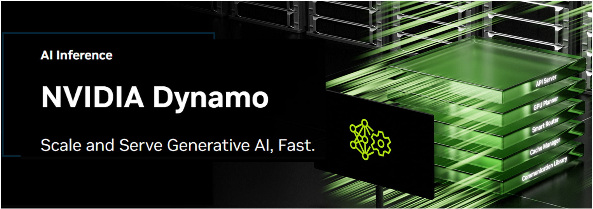

<!--
SPDX-FileCopyrightText: Copyright (c) 2024-2025 NVIDIA CORPORATION & AFFILIATES. All rights reserved.
SPDX-License-Identifier: Apache-2.0

Licensed under the Apache License, Version 2.0 (the "License");
you may not use this file except in compliance with the License.
You may obtain a copy of the License at

http://www.apache.org/licenses/LICENSE-2.0

Unless required by applicable law or agreed to in writing, software
distributed under the License is distributed on an "AS IS" BASIS,
WITHOUT WARRANTIES OR CONDITIONS OF ANY KIND, either express or implied.
See the License for the specific language governing permissions and
limitations under the License.
-->


[](https://opensource.org/licenses/Apache-2.0)
[](https://github.com/ai-dynamo/dynamo/releases/latest)
[](https://discord.gg/D92uqZRjCZ)
[](https://deepwiki.com/ai-dynamo/dynamo)

| **[Roadmap](https://github.com/ai-dynamo/dynamo/issues/762)** | **[Documentation](https://docs.nvidia.com/dynamo/latest/index.html)** | **[Examples](https://github.com/ai-dynamo/examples)** | **[Design Proposals](https://github.com/ai-dynamo/enhancements)** |

### The Era of Multi-Node, Multi-GPU


Large language models are quickly outgrowing the memory and compute budget of any single GPU. Tensor-parallelism solves the capacity problem by spreading each layer across many GPUs—and sometimes many servers—but it creates a new one: how do you coordinate those shards, route requests, and share KV cache fast enough to feel like one accelerator? This orchestration gap is exactly what NVIDIA Dynamo is built to close.


### Introducing NVIDIA Dynamo

NVIDIA Dynamo is a high-throughput low-latency inference framework designed for serving generative AI and reasoning models in multi-node distributed environments. Dynamo is designed to be inference engine agnostic (supports TRT-LLM, vLLM, SGLang or others) and captures LLM-specific capabilities such as:


- **Disaggregated prefill & decode inference** – Maximizes GPU throughput and facilitates trade off between throughput and latency.
- **Dynamic GPU scheduling** – Optimizes performance based on fluctuating demand
- **LLM-aware request routing** – Eliminates unnecessary KV cache re-computation
- **Accelerated data transfer** – Reduces inference response time using NIXL.
- **KV cache offloading** – Leverages multiple memory hierarchies for higher system throughput

Built in Rust for performance and in Python for extensibility, Dynamo is fully open-source and driven by a transparent, OSS (Open Source Software) first development approach.


### Installation

The following examples require a few system level packages.
Recommended to use Ubuntu 24.04 with a x86_64 CPU. See [docs/support_matrix.md](docs/support_matrix.md)

1. Install etcd and nats

To co-ordinate across the data center Dynamo relies on an etcd and nats cluster. To run locally these need to be available.

- [etcd](https://etcd.io/) can be run directly as `./etcd`.
- [nats](https://nats.io/) needs jetstream enabled: `nats-server -js`.

The Dynamo team recommend the `uv` Python package manager, although anyway works. Install uv:
```
curl -LsSf https://astral.sh/uv/install.sh | sh
```

2. Select an engine

We publish Python wheels specialized for each of our supported engines: vllm, sglang, llama.cpp and trtllm. The examples that follow use sglang, read on for other engines.

```
uv venv venv
source venv/bin/activate
uv pip install pip

# Choose one
uv pip install "ai-dynamo[sglang]"
uv pip install "ai-dynamo[vllm]"
uv pip install "ai-dynamo[trtllm]"
uv pip install "ai-dynamo[llama_cpp]" # CPU, see later for GPU
```

### Running and Interacting with an LLM Locally

You can run a model and interact with it locally using commands below.

#### Example Commands

```
python -m dynamo.frontend --interactive
python -m dynamo.sglang.worker Qwen/Qwen3-4B
```

```
✔ User · Hello, how are you?
Okay, so I'm trying to figure out how to respond to the user's greeting. They said, "Hello, how are you?" and then followed it with "Hello! I'm just a program, but thanks for asking." Hmm, I need to come up with a suitable reply. ...
```

If the model is not available locally it will be downloaded from HuggingFace and cached.

You can also pass a local path: `python -m dynamo.sglang.worker --model-path ~/llms/Qwen3-0.6B`

### Running an LLM API server

Dynamo provides a simple way to spin up a local set of inference components including:

- **OpenAI Compatible Frontend** – High performance OpenAI compatible http api server written in Rust.
- **Basic and Kv Aware Router** – Route and load balance traffic to a set of workers.
- **Workers** – Set of pre-configured LLM serving engines.

```
# Start an OpenAI compatible HTTP server, a pre-processor (prompt templating and tokenization) and a router:
python -m dynamo.frontend [--http-port 8080]

# Start the vllm engine, connecting to nats and etcd to receive requests. You can run several of these,
# both for the same model and for multiple models. The frontend node will discover them.
python -m dynamo.sglang.worker deepseek-ai/DeepSeek-R1-Distill-Llama-8B
```

#### Send a Request

```bash
curl localhost:8080/v1/chat/completions   -H "Content-Type: application/json"   -d '{
    "model": "deepseek-ai/DeepSeek-R1-Distill-Llama-8B",
    "messages": [
    {
        "role": "user",
        "content": "Hello, how are you?"
    }
    ],
    "stream":false,
    "max_tokens": 300
  }' | jq
```

Rerun with `curl -N` and change `stream` in the request to `true` to get the responses as soon as the engine issues them.

### Engines

In the introduction we installed the `sglang` engine. There are other options.

All of these requires nats and etcd, as well as a frontend (`python -m dynamo.frontend [--interactive]`).

# vllm

```
uv pip install ai-dynamo[vllm]
```

Run the backend/worker like this:
```
python -m dynamo.vllm --help
```

vllm attempts to allocate enough KV cache for the full context length at startup. If that does not fit in your available memory pass `--context-length <value>`.

To specify which GPUs to use set environment variable `CUDA_VISIBLE_DEVICES`.

# sglang

```
uv pip install ai-dynamo[sglang]
```

Run the backend/worker like this:
```
python -m dynamo.sglang.worker --help
```

You can pass any sglang flags directly to this worker, see https://docs.sglang.ai/backend/server_arguments.html . See there to use multiple GPUs.

# TRT-LLM

It is recommended to use [NGC PyTorch Container](https://catalog.ngc.nvidia.com/orgs/nvidia/containers/pytorch) for running TensorRT-LLM engine.

> [!Note]
> Ensure that you select a PyTorch container image version that matches the version of TensorRT-LLM you are using.
> For example, if you are using `tensorrt-llm==1.0.0rc4`, use the PyTorch container image version `25.05`.
> To find the correct PyTorch container version for your desired `tensorrt-llm` release, visit the [TensorRT-LLM Dockerfile.multi](https://github.com/NVIDIA/TensorRT-LLM/blob/main/docker/Dockerfile.multi) on GitHub. Switch to the branch that matches your `tensorrt-llm` version, and look for the `BASE_TAG` line to identify the recommended PyTorch container tag.

> [!Important]
> Launch container with the following additional settings `--shm-size=1g --ulimit memlock=-1`

## Install prerequites
```
# Optional step: Only required for Blackwell and Grace Hopper
pip3 install torch==2.7.1 torchvision torchaudio --index-url https://download.pytorch.org/whl/cu128

sudo apt-get -y install libopenmpi-dev
```

> [!Tip]
> You can learn more about these prequisites and known issues with TensorRT-LLM pip based installation [here](https://nvidia.github.io/TensorRT-LLM/installation/linux.html).

## Install dynamo
```
uv pip install --upgrade pip setuptools && uv pip install ai-dynamo[trtllm]
```

Run the backend/worker like this:
```
python -m dynamo.trtllm --help
```

To specify which GPUs to use set environment variable `CUDA_VISIBLE_DEVICES`.

# llama.cpp

To install llama.cpp for CPU inference:
```
uv pip install ai-dynamo[llama_cpp]
```

To build llama.cpp for CUDA:
```
pip install llama-cpp-python -C cmake.args="-DGGML_CUDA=on"
uv pip install uvloop ai-dynamo
```

At time of writing the `uv pip` version does not support that syntax, so use `pip` directly inside the venv.

To build llama.cpp for other accelerators see https://pypi.org/project/llama-cpp-python/ .

Download a GGUF and run the engine like this:
```
python -m dynamo.llama_cpp --model-path ~/llms/Qwen3-0.6B-Q8_0.gguf
```

If you have multiple GPUs, llama.cpp does automatic tensor parallelism. You do not need to pass any extra flags to dynamo-run to enable it.

### Local Development

1. Install libraries

**Ubuntu:**
```
sudo apt install -y build-essential libhwloc-dev libudev-dev pkg-config libclang-dev protobuf-compiler python3-dev cmake
```

**macOS:**
- [Homebrew](https://brew.sh/)
```
# if brew is not installed on your system, install it
/bin/bash -c "$(curl -fsSL https://raw.githubusercontent.com/Homebrew/install/HEAD/install.sh)"
```
- [Xcode](https://developer.apple.com/xcode/)

```
brew install cmake protobuf

## Check that Metal is accessible
xcrun -sdk macosx metal
```
If Metal is accessible, you should see an error like `metal: error: no input files`, which confirms it is installed correctly.


2. Install Rust

```
curl --proto '=https' --tlsv1.2 -sSf https://sh.rustup.rs | sh
source $HOME/.cargo/env
```

3. Create a Python virtual env:

```
uv venv dynamo
source dynamo/bin/activate
```

4. Install build tools

```
uv pip install pip maturin
```

[Maturin](https://github.com/PyO3/maturin) is the Rust<->Python bindings build tool.

5. Build the Rust bindings

```
cd lib/bindings/python
maturin develop --uv
```

6. Install the wheel

```
cd $PROJECT_ROOT
uv pip install .
```

Note editable (`-e`) does not work because the `dynamo` package is split over multiple directories, one per backend.

You should now be able to run `python -m dynamo.frontend`.

Remember that nats and etcd must be running (see earlier).

Set the environment variable `DYN_LOG` to adjust the logging level; for example, `export DYN_LOG=debug`. It has the same syntax as `RUST_LOG`.

If you use vscode or cursor, we have a .devcontainer folder built on [Microsofts Extension](https://code.visualstudio.com/docs/devcontainers/containers). For instructions see the [ReadMe](.devcontainer/README.md) for more details.

### Deployment to Kubernetes

Follow the [Quickstart Guide](docs/guides/dynamo_deploy/quickstart.md) to deploy to Kubernetes.

