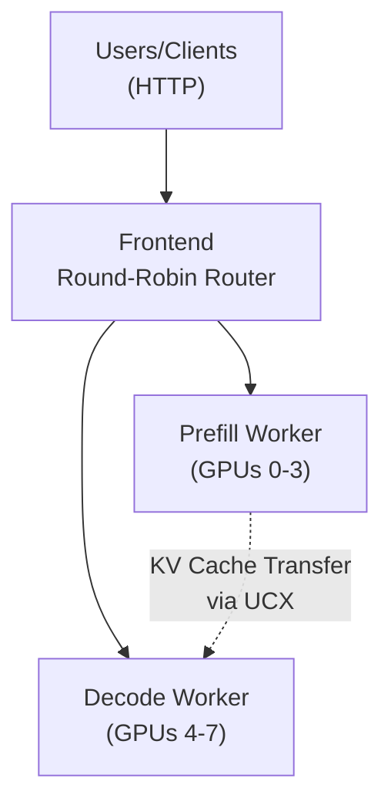

<!--
SPDX-FileCopyrightText: Copyright (c) 2025 NVIDIA CORPORATION & AFFILIATES. All rights reserved.
SPDX-License-Identifier: Apache-2.0
-->

# Running gpt-oss-120b Disaggregated with TensorRT-LLM

Dynamo supports disaggregated serving of gpt-oss-120b with TensorRT-LLM. This guide demonstrates how to deploy gpt-oss-120b using disaggregated prefill/decode serving on a single B200 node with 8 GPUs, running 1 prefill worker on 4 GPUs and 1 decode worker on 4 GPUs.

## Overview

This deployment uses disaggregated serving in TensorRT-LLM where:
- **Prefill Worker**: Processes input prompts efficiently using 4 GPUs with tensor parallelism
- **Decode Worker**: Generates output tokens using 4 GPUs, optimized for token generation throughput
- **Frontend**: Provides OpenAI-compatible API endpoint with round-robin routing

The disaggregated approach optimizes for both low-latency (maximizing tokens per second per user) and high-throughput (maximizing total tokens per GPU per second) use cases by separating the compute-intensive prefill phase from the memory-bound decode phase.

## Prerequisites

- 1x NVIDIA B200 node with 8 GPUs (this guide focuses on single-node B200 deployment)
- CUDA Toolkit 12.8 or later
- Docker with [NVIDIA Container Toolkit](https://docs.nvidia.com/datacenter/cloud-native/container-toolkit/latest/install-guide.html) installed
- Fast SSD storage for model weights (~240GB required)
- HuggingFace account and [access token](https://huggingface.co/settings/tokens)
- [HuggingFace CLI](https://huggingface.co/docs/huggingface_hub/en/guides/cli)


Ensure that the `etcd` and `nats` services are running with the following command:

```bash
docker compose -f deploy/docker-compose.yml up
```

## Instructions

### 1. Pull the Container

```bash
export DYNAMO_CONTAINER_IMAGE="nvcr.io/nvidia/ai-dynamo/tensorrtllm-gpt-oss:latest"

docker pull $DYNAMO_CONTAINER_IMAGE
```

<details>
<summary> Building your own container </summary>

If you'd like to build your own Dynamo container, use the following instructions

**For ARM64 (GB200):**
```bash
# Navigate to the Dynamo repository root
cd $DYNAMO_ROOT

export DYNAMO_CONTAINER_IMAGE=dynamo-gpt-oss-arm64

# Build the container with a specific TensorRT-LLM commit
docker build --platform linux/arm64 -f container/Dockerfile.trtllm_prebuilt . \
  --build-arg BASE_IMAGE=nvcr.io/nvidia/tensorrt-llm/release \
  --build-arg BASE_IMAGE_TAG=gpt-oss-dev \
  --build-arg ARCH=arm64 \
  --build-arg ARCH_ALT=aarch64 \
  -t $DYNAMO_CONTAINER_IMAGE
```

**For x86_64:**
```bash
# Navigate to the Dynamo repository root
cd $DYNAMO_ROOT

export DYNAMO_CONTAINER_IMAGE=dynamo-gpt-oss-amd64

docker build -f container/Dockerfile.trtllm_prebuilt . \
  --build-arg BASE_IMAGE=nvcr.io/nvidia/tensorrt-llm/release \
  --build-arg BASE_IMAGE_TAG=gpt-oss-dev \
  -t $DYNAMO_CONTAINER_IMAGE
```

</details>

### 2. Download the Model

```bash
export MODEL_PATH=<LOCAL_MODEL_DIRECTORY>
export HF_TOKEN=<INSERT_TOKEN_HERE>

pip install -U "huggingface_hub[cli]"

huggingface-cli download openai/gpt-oss-120b --exclude "original/*" --exclude "metal/*" --local-dir $MODEL_PATH
```

### 3. Run the Container

Launch the Dynamo TensorRT-LLM container with the necessary configurations:

```bash
docker run \
    --gpus all \
    -it \
    --rm \
    --network host \
    --volume $MODEL_PATH:/model \
    --volume $PWD:/workspace \
    --shm-size=10G \
    --ulimit memlock=-1 \
    --ulimit stack=67108864 \
    --ulimit nofile=65536:65536 \
    --cap-add CAP_SYS_PTRACE \
    --ipc host \
    -e HF_TOKEN=$HF_TOKEN \
    -e TRTLLM_ENABLE_PDL=1 \
    -e TRT_LLM_DISABLE_LOAD_WEIGHTS_IN_PARALLEL=True \
    $DYNAMO_CONTAINER_IMAGE
```

This command:
- Automatically removes the container when stopped (`--rm`)
- Allows container to interact with host's IPC resources for optimal performance (`--ipc=host`)
- Runs the container in interactive mode (`-it`)
- Sets up shared memory and stack limits for optimal performance
- Mounts your model directory into the container at `/model`
- Mounts the current Dynamo workspace into the container at `/workspace/dynamo`
- Enables [PDL](https://docs.nvidia.com/cuda/cuda-c-programming-guide/index.html#programmatic-dependent-launch-and-synchronization) and disables parallel weight loading
- Sets HuggingFace token as environment variable in the container

### 4. Understanding the Configuration

The deployment uses configuration files and command-line arguments to control behavior:

#### Configuration Files

**Prefill Configuration (`engine_configs/gpt_oss/prefill.yaml`)**:
- `enable_attention_dp: false` - Attention data parallelism disabled for prefill
- `enable_chunked_prefill: true` - Enables efficient chunked prefill processing
- `moe_config.backend: CUTLASS` - Uses optimized CUTLASS kernels for MoE layers
- `cache_transceiver_config.backend: ucx` - Uses UCX for efficient KV cache transfer
- `cuda_graph_config.max_batch_size: 32` - Maximum batch size for CUDA graphs

**Decode Configuration (`engine_configs/gpt_oss/decode.yaml`)**:
- `enable_attention_dp: true` - Attention data parallelism enabled for decode
- `disable_overlap_scheduler: false` - Enables overlapping for decode efficiency
- `moe_config.backend: CUTLASS` - Uses optimized CUTLASS kernels for MoE layers
- `cache_transceiver_config.backend: ucx` - Uses UCX for efficient KV cache transfer
- `cuda_graph_config.max_batch_size: 128` - Maximum batch size for CUDA graphs

#### Command-Line Arguments

Both workers receive these key arguments:
- `--tensor-parallel-size 4` - Uses 4 GPUs for tensor parallelism
- `--expert-parallel-size 4` - Expert parallelism across 4 GPUs
- `--free-gpu-memory-fraction 0.9` - Allocates 90% of GPU memory

Prefill-specific arguments:
- `--max-num-tokens 20000` - Maximum tokens for prefill processing
- `--max-batch-size 32` - Maximum batch size for prefill

Decode-specific arguments:
- `--max-num-tokens 16384` - Maximum tokens for decode processing
- `--max-batch-size 128` - Maximum batch size for decode

### 5. Launch the Deployment

You can use the provided launch script or run the components manually:

#### Option A: Using the Launch Script

```bash
cd /workspace/components/backends/trtllm
./launch/gpt_oss_disagg.sh
```

#### Option B: Manual Launch

1. **Clear namespace and start frontend**:
```bash
cd /workspace/dynamo/components/backends/trtllm

# Clear any existing deployments
python3 utils/clear_namespace.py --namespace dynamo

# Start frontend with round-robin routing
python3 -m dynamo.frontend --router-mode round-robin --http-port 8000 &
```

2. **Launch prefill worker**:
```bash
CUDA_VISIBLE_DEVICES=0,1,2,3 python3 -m dynamo.trtllm \
  --model-path /model \
  --served-model-name openai/gpt-oss-120b \
  --extra-engine-args engine_configs/gpt_oss/prefill.yaml \
  --disaggregation-mode prefill \
  --disaggregation-strategy prefill_first \
  --max-num-tokens 20000 \
  --max-batch-size 32 \
  --free-gpu-memory-fraction 0.9 \
  --tensor-parallel-size 4 \
  --expert-parallel-size 4 &
```

3. **Launch decode worker**:
```bash
CUDA_VISIBLE_DEVICES=4,5,6,7 python3 -m dynamo.trtllm \
  --model-path /model \
  --served-model-name openai/gpt-oss-120b \
  --extra-engine-args engine_configs/gpt_oss/decode.yaml \
  --disaggregation-mode decode \
  --disaggregation-strategy prefill_first \
  --max-num-tokens 16384 \
  --free-gpu-memory-fraction 0.9 \
  --tensor-parallel-size 4 \
  --expert-parallel-size 4
```

### 6. Test the Deployment

Send a test request to verify the deployment:

```bash
curl -X POST http://localhost:8000/v1/responses \
  -H "Content-Type: application/json" \
  -d '{
    "model": "openai/gpt-oss-120b",
    "input": "Explain the concept of disaggregated serving in LLM inference in 3 sentences.",
    "max_output_tokens": 200,
    "stream": false
  }'
```

The server exposes a standard OpenAI-compatible API endpoint that accepts JSON requests. You can adjust parameters like `max_tokens`, `temperature`, and others according to your needs.

## Benchmarking

### Performance Testing with GenAI-Perf

The Dynamo container includes [GenAI-Perf](https://docs.nvidia.com/deeplearning/triton-inference-server/user-guide/docs/perf_analyzer/genai-perf/README.html), NVIDIA's tool for benchmarking generative AI models. This tool helps measure throughput, latency, and other performance metrics for your deployment.

**Run the following benchmark from inside the container** (after completing the deployment steps above):

```bash
# Create a directory for benchmark results
mkdir -p /tmp/benchmark-results

# Run the benchmark - this command tests the deployment with high-concurrency synthetic workload
genai-perf profile \
    --model openai/gpt-oss-120b \
    --tokenizer /model \
    --endpoint-type chat \
    --endpoint /v1/chat/completions \
    --streaming \
    --url localhost:8000 \
    --synthetic-input-tokens-mean 32000 \
    --synthetic-input-tokens-stddev 0 \
    --output-tokens-mean 256 \
    --output-tokens-stddev 0 \
    --extra-inputs max_tokens:256 \
    --extra-inputs min_tokens:256 \
    --extra-inputs ignore_eos:true \
    --extra-inputs "{\"nvext\":{\"ignore_eos\":true}}" \
    --concurrency 256 \
    --request-count 6144 \
    --warmup-request-count 1000 \
    --num-dataset-entries 8000 \
    --random-seed 100 \
    --artifact-dir /tmp/benchmark-results \
    -- \
    -v \
    --max-threads 500 \
    -H 'Authorization: Bearer NOT USED' \
    -H 'Accept: text/event-stream'
```

### What This Benchmark Does

This command:
- **Tests chat completions** with streaming responses against the disaggregated deployment
- **Simulates high load** with 256 concurrent requests and 6144 total requests
- **Uses long context inputs** (32K tokens) to test prefill performance
- **Generates consistent outputs** (256 tokens) to measure decode throughput
- **Includes warmup period** (1000 requests) to stabilize performance metrics
- **Saves detailed results** to `/tmp/benchmark-results` for analysis

Key parameters you can adjust:
- `--concurrency`: Number of simultaneous requests (impacts GPU utilization)
- `--synthetic-input-tokens-mean`: Average input length (tests prefill capacity)
- `--output-tokens-mean`: Average output length (tests decode throughput)
- `--request-count`: Total number of requests for the benchmark

### Installing GenAI-Perf Outside the Container

If you prefer to run benchmarks from outside the container:

```bash
# Install GenAI-Perf
pip install genai-perf

# Then run the same benchmark command, adjusting the tokenizer path if needed
```

## Architecture Overview

The disaggregated architecture separates prefill and decode phases:



## Key Features

1. **Disaggregated Serving**: Separates compute-intensive prefill from memory-bound decode operations
2. **Optimized Resource Usage**: Different parallelism strategies for prefill vs decode
3. **Scalable Architecture**: Easy to adjust worker counts based on workload
4. **TensorRT-LLM Optimizations**: Leverages TensorRT-LLM's efficient kernels and memory management

## Troubleshooting

### Common Issues

1. **CUDA Out-of-Memory Errors**
   - Reduce `--max-num-tokens` in the launch commands (currently 20000 for prefill, 16384 for decode)
   - Lower `--free-gpu-memory-fraction` from 0.9 to 0.8 or 0.7
   - Ensure model checkpoints are compatible with the expected format

2. **Workers Not Connecting**
   - Ensure etcd and NATS services are running: `docker ps | grep -E "(etcd|nats)"`
   - Check network connectivity between containers
   - Verify CUDA_VISIBLE_DEVICES settings match your GPU configuration
   - Check that no other processes are using the assigned GPUs

3. **Performance Issues**
   - Monitor GPU utilization with `nvidia-smi` while the deployment is running
   - Check worker logs for bottlenecks or errors
   - Ensure that batch sizes in manual commands match those in configuration files
   - Adjust chunked prefill settings based on your workload
   - For connection issues, ensure port 8000 is not being used by another application

4. **Container Startup Issues**
   - Verify that the NVIDIA Container Toolkit is properly installed
   - Check Docker daemon is running with GPU support
   - Ensure sufficient disk space for model weights and container images

## Next Steps

- **Production Deployment**: For multi-node deployments, see the [Multi-node Guide](../../examples/basics/multinode/README.md)
- **Advanced Configuration**: Explore TensorRT-LLM engine building options for further optimization
- **Monitoring**: Set up Prometheus and Grafana for production monitoring
- **Performance Benchmarking**: Use GenAI-Perf to measure and optimize your deployment performance
