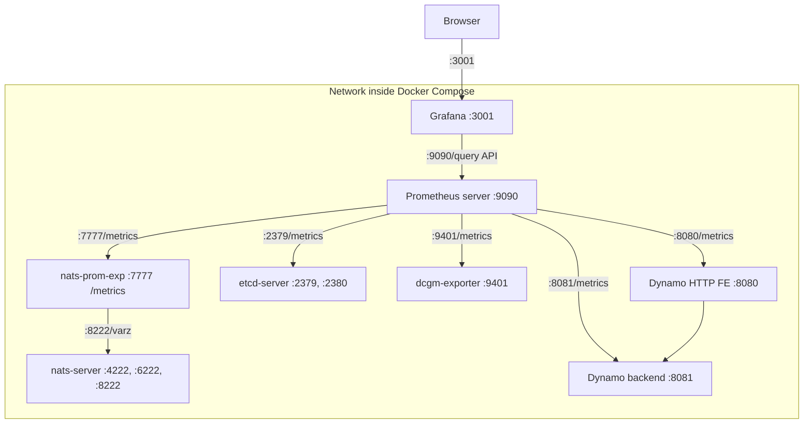

# Metrics Visualization with Prometheus and Grafana

This directory contains configuration for visualizing metrics from the metrics aggregation service using Prometheus and Grafana.

> [!NOTE]
> For detailed information about Dynamo's metrics system, including hierarchical metrics, automatic labeling, and usage examples, see the [Metrics Guide](../../docs/guides/metrics.md).

## Overview

### Components

- **Prometheus Server**: Collects and stores metrics from Dynamo services and other components.
- **Grafana**: Provides dashboards by querying the Prometheus Server.

### Topology

Default Service Relationship Diagram:


The dcgm-exporter service in the Docker Compose network is configured to use port 9401 instead of the default port 9400. This adjustment is made to avoid port conflicts with other dcgm-exporter instances that may be running simultaneously. Such a configuration is typical in distributed systems like SLURM.

As of Q2 2025, Dynamo HTTP Frontend metrics are exposed when you build containers with `--framework VLLM` or `--framework TRTLLM`.

### Available Metrics

#### Component Metrics

The core Dynamo backend system automatically exposes metrics with the `dynamo_component_*` prefix for all components that use the `DistributedRuntime` framework:

- `dynamo_component_concurrent_requests`: Requests currently being processed (gauge)
- `dynamo_component_request_bytes_total`: Total bytes received in requests (counter)
- `dynamo_component_request_duration_seconds`: Request processing time (histogram)
- `dynamo_component_requests_total`: Total requests processed (counter)
- `dynamo_component_response_bytes_total`: Total bytes sent in responses (counter)
- `dynamo_component_system_uptime_seconds`: DistributedRuntime uptime (gauge)

#### Specialized Component Metrics

Some components expose additional metrics specific to their functionality:

- `dynamo_preprocessor_*`: Metrics specific to preprocessor components

#### Frontend Metrics

When using Dynamo HTTP Frontend (`--framework VLLM` or `--framework TRTLLM`), these metrics are automatically exposed with the `dynamo_frontend_*` prefix and include `model` labels containing the model name:

- `dynamo_frontend_inflight_requests`: Inflight requests (gauge)
- `dynamo_frontend_input_sequence_tokens`: Input sequence length (histogram)
- `dynamo_frontend_inter_token_latency_seconds`: Inter-token latency (histogram)
- `dynamo_frontend_output_sequence_tokens`: Output sequence length (histogram)
- `dynamo_frontend_request_duration_seconds`: LLM request duration (histogram)
- `dynamo_frontend_requests_total`: Total LLM requests (counter)
- `dynamo_frontend_time_to_first_token_seconds`: Time to first token (histogram)

### Required Files

The following configuration files should be present in this directory:
- [docker-compose.yml](../docker-compose.yml): Defines the Prometheus and Grafana services
- [prometheus.yml](./prometheus.yml): Contains Prometheus scraping configuration
- [grafana-datasources.yml](./grafana-datasources.yml): Contains Grafana datasource configuration
- [grafana_dashboards/grafana-dashboard-providers.yml](./grafana_dashboards/grafana-dashboard-providers.yml): Contains Grafana dashboard provider configuration
- [grafana_dashboards/grafana-dynamo-dashboard.json](./grafana_dashboards/grafana-dynamo-dashboard.json): A general Dynamo Dashboard for both SW and HW metrics.
- [grafana_dashboards/grafana-dcgm-metrics.json](./grafana_dashboards/grafana-dcgm-metrics.json): Contains Grafana dashboard configuration for DCGM GPU metrics
- [grafana_dashboards/grafana-llm-metrics.json](./grafana_dashboards/grafana-llm-metrics.json): This file, which is being phased out, contains the Grafana dashboard configuration for LLM-specific metrics. It requires an additional `metrics` component to operate concurrently. A new version is under development.

## Getting Started

### Prerequisites

1. Make sure Docker and Docker Compose are installed on your system

### Quick Start

1. Start Dynamo dependencies. Assume you're at the root dynamo path:

   ```bash
   # Start the basic services (etcd & natsd), along with Prometheus and Grafana
   docker compose -f deploy/docker-compose.yml --profile metrics up -d

   # Minimum components for Dynamo (will not have Prometheus and Grafana): etcd/nats/dcgm-exporter
   docker compose -f deploy/docker-compose.yml up -d
   ```

   Optional: To target specific GPU(s), export the variable below before running Docker Compose
   ```bash
   export CUDA_VISIBLE_DEVICES=0,2
   ```

2. Web servers started. The ones that end in /metrics are in Prometheus format:
   - Grafana: `http://localhost:3001` (default login: dynamo/dynamo)
   - Prometheus Server: `http://localhost:9090`
   - NATS Server: `http://localhost:8222` (monitoring endpoints: /varz, /healthz, etc.)
   - NATS Prometheus Exporter: `http://localhost:7777/metrics`
   - etcd Server: `http://localhost:2379/metrics`
   - DCGM Exporter: `http://localhost:9401/metrics`


   - Start the [components/metrics](../../components/metrics/README.md) application to begin monitoring for metric events from dynamo workers and aggregating them on a Prometheus metrics endpoint: `http://localhost:9091/metrics`.
   - Uncomment the appropriate lines in prometheus.yml to poll port 9091.
   - Start worker(s) that publishes KV Cache metrics: [lib/runtime/examples/service_metrics/README.md](../../lib/runtime/examples/service_metrics/README.md) can populate dummy KV Cache metrics.

### Configuration

#### Prometheus

The Prometheus configuration is specified in [prometheus.yml](./prometheus.yml). This file is set up to collect metrics from the metrics aggregation service endpoint.

Please be aware that you might need to modify the target settings to align with your specific host configuration and network environment.

After making changes to prometheus.yml, it is necessary to reload the configuration using the command below. Simply sending a kill -HUP signal will not suffice due to the caching of the volume that contains the prometheus.yml file.

```
docker compose -f deploy/docker-compose.yml up prometheus -d --force-recreate
```

#### Grafana

Grafana is pre-configured with:
- Prometheus datasource
- Sample dashboard for visualizing service metrics


### Troubleshooting

1. Verify services are running:
  ```bash
  docker compose ps
  ```

2. Check logs:
  ```bash
  docker compose logs prometheus
  docker compose logs grafana
  ```

3. For issues with the legacy metrics component (being phased out), see [components/metrics/README.md](../../components/metrics/README.md) for details on the exposed metrics and troubleshooting steps.

## Developer Guide

### Creating Metrics at Different Hierarchy Levels

#### Runtime-Level Metrics

```rust
use dynamo_runtime::DistributedRuntime;

let runtime = DistributedRuntime::new()?;
let namespace = runtime.namespace("my_namespace")?;
let component = namespace.component("my_component")?;
let endpoint = component.endpoint("my_endpoint")?;

// Create endpoint-level counters (this is a Prometheus Counter type)
let total_requests = endpoint.create_counter(
    "total_requests",
    "Total requests across all namespaces",
    &[]
)?;

let active_connections = endpoint.create_gauge(
    "active_connections",
    "Number of active client connections",
    &[]
)?;
```

#### Namespace-Level Metrics

```rust
let namespace = runtime.namespace("my_model")?;

// Namespace-scoped metrics
let model_requests = namespace.create_counter(
    "model_requests",
    "Requests for this specific model",
    &[]
)?;

let model_latency = namespace.create_histogram(
    "model_latency_seconds",
    "Model inference latency",
    &[],
    &[0.001, 0.01, 0.1, 1.0, 10.0]
)?;
```

#### Component-Level Metrics

```rust
let component = namespace.component("backend")?;

// Component-specific metrics
let backend_requests = component.create_counter(
    "backend_requests",
    "Requests handled by this backend component",
    &[]
)?;

let gpu_memory_usage = component.create_gauge(
    "gpu_memory_bytes",
    "GPU memory usage in bytes",
    &[]
)?;
```

#### Endpoint-Level Metrics

```rust
let endpoint = component.endpoint("generate")?;

// Endpoint-specific metrics
let generate_requests = endpoint.create_counter(
    "generate_requests",
    "Generate endpoint requests",
    &[]
)?;

let generate_latency = endpoint.create_histogram(
    "generate_latency_seconds",
    "Generate endpoint latency",
    &[],
    &[0.001, 0.01, 0.1, 1.0, 10.0]
)?;
```

### Creating Vector Metrics with Dynamic Labels

Use vector metrics when you need to track metrics with different label values:

```rust
// Counter with labels
let requests_by_model = endpoint.create_counter_vec(
    "requests_by_model",
    "Requests by model type",
    &["model_type", "model_size"]
)?;

// Increment with specific labels
requests_by_model.with_label_values(&["llama", "7b"]).inc();
requests_by_model.with_label_values(&["gpt", "13b"]).inc();

// Gauge with labels
let memory_by_gpu = component.create_gauge_vec(
    "gpu_memory_bytes",
    "GPU memory usage by device",
    &["gpu_id", "memory_type"]
)?;

memory_by_gpu.with_label_values(&["0", "allocated"]).set(8192.0);
memory_by_gpu.with_label_values(&["0", "cached"]).set(4096.0);
```

### Creating Histograms

Histograms are useful for measuring distributions of values like latency:

```rust
let latency_histogram = endpoint.create_histogram(
    "request_latency_seconds",
    "Request latency distribution",
    &[],
    &[0.001, 0.005, 0.01, 0.05, 0.1, 0.5, 1.0, 5.0]
)?;

// Record latency values
latency_histogram.observe(0.023); // 23ms
latency_histogram.observe(0.156); // 156ms
```

### Transitioning from Plain Prometheus

If you're currently using plain Prometheus metrics, transitioning to Dynamo's `MetricsRegistry` is straightforward:

#### Before (Plain Prometheus)

```rust
use prometheus::{Counter, Opts, Registry};

// Create a registry to hold metrics
let registry = Registry::new();
let counter_opts = Opts::new("my_counter", "My custom counter");
let counter = Counter::with_opts(counter_opts).unwrap();
registry.register(Box::new(counter.clone())).unwrap();

// Use the counter
counter.inc();

// To expose metrics, you'd need to set up an HTTP server manually
// and implement the /metrics endpoint yourself
```

#### After (Dynamo MetricsRegistry)

```rust
let counter = endpoint.create_counter(
    "my_counter",
    "My custom counter",
    &[]
)?;

counter.inc();
```

**Note:** The metric is automatically registered when created via the endpoint's `create_counter` factory method.

**Benefits of Dynamo's approach:**
- **Automatic registration**: Metrics created via endpoint's `create_*` factory methods are automatically registered with the system
- Automatic labeling with namespace, component, and endpoint information
- Consistent metric naming with `dynamo_` prefix
- Built-in HTTP metrics endpoint when enabled with `DYN_SYSTEM_ENABLED=true`
- Hierarchical metric organization

### Advanced Features

#### Custom Buckets for Histograms

```rust
// Define custom buckets for your use case
let custom_buckets = vec![0.001, 0.01, 0.1, 1.0, 10.0];
let latency = endpoint.create_histogram(
    "api_latency_seconds",
    "API latency in seconds",
    &[],
    &custom_buckets
)?;
```

#### Metric Aggregation

```rust
// Aggregate metrics across multiple endpoints
let total_requests = namespace.create_counter(
    "total_requests",
    "Total requests across all endpoints",
    &[]
)?;
```

## Running the deprecated `components/metrics` program

⚠️ **DEPRECATION NOTICE** ⚠️

When you run the example [components/metrics](../../components/metrics/README.md) program, it exposes a Prometheus /metrics endpoint with the following metrics (defined in [components/metrics/src/lib.rs](../../components/metrics/src/lib.rs)):

**⚠️ The following `llm_kv_*` metrics are deprecated:**

- `llm_requests_active_slots`: Active request slots per worker
- `llm_requests_total_slots`: Total available request slots per worker
- `llm_kv_blocks_active`: Active KV blocks per worker
- `llm_kv_blocks_total`: Total KV blocks available per worker
- `llm_kv_hit_rate_percent`: KV Cache hit percent per worker
- `llm_load_avg`: Average load across workers
- `llm_load_std`: Load standard deviation across workers

## Troubleshooting

1. Verify services are running:
  ```bash
  docker compose ps
  ```

2. Check logs:
  ```bash
  docker compose logs prometheus
  docker compose logs grafana
  ```

3. For issues with the legacy metrics component (being phased out), see [components/metrics/README.md](../../components/metrics/README.md) for details on the exposed metrics and troubleshooting steps.
