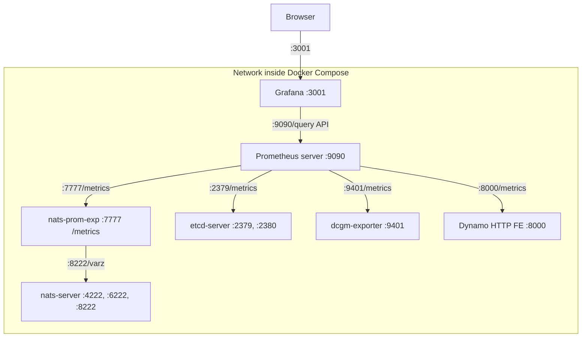

# Metrics Visualization with Prometheus and Grafana

This directory contains configuration for visualizing metrics from the metrics aggregation service using Prometheus and Grafana.

## Components

- **Prometheus Server**: Collects and stores metrics from Dynamo services and other components.
- **Grafana**: Provides dashboards by querying the Prometheus Server.

## Topology

Default Service Relationship Diagram:


The dcgm-exporter service in the Docker Compose network is configured to use port 9401 instead of the default port 9400. This adjustment is made to avoid port conflicts with other dcgm-exporter instances that may be running simultaneously. Such a configuration is typical in distributed systems like SLURM.

As of Q2 2025, Dynamo HTTP Frontend metrics are exposed when you build containers with `--framework VLLM` or `--framework TENSORRTLLM`.

## Getting Started

1. Make sure Docker and Docker Compose are installed on your system

2. Start Dynamo dependencies. Assume you're at the root dynamo path:

   ```bash
   docker compose -f deploy/metrics/docker-compose.yml up -d  # Minimum components for Dynamo: etcd/nats/dcgm-exporter
   # or
   docker compose -f deploy/metrics/docker-compose.yml --profile metrics up -d  # In addition to the above, start Prometheus & Grafana
   ```

   To target specific GPU(s), export the variable below before running Docker Compose:
   ```bash
   export CUDA_VISIBLE_DEVICES=0,2
   ```

3. Web servers started. The ones that end in /metrics are in Prometheus format:
   - Grafana: `http://localhost:3001` (default login: dynamo/dynamo)
   - Prometheus Server: `http://localhost:9090`
   - NATS Server: `http://localhost:8222` (monitoring endpoints: /varz, /healthz, etc.)
   - NATS Prometheus Exporter: `http://localhost:7777/metrics`
   - etcd Server: `http://localhost:2379/metrics`
   - DCGM Exporter: `http://localhost:9401/metrics`

4. Optionally, if you want to experiment further, look through components/metrics/README.md for more details on launching a metrics server (subscribes to nats), mock_worker (publishes to nats), and real workers.

   - Start the [components/metrics](../../components/metrics/README.md) application to begin monitoring for metric events from dynamo workers and aggregating them on a Prometheus metrics endpoint: `http://localhost:9091/metrics`.
   - Uncomment the appropriate lines in prometheus.yml to poll port 9091.
   - Start worker(s) that publishes KV Cache metrics: [examples/rust/service_metrics/bin/server](../../lib/runtime/examples/service_metrics/README.md)` can populate dummy KV Cache metrics.


## Configuration

### Prometheus

The Prometheus configuration is defined in [prometheus.yml](./prometheus.yml). It is configured to scrape metrics from the metrics aggregation service endpoint.

Note: You may need to adjust the target based on your host configuration and network setup.

### Grafana

Grafana is pre-configured with:
- Prometheus datasource
- Sample dashboard for visualizing service metrics


## Required Files

The following configuration files should be present in this directory:
- [docker-compose.yml](./docker-compose.yml): Defines the Prometheus and Grafana services
- [prometheus.yml](./prometheus.yml): Contains Prometheus scraping configuration
- [grafana-datasources.yml](./grafana-datasources.yml): Contains Grafana datasource configuration
- [grafana_dashboards/grafana-dashboard-providers.yml](./grafana_dashboards/grafana-dashboard-providers.yml): Contains Grafana dashboard provider configuration
- [grafana_dashboards/grafana-dynamo-dashboard.json](./grafana_dashboards/grafana-dynamo-dashboard.json): A general Dynamo Dashboard for both SW and HW metrics.
- [grafana_dashboards/grafana-llm-metrics.json](./grafana_dashboards/grafana-llm-metrics.json): Contains Grafana dashboard configuration for LLM specific metrics.
- [grafana_dashboards/grafana-dcgm-metrics.json](./grafana_dashboards/grafana-dcgm-metrics.json): Contains Grafana dashboard configuration for DCGM GPU metrics

## Running the example `metrics` component

When you run the example [components/metrics](../../components/metrics/README.md) component, it exposes a Prometheus /metrics endpoint with the followings (defined in [../../components/metrics/src/lib.rs](../../components/metrics/src/lib.rs)):
- `llm_requests_active_slots`: Number of currently active request slots per worker
- `llm_requests_total_slots`: Total available request slots per worker
- `llm_kv_blocks_active`: Number of active KV blocks per worker
- `llm_kv_blocks_total`: Total KV blocks available per worker
- `llm_kv_hit_rate_percent`: Cumulative KV Cache hit percent per worker
- `llm_load_avg`: Average load across workers
- `llm_load_std`: Load standard deviation across workers

## Troubleshooting

1. Verify services are running:
  ```bash
  docker compose ps
  ```

2. Check logs:
  ```bash
  docker compose logs prometheus
  docker compose logs grafana
  ```
