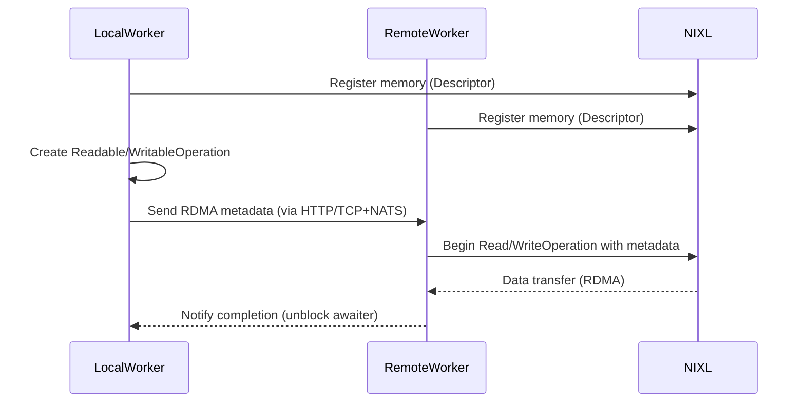
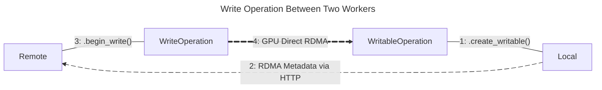

<!--
SPDX-FileCopyrightText: Copyright (c) 2025 NVIDIA CORPORATION & AFFILIATES. All rights reserved.
SPDX-License-Identifier: Apache-2.0

Licensed under the Apache License, Version 2.0 (the "License");
you may not use this file except in compliance with the License.
You may obtain a copy of the License at

http://www.apache.org/licenses/LICENSE-2.0

Unless required by applicable law or agreed to in writing, software
distributed under the License is distributed on an "AS IS" BASIS,
WITHOUT WARRANTIES OR CONDITIONS OF ANY KIND, either express or implied.
See the License for the specific language governing permissions and
limitations under the License.
-->

# Dynamo NIXL Connect

Dynamo connect provides utilities for using the NIXL base RDMA subsystem via a set of Python classes.
The primary goal of this library to simplify the integration of NIXL based RDMA into inference applications.
The `dynamo.nixl_connect` library can be imported by any Dynamo container hosted application.

```python
import dynamo.nixl_connect
```

All operations using the NIXL Connect library begin with the [`Connector`](connector.md) class and the type of operation required.
There are four types of supported operations:

 1. **Register local readable memory**:

    Register local memory buffer(s) with the RDMA subsystem to enable a remote worker to read from.

 2. **Register local writable memory**:

    Register local memory buffer(s) with the RDMA subsystem to enable a remote worker to write to.

 3. **Read from registered, remote memory**:

    Read remote memory buffer(s), registered by a remote worker to be readable, into local memory buffer(s).

 4. **Write to registered, remote memory**:

    Write local memory buffer(s) to remote memory buffer(s) registered by a remote worker to writable.

By connecting correctly paired operations, high-throughput GPU Direct RDMA data transfers can be completed.
Given the list above, the correct pairing of operations would be 1 & 3 or 2 & 4.
Where one side is a "(read|write)-able operation" and the other is its correctly paired "(read|write) operation".
Specifically, a read operation must be paired with a readable operation, and a write operation must be paired with a writable operation.



## Examples

### Generic Example

In the diagram below, Local creates a [`WritableOperation`](writable_operation.md) intended to receive data from Remote.
Local then sends metadata about the requested RDMA operation to Remote.
Remote then uses the metadata to create a [`WriteOperation`](write_operation.md) which will perform the GPU Direct RDMA memory transfer from Remote's GPU memory to Local's GPU memory.



### Multimodal Example

In the case of the [Dynamo Multimodal Disaggregated Example](../../examples/multimodal/README.md):

 1. The HTTP frontend accepts a text prompt and a URL to an image.

 2. The prompt and URL are then enqueued with the Processor before being dispatched to the first available Decode Worker.

 3. Decode Worker then requests a Prefill Worker to provide key-value data for the LLM powering the Decode Worker.

 4. Prefill Worker then requests that the image be processed and provided as embeddings by the Encode Worker.

 5. Encode Worker acquires the image, processes it, performs inference on the image using a specialized vision model, and finally provides the embeddings to Prefill Worker.

 6. Prefill Worker receives the embeddings from Encode Worker and generates a key-value cache (KV$) update for Decode Worker's LLM and writes the update directly to the GPU memory reserved for the data.

 7. Finally, Decode Worker performs the requested inference.


> [!Note]
> In this example, it is the data transfer between the Prefill Worker and the Encode Worker that utilizes the Dynamo NIXL Connect library.
> The KV Cache transfer between Decode Worker and Prefill Worker utilizes the NIXL base RDMA subsystem directly without using the Dynamo NIXL Connect library.

#### Code Examples

See [prefill_worker](https://github.com/ai-dynamo/dynamo/tree/main/examples/multimodal/components/prefill_worker.py#L199) or [decode_worker](https://github.com/ai-dynamo/dynamo/tree/main/examples/multimodal/components/decode_worker.py#L239) from our Multimodal example,
for how they coordinate directly with the Encode Worker by creating a [`WritableOperation`](writable_operation.md),
sending the operation's metadata via Dynamo's round-robin dispatcher, and awaiting the operation for completion before making use of the transferred data.

See [encode_worker](https://github.com/ai-dynamo/dynamo/tree/main/examples/multimodal/components/encode_worker.py#L190) from our Multimodal example,
for how the resulting embeddings are registered with the RDMA subsystem by creating a [`Descriptor`](descriptor.md),
a [`WriteOperation`](write_operation.md) is created using the metadata provided by the requesting worker,
and the worker awaits for the data transfer to complete for yielding a response.


## Python Classes

  - [Connector](connector.md)
  - [Descriptor](descriptor.md)
  - [Device](device.md)
  - [ReadOperation](read_operation.md)
  - [ReadableOperation](readable_operation.md)
  - [SerializedRequest](serialized_request.md)
  - [WritableOperation](writable_operation.md)
  - [WriteOperation](write_operation.md)


## References

  - [NVIDIA Dynamo](https://developer.nvidia.com/dynamo) @ [GitHub](https://github.com/ai-dynamo/dynamo)
    - [NVIDIA Dynamo NIXL Connect](https://github.com/ai-dynamo/dynamo/tree/main/docs/runtime/nixl_connect)
  - [NVIDIA Inference Transfer Library (NIXL)](https://developer.nvidia.com/blog/introducing-nvidia-dynamo-a-low-latency-distributed-inference-framework-for-scaling-reasoning-ai-models/#nvidia_inference_transfer_library_nixl_low-latency_hardware-agnostic_communication%C2%A0) @ [GitHub](https://github.com/ai-dynamo/nixl)
  - [Dynamo Multimodal Example](https://github.com/ai-dynamo/dynamo/tree/main/examples/multimodal)
  - [NVIDIA GPU Direct](https://developer.nvidia.com/gpudirect)
