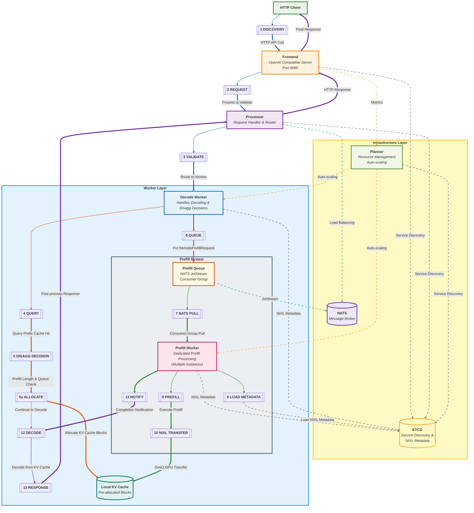

<!--
SPDX-FileCopyrightText: Copyright (c) 2025 NVIDIA CORPORATION & AFFILIATES. All rights reserved.
SPDX-License-Identifier: Apache-2.0

Licensed under the Apache License, Version 2.0 (the "License");
you may not use this file except in compliance with the License.
You may obtain a copy of the License at

http://www.apache.org/licenses/LICENSE-2.0

Unless required by applicable law or agreed to in writing, software
distributed under the License is distributed on an "AS IS" BASIS,
WITHOUT WARRANTIES OR CONDITIONS OF ANY KIND, either express or implied.
See the License for the specific language governing permissions and
limitations under the License.
-->

# Dynamo Architecture Flow

This diagram shows the NVIDIA Dynamo disaggregated inference system as implemented in [examples/llm](https://github.com/ai-dynamo/dynamo/tree/main/examples/llm). Color-coded flows indicate different types of operations:

## 🔵 Main Request Flow (Blue)
The primary user journey through the system:

1. **Discovery (S1)**: Client discovers the service endpoint
2. **Request (S2)**: HTTP client sends API request to Frontend (OpenAI-compatible server on port 8080)
3. **Validate (S3)**: Frontend forwards request to Processor for validation and routing
4. **Route (S3)**: Processor routes the validated request to appropriate Decode Worker

## 🟠 Decision and Allocation Flow (Orange)
The system's intelligent routing and resource allocation:

4. **Query (S4)**: Decode Worker queries for prefix cache hits to optimize processing
5. **Disagg Decision (S5)**: Based on prefill length and queue size, the system decides whether it needs remote prefill
5a. **Allocate (S5a)**: Decode Worker pre-allocates KV cache blocks in its local GPU memory
6. **Queue (S6)**: If remote prefill is required, the system puts the RemotePrefillRequest with block IDs into the PrefillQueue

## 🟢 Prefill Worker Flow (Green)
The dedicated prefill processing pipeline:

7. **NATS Pull (S7)**: PrefillQueue uses a NATS consumer group to distribute work to available PrefillWorkers
8. **Load Metadata (S8)**: PrefillWorker loads NIXL metadata from ETCD to establish GPU communication
9. **Prefill (S9)**: Worker executes the prefill computation on the input tokens
10. **NIXL Transfer (S10)**: Direct GPU-to-GPU transfer writes the prefilled KV cache to the Decode Worker's pre-allocated blocks

## 🟣 Completion Flow (Purple)
The response generation and delivery:

11. **Notify (S11)**: PrefillWorker sends completion notification to Decode Worker
12. **Decode (S12)**: Decode Worker decodes from its local KV cache containing prefilled data
13. **Response (S13)**: The system sends the generated response to the Processor for post-processing, then through the Frontend to the Client

## 🔗 Infrastructure Connections (Dotted lines)
Coordination and messaging support:

### ETCD Connections (Gray, dotted)
- **Frontend, Processor, Planner**: Service discovery and registration
- **Decode Worker, PrefillWorker**: NIXL metadata storage for GPU communication setup

### NATS Connections (Teal, dotted)
- **PrefillQueue**: JetStream consumer group for reliable work distribution
- **Processor**: Load balancing across workers

### Planning Connections (Gold, dotted)
- **Frontend → Planner**: Metrics collection for auto-scaling decisions
- **Planner → Workers**: Resource scaling commands for both Decode Worker and PrefillWorker

## Technical Implementation Details

### NIXL (NVIDIA Interchange Library):
- Enables high-speed GPU-to-GPU data transfers using NVLink/PCIe
- Decode Worker publishes GPU metadata to ETCD for coordination
- PrefillWorker loads metadata to establish direct communication channels
- Block-based transfers (64–128 tokens per block) for efficient batching

### Disaggregated KV Cache:
- Each Decode Worker maintains local KV cache in its GPU memory
- No shared storage bottlenecks—all transfers are direct worker-to-worker
- Pre-allocated blocks ensure deterministic memory layout and performance

