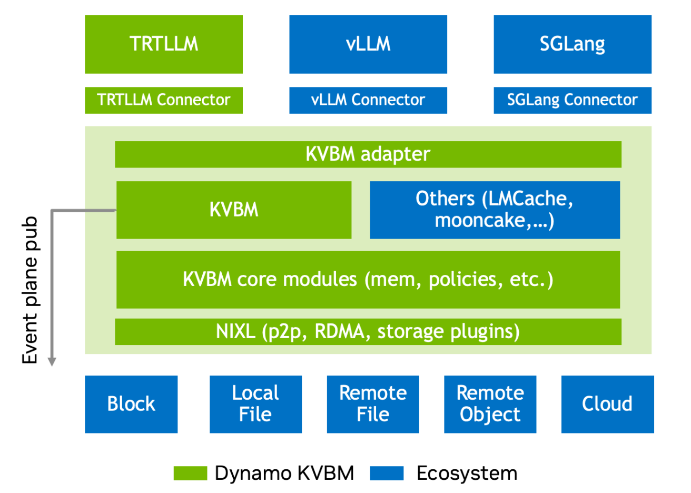

<!--
SPDX-FileCopyrightText: Copyright (c) 2025 NVIDIA CORPORATION & AFFILIATES.
All rights reserved.
SPDX-License-Identifier: Apache-2.0

Licensed under the Apache License, Version 2.0 (the "License");
you may not use this file except in compliance with the License.
You may obtain a copy of the License at

http://www.apache.org/licenses/LICENSE-2.0

Unless required by applicable law or agreed to in writing, software
distributed under the License is distributed on an "AS IS" BASIS,
WITHOUT WARRANTIES OR CONDITIONS OF ANY KIND, either express or implied.
See the License for the specific language governing permissions and
limitations under the License.
-->

# KVBM Architecture

The KVBM serves as a critical infrastructure component for scaling LLM inference workloads efficiently. By cleanly separating runtime logic from memory management, and by enabling distributed block sharing, KVBM lays the foundation for high-throughput, multi-node, and memory-disaggregated AI systems.

**High level layered architecture view of Dynamo KV Block manager and how it interfaces with different components of LLM inference ecosystem**

The KVBM has three primary logical layers. The top layer-the LLM inference runtimes (TRTLLM, vLLM and SGLang)-integrates through a dedicated connector module to the Dynamo KVBM module. These connectors act as translation layers, mapping runtime-specific operations and events into the KVBM’s block-oriented memory interface. This decouples memory management from the inference runtime, enabling backend portability and providing memory tiering.

The middle layer, the KVBM layer, encapsulates the core logic of the KV block manager and serves as the runtime substrate for managing block memory. The KVBM adapter layer normalizes the representations and data layout for the incoming requests across runtimes and forwards them to the core memory manager. The KVBM and the core modules implement required internal functionality, such as table lookups, memory allocation, block layout management, lifecycle, and state transitions and block reuse or eviction was on policies. The KVBM layer also has required abstractions for external components to override or augment its behavior.

The last layer, the NIXL layer, provides unified support for enabling all data and storage transactions. NIXL enables P2P GPU transfers, enables RDMA and NVLINK remote memory sharing, dynamic block registration and metadata exchange and provides a plugin interface for storage backends.

NIXL integrates with several backends:

- Block memory (Eg. GPU HBM, Host DRAM, Remote DRAM, Local SSD when exposed as block device)
- Local file system (for example, POSIX)
- Remote file system (for example, NFS)
- Object stores (for example, S3-compatible)
- Cloud storage (for example, blob storage APIs)

**[NIXL](https://github.com/ai-dynamo/nixl/blob/main/docs/nixl.md)** abstracts away the registration and integration complexity for each backends via custom optimizable plugin architecture and enables memory blocks to be published, serialized, and accessed remotely, allowing the disaggregation of compute and memory across nodes. Combined with the Dynamo KV Block Manager (KVBM), storage providers no longer need to retrofit or optimize individual LLM inference engines. Instead, they can focus on tuning their own stack, providing optimized endpoints, knowing that integration is smooth, standardized, and efficient. And for those who *do* want to go further, Dynamo KVBM offers a clean separation of concerns, making custom optimization not only possible, but simple.