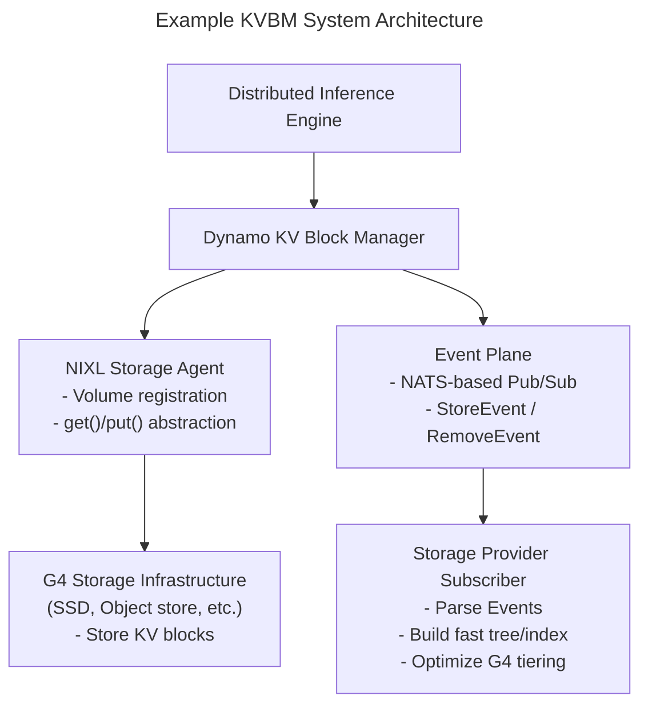

<!--
SPDX-FileCopyrightText: Copyright (c) 2025 NVIDIA CORPORATION & AFFILIATES.
All rights reserved.
SPDX-License-Identifier: Apache-2.0

Licensed under the Apache License, Version 2.0 (the "License");
you may not use this file except in compliance with the License.
You may obtain a copy of the License at

http://www.apache.org/licenses/LICENSE-2.0

Unless required by applicable law or agreed to in writing, software
distributed under the License is distributed on an "AS IS" BASIS,
WITHOUT WARRANTIES OR CONDITIONS OF ANY KIND, either express or implied.
See the License for the specific language governing permissions and
limitations under the License.
-->

# Understanding KVBM components

The design of the KVBM is inspired from vLLM and SGLang KV block managers but with a twist from historical memory tiering design aspired in general GPU programming. [See KVBM Reading](kvbm_reading.md). The following figure shows the internal architecture of KVBM and how it works across workers using NIXL.


**Internal architecture and key modules in the Dynamo KVBM**

## KvBlockManager as Orchestration Layer

The `KvBlockManager <H, D>` acts as a coordinator across memory tiers—host (CPU), device (GPU), and remote—by managing per-backend block pools and exposing consistent block lifecycle APIs. It tracks KV block locations across device memory (G1), CPU memory within and across nodes (G2), local/pooled SSDs (G3), and remote storage (G4). G1-G4 are key tiers enabled by KVBM. Critical to note that KVBM treats G4 storage as an opaque blob store, unaware of internal layout optimizations.

`KvBlockManager<H, D>` owns:

* A device-side `BlockPool<Device>`
* A host-side `BlockPool<Host>`
* A remote NIXL agent that supports communication and memory sharing across nodes
* A block set registry for remote lookup and import/export of block metadata

Implementation-wise, `KvBlockManagerState` holds the logic: it's initialized by `KvBlockManagerConfig`, which merges runtime, model, and layout configurations. `NixlOptions` injects remote awareness.

## Block Layout and Memory Mapping

Each block is a 2D array `[num_layers][page_size × inner_dim]`. `BlockLayouttrait` abstracts the memory layout. The default implementation,`FullyContiguous`, stores all layers for all blocks in one region with alignment-aware stride computation:


```none
block_stride_in_bytes = align_up(num_layers × layer_stride, alignment);
```


Both CPU and GPU pools share this memory layout, but they use storage-specific backends:

* `DeviceStorage` → CUDA device buffer
* `PinnedStorage` → page-locked host memory
* `SystemStorage` → CPU heap memory (fallback/test)
* `NixlStorage` → remote memory through NIXL RDMA handles (includes storage)

Each layout is constructed using a `LayoutConfig`, and storage is either passed directly or allocated using a StorageAllocator.

## BlockPool and Memory Pools (Active and Inactive)

Each `BlockPool<T>` (where `T` is `DeviceStorage`, `PinnedStorage`, and so forth) tracks two sub-pools:

* `ActivePool`: Contains blocks currently in use by sequences
* `InactivePool`: Recycled blocks ready for allocation; think free list

When a token block is requested (for example, `get_mutable_block()`), the allocator pops from `InactivePool`, transitions its state, and returns a writable handle. On sequence commit or eviction, the system resets blocks and returns them to the inactive pool.

The state machine (`BlockState`) that tracks the block lifecycle transitions includes:

| State | Description | Ownership | Valid Actions/Transitions |
| ----- | ----- | ----- | ----- |
| Reset | Block hasn't been initialized or was reset. No associated sequence. | Held in InactivePool, reusable | init_sequence(salt_hash) → Partial |
| Partial | Block is being filled with tokens for a new sequence. In-progress. | Owned by the sequence creator | add_token() / add_tokens() (accumulate)- commit() → Complete- reset() → Reset |
| Complete | Block is fully filled with token data but not yet visible to others. | Still owned by creator thread | register() → Registered- reset() → Reset |
| Registered | Block is finalized and visible for reuse. Available in the deduplication cache. Can use block for lookups | Shared ownership (global registry) | Auto drop() → triggers Remove event and transitions to Reset |

This table lists the valid KVBM transitions:

| From → To | Trigger | Validation |
| ----- | ----- | ----- |
| Reset → Partial | initsequence(salt_hash) | Must not be in use |
| Partial → Complete | commit() | Must be full |
| Complete → Registered | register() | Must be finalized |
| Registered → Reset | Drop of RegistrationHandle | Automatic |
| Partial → Reset | Aborted sequence | Explicit or drop |
| Complete → Reset | Invalidated | Explicit or drop |

Consider this example lifecycle of a block in the KVBM; in it, a sequence requests a new KV block:

1. Allocator pops from InactivePool → Block is in Reset
2. `init_sequence()` → Transitions to Partial
3. Tokens are appended → State remains Partial
4. On full → `commit()` → State becomes Complete
5. `register()` → Block is hashed and moved to Registered. Blocks can now be used to lookup.
6. On eviction or end-of-life → `drop()` of RAII handle returns block to Reset

## Lifecycle Management using RAII and Event Plane

The system uses RAII for memory lifecycle management. Every block holds metadata and registration state, and registration is coupled with an `EventManager`. On registration and drop:

* `PublishHandle` triggers Register events
* Dropping it triggers Remove events

This pattern ensures consistency for shared memory tracking across workers without requiring explicit deallocation logic. The events are propagated in the Dynamo Events plane. Any Dynamo component subscribed to the events plane can listen to these changes. Note that even the storage provider can subscribe to the events plane and create an internal prefix tree representation that is tailored and optimized for the specific platform.

## Remote Memory Integration using NIXL

The NIXL agent exposes remote memory buffers using `NixlBlockSet`, `RemoteBlocks`, and layout descriptors. Key operations include:

* `nixl_register()`: Registers memory region with NIXL runtime
* `serialize() / deserialize()`: Converts layout and memory into transferable descriptors
* `import_remote_blockset()`: Loads remote node's block layouts into the manager
* `get_remote_blocks_mutable()`: Fetches transferable memory views from another node

`RemoteBlocks` is a lightweight abstraction over shared memory for cross-node block usage (through UCX or other backends).

The left side of the figure in [Understanding KVBM Components](#understanding-kvbm-components) illustrates a bidirectional remote memory registration and layout synchronization protocol between workers (for example, Worker 1 and Worker 2) using NIXL. The following steps break down the process:

1. *Agent Creation & Memory Registration:*

   Each worker independently sets up a NixlAgent:
    * Registers its memory regions (that is, device memory) through `nixl_register()`.
    * These regions correspond to blocks managed in the local BlockPool.
      Once the worker registers the memory, NIXL creates remote-accessible descriptors, which it binds to the memory layout.

2. *Metadata exchange:*

   After memory registration, workers exchange serialized layout metadata, encapsulated in a `SerializedNixlBlockLayout`.

    Why is this step critical?
   * LLM inference workloads often differ in *tensor parallel (TP)* configurations:
     * Worker 1 might have TP=4, while Worker 2 has TP=8.
     * Thus, even if both systems use similar `FullyContiguous` layouts, their internal slicing and alignment assumptions differ.
   * The metadata exchange bridges this semantic mismatch by sharing:
     * LayoutConfig (num_layers, page_size, inner_dim, dtype)
     * BlockSetID
     * Base address + stride information (including alignment)
     * Device ID + memory type (host/device)
   * Once the workers share metadata, each can reconstruct the layout on its side using deserialize().
  This enables NIXL to:
      * Understand where each layer/block resides
      * Perform correct gather-scatter operations during RDMA-like transfers

    Without this step, remote fetches would result in data corruption or misaligned tokens.

3. *Serialization & Deserialization: Making Layouts Portable*

   In the serialization stage, KVBM exports and `FullyContiguous::serialize()` encodes:
   * FullyContiguousConfig
   * base_offset
   * Physical memory descriptors (NixlStorage), including:
     * Memory type (VRAM, DRAM)
     * Address & size
     * Device ID

       The system sends this using NIXL transfer and then injects it into a KVBM scheduler state. In the deserialization stage, `SerializedNixlBlockLayout::deserialize()` rehydrates this into:
       * A fully reconstructed memory layout view
       * Local representation of a remote memory slice with correct offsets and size semantics
       It also enables direct access to remote memory with consistent logical semantics
       This guarantees that even across different system configurations (hardware or LLM shape), both parties agree on the memory view for each KV block.

4. *Ownership handles and lifetime tracking*

    Memory ownership in NIXL is tightly coupled with RAII-based handles:
     * When a block is registered, it returns a `PublishHandle` which wraps a `RegistrationHandle`
     * On drop of this handle, an automatic Remove event is published, which:
       * Deregisters the block from the NIXL layer
       * Removes it from the remote block registry
     * This ensures that, once the block is evicted from the cache or no longer used in inference, all references are invalidated cleanly across nodes
       This mechanism avoids:
     * Stale memory access
     * Dangling pointers on GPU or host
     * Manual deregistration bugs
       The system can batch and publish registration events using a Publisher, optimizing performance under high concurrency


## Storage backends and pluggability

You can integrate KVBM with a storage backend by extending or wrapping `NixlEnabledStorage` to support cross-node RDMA registration. All layouts and block pools are generic over these backends, allowing for fine-grained control over memory tiers. We defer detailed integration guidance, since we collaborate with storage partners to simplify and standardize these integration paths.



For now, the following breakdown provides a high-level understanding of how KVBM interacts with external storage using the NIXL storage interface and the Dynamo Event Plane:

### NIXL Storage Interface (for Backend Integration)

The NIXL interface abstracts volume interaction and decouples it from mounting, metadata tracking, or direct system I/O. It provides:

* registerVolume(descriptor): Register a logical volume for KV cache data.
* unregisterVolume(): Cleanly deregister and release volume mappings.
* get() / put(): Block-level APIs used by KVBM to fetch and store token blocks.

These abstractions allow backends to be integrated without tying into the host's file system stack, enabling safe interaction with block devices, local filesystems, and RDMA-capable volumes. Please note that these APIs are still being finalized.

### Dynamo Event Plane (Pub/Sub Coordination Layer)

To support external storage optimizations without modifying KVBM logic, we provide an **event plane** built on NATS.io that emits lifecycle events for all block operations. Particularly there are two events emitted.

* StoreEvent: Emitted when a KV block is registered.
* RemoveEvent: Emitted when a KV block is released or evicted.

Each KVEvent (\~100 bytes) contains:

* sequence_hash: Unique identifier of the KV block
* prefix_hash: Prefix grouping for query-level aggregation
* block_size: Size in bytes
* storage_location: Logical volume identifier
* event_type: Store or Remove
* extra_metadata: Reserved fields for partner-specific optimization

For scalability, the system batches and publishes these events periodically (for example, every \~10s, or dynamically based on system load).

### A conceptual design of a storage advisor

This section provides an overview for the storage provider who is interested in integrating as a custom backend to KVBM and providing optimized performance. **Please note, this is optional for KVBM integration with a backend.**

External storage systems are not tightly coupled with Dynamo's execution pipeline. Instead, they passively observe KV block lifecycle events through a subscription model:

* Storage volumes are pre-provisioned and mounted by the storage provider.
* These volumes are then registered with Dynamo through the NIXL Storage Agent using registerVolume() APIs. Dynamo itself does not manage mounts or provisioning.
* The Dynamo KV Block Manager interacts only with logical block-level APIs (that is, get() and put()).
* In parallel, the Event Plane asynchronously broadcasts KV lifecycle events using a NATS-based pub/sub channel.
* Storage vendors implement a lightweight subscriber process that listens to these events without interfering with the KV Manager's runtime behavior.
* This decoupling ensures that external storage systems can optimize block placement and lifecycle tracking without modifying or instrumenting the core Dynamo codebase.

Now, to enable fast lookup and dynamic tiering, storage vendors may build internal data structures using the received event stream. Here is a high level conceptual design:

* On receiving a StoreEvent, the storage system:
  * Inserts a record into an internal prefix tree, hash map, or LRU index.
  * This record includes the prefix_hash and sequence_hash, which logically identify the token block and its grouping.
  * Associated metadata (for example, block_size, storage_location) is also captured.
* On receiving a RemoveEvent, the system:
  * Deletes or prunes the corresponding record from its index.
  * Optionally triggers cleanup or tier migration workflows.

This event-driven indexing allows the storage system to track which KV blocks are live and where they belong—enabling low-latency lookup, efficient space reclamation, and multi-tier coordination. With real-time visibility into KV block usage patterns, the storage system can implement smart tiering policies, such as:

* Hot block promotion: Frequently accessed KV blocks can be migrated to fast SSD volumes.
* Cold block demotion: Infrequently used blocks can be demoted to slower storage (for example, HDDs, cloud object storage).
* Proactive compaction: If block sizes or prefix patterns indicate fragmentation, the storage backend can coalesce or rewrite blocks.

These optimizations are performed entirely outside of Dynamo, with the assumption that storage providers adhere to SLA guarantees and volume availability.

Critically, this entire system is designed to be non-intrusive:

* The Dynamo KV Block Manager remains agnostic to how data is stored or optimized.
* The Event Plane doesn't block or intercept any critical path of inference.
* Storage vendors are given the freedom to innovate and optimize without requiring changes to the inference runtime.

This design ensures that performance, resilience, and extensibility scale independently across the KV layer and the storage backend layer.
