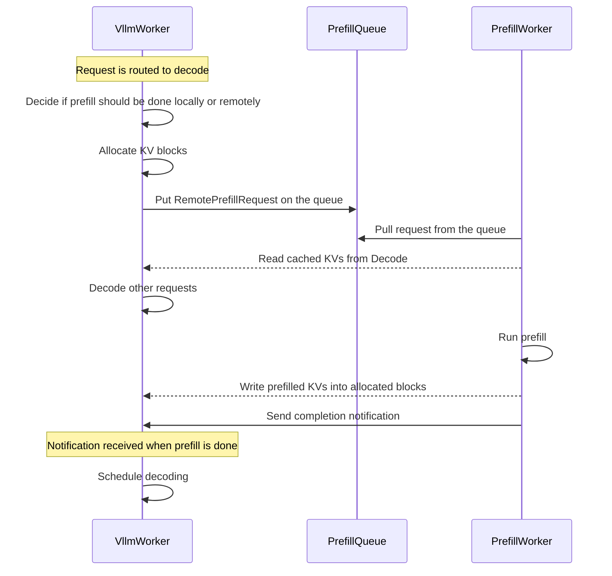

<!--
SPDX-FileCopyrightText: Copyright (c) 2025 NVIDIA CORPORATION & AFFILIATES. All rights reserved.
SPDX-License-Identifier: Apache-2.0

Licensed under the Apache License, Version 2.0 (the "License");
you may not use this file except in compliance with the License.
You may obtain a copy of the License at

http://www.apache.org/licenses/LICENSE-2.0

Unless required by applicable law or agreed to in writing, software
distributed under the License is distributed on an "AS IS" BASIS,
WITHOUT WARRANTIES OR CONDITIONS OF ANY KIND, either express or implied.
See the License for the specific language governing permissions and
limitations under the License.
-->

# LLM Deployment Examples

This directory contains examples and reference implementations for deploying Large Language Models (LLMs) in various configurations.

## Use the Latest Release

We recommend using the latest stable release of dynamo to avoid breaking changes:

[](https://github.com/ai-dynamo/dynamo/releases/latest)

You can find the latest release [here](https://github.com/ai-dynamo/dynamo/releases/latest) and check out the corresponding branch with:

```bash
git checkout $(git describe --tags $(git rev-list --tags --max-count=1))
```

## Components

- workers: Prefill and decode worker handles actual LLM inference
- router: Handles API requests and routes them to appropriate workers based on specified strategy
- frontend: OpenAI compatible http server handles incoming requests

## Deployment Architectures

### Aggregated
Single-instance deployment where both prefill and decode are done by the same worker.

### Disaggregated
Distributed deployment where prefill and decode are done by separate workers that can scale independently.



## Getting Started

1. Choose a deployment architecture based on your requirements
2. Configure the components as needed
3. Deploy using the provided scripts

### Prerequisites

Start required services (etcd and NATS) using [Docker Compose](../../deploy/metrics/docker-compose.yml)
```bash
docker compose -f deploy/metrics/docker-compose.yml up -d
```

### Build the container image for your platform

```bash
# On an x86 machine
./container/build.sh --framework VLLM

# On an ARM machine (ex: GB200)
./container/build.sh --framework VLLM --platform linux/arm64
```

```{note}
Building a vLLM docker image for ARM machines currently involves building vLLM from source, which is known to have performance issues to require extensive system RAM; see [vLLM Issue 8878](https://github.com/vllm-project/vllm/issues/8878).

You can tune the number of parallel build jobs for building VLLM from source
on ARM based on your available cores and system RAM with `VLLM_MAX_JOBS`.

For example, on an ARM machine with low system resources:
`./container/build.sh --framework VLLM --platform linux/arm64 --build-arg VLLM_MAX_JOBS=2`

For example, on a GB200 which has very high CPU cores and memory resource:
`./container/build.sh --framework VLLM --platform linux/arm64 --build-arg VLLM_MAX_JOBS=64`

When vLLM has pre-built ARM wheels published, this process can be improved.

You can tune the number of parallel build jobs for building VLLM from source
on ARM based on your available cores and system RAM with `VLLM_MAX_JOBS`.

For example, on an ARM machine with low system resources:
`./container/build.sh --framework VLLM --platform linux/arm64 --build-arg VLLM_MAX_JOBS=2`

For example, on a GB200 which has very high CPU cores and memory resource:
`./container/build.sh --framework VLLM --platform linux/arm64 --build-arg VLLM_MAX_JOBS=64`

When vLLM has pre-built ARM wheels published, this process can be improved.
```
### Run the container you have built

```
./container/run.sh -it --framework VLLM
```

## Run Deployment

This figure shows an overview of the major components to deploy:

```
                                                 +----------------+
                                          +------| prefill worker |-------+
                                   notify |      |                |       |
                                 finished |      +----------------+       | pull
                                          v                               v
+------+      +-----------+      +------------------+    push     +---------------+
| HTTP |----->| processor |----->| decode/monolith  |------------>| prefill queue |
|      |<-----|           |<-----|      worker      |             |               |
+------+      +-----------+      +------------------+             +---------------+
                  |    ^                  |
       query best |    | return           | publish kv events
           worker |    | worker_id        v
                  |    |         +------------------+
                  |    +---------|     kv-router    |
                  +------------->|                  |
                                 +------------------+

```

```{note}
The planner component is enabled by default for all deployment architectures but is set to no-op mode. This means the planner observes metrics but doesn't take scaling actions. To enable active scaling, you can add `--Planner.no-operation=false` to your `dynamo serve` command.
For more details, see [Planner Architecture Overview](../architecture/planner_intro.rst).
```
