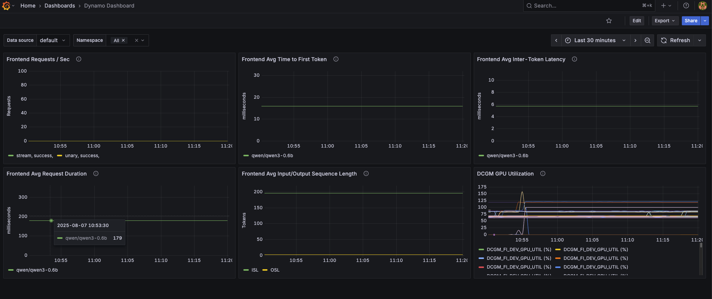

# Dynamo Metrics Collection on Kubernetes

## Overview

This guide provides a walkthrough for collecting and visualizing metrics from Dynamo components using the kube-prometheus-stack. The kube-prometheus-stack provides a powerful and flexible way to configure monitoring for Kubernetes applications through custom resources like PodMonitors, making it easy to automatically discover and scrape metrics from Dynamo components.

## Prerequisites

### Install Dynamo Operator
Before setting up metrics collection, you'll need to have the Dynamo operator installed in your cluster. Follow our [Installation Guide](../dynamo_deploy/dynamo_cloud.md) for detailed instructions on deploying the Dynamo operator.

### Install kube-prometheus-stack
If you don't have an existing Prometheus setup, you'll likely want to install the kube-prometheus-stack. This is a collection of Kubernetes manifests that includes the Prometheus Operator, Prometheus, Grafana, and other monitoring components in a pre-configured setup. The stack introduces custom resources that make it easy to deploy and manage monitoring in Kubernetes:

- `PodMonitor`: Automatically discovers and scrapes metrics from pods based on label selectors
- `ServiceMonitor`: Similar to PodMonitor but works with Services
- `PrometheusRule`: Defines alerting and recording rules

For a basic installation:
```bash
helm repo add prometheus-community https://prometheus-community.github.io/helm-charts
helm repo update
# Values allow podmnonitors to be picked up that are outside of the kube-prometheus-stack helm release
helm install prometheus prometheus-community/kube-prometheus-stack \
  --set prometheus.prometheusSpec.podMonitorSelectorNilUsesHelmValues=false \
  --set prometheus.prometheusSpec.podMonitorNamespaceSelector="{}" \
  --set prometheus.prometheusSpec.probeNamespaceSelector="{}"
```

> [!Note]
> The commands enumerated below assume you have installed the kube-prometheus-stack with the installation method listed above. Depending on your installation configuration of the monitoring stack, you may need to modify the `kubectl` commands that follow in this document accordingly (e.g modifying Namespace or Service names accordingly).

### DCGM Metrics Collection (Optional)

GPU utilization metrics are collected and exported to Prometheus via dcgm-exporter. The Dynamo Grafana dashboard includes a panel for GPU utilization related to your Dynamo deployment. For that panel to be populated, you need to ensure that the dcgm-exporter is running in your cluster. To check if the dcgm-exporter is running, please run the following command:

```bash
kubectl get daemonset -A | grep dcgm-exporter
```

If the output is empty, you need to install the dcgm-exporter. For more information, please consult the official [dcgm-exporter documentation](https://docs.nvidia.com/datacenter/cloud-native/gpu-telemetry/latest/dcgm-exporter.html).


## Deploy a DynamoGraphDeployment

Let's start by deploying a simple vLLM aggregated deployment:

```bash
export NAMESPACE=dynamo # namespace where dynamo operator is installed
pushd components/backends/vllm/deploy
kubectl apply -f agg.yaml -n $NAMESPACE
popd
```

This will create two components:
- A Frontend component exposing metrics on its HTTP port
- A Worker component exposing metrics on its system port

Both components expose a `/metrics` endpoint following the OpenMetrics format, but with different metrics appropriate to their roles. For details about:
- Deployment configuration: See the [vLLM README](../../components/backends/vllm/README.md)
- Available metrics: See the [metrics guide](../metrics.md)

### Validate the Deployment

Let's send some test requests to populate metrics:

```bash
curl localhost:8000/v1/chat/completions \
  -H "Content-Type: application/json" \
  -d '{
    "model": "Qwen/Qwen3-0.6B",
    "messages": [
    {
        "role": "user",
        "content": "In the heart of Eldoria, an ancient land of boundless magic and mysterious creatures, lies the long-forgotten city of Aeloria. Once a beacon of knowledge and power, Aeloria was buried beneath the shifting sands of time, lost to the world for centuries. You are an intrepid explorer, known for your unparalleled curiosity and courage, who has stumbled upon an ancient map hinting at ests that Aeloria holds a secret so profound that it has the potential to reshape the very fabric of reality. Your journey will take you through treacherous deserts, enchanted forests, and across perilous mountain ranges. Your Task: Character Background: Develop a detailed background for your character. Describe their motivations for seeking out Aeloria, their skills and weaknesses, and any personal connections to the ancient city or its legends. Are they driven by a quest for knowledge, a search for lost familt clue is hidden."
    }
    ],
    "stream": true,
    "max_tokens": 30
  }'
```

For more information about validating the deployment, see the [vLLM README](../../components/backends/vllm/README.md).

## Set Up Metrics Collection

### Create PodMonitors

The Prometheus Operator uses PodMonitor resources to automatically discover and scrape metrics from pods. To enable this discovery, the Dynamo operator automatically adds these labels to all pods:
- `nvidia.com/metrics-enabled: "true"` - Enables metrics collection
- `nvidia.com/dynamo-component-type: "frontend|worker"` - Identifies the component type

> **Note**: You can opt-out specific deployments from metrics collection by adding this annotation to your DynamoGraphDeployment:
```yaml
apiVersion: nvidia.com/v1
kind: DynamoGraphDeployment
metadata:
  name: my-deployment
  annotations:
    nvidia.com/enable-metrics: "false"
spec:
  # …
```

Let's create two monitors - one for each component type:

First, create the frontend PodMonitor:

```yaml
apiVersion: monitoring.coreos.com/v1
kind: PodMonitor
metadata:
  name: dynamo-frontend-metrics
  namespace: $NAMESPACE
spec:
  selector:
    matchLabels:
      nvidia.com/metrics-enabled: "true"
      nvidia.com/dynamo-component-type: "frontend"
  podMetricsEndpoints:
    - port: http
      path: /metrics
      interval: 2s
  namespaceSelector:
    matchNames:
      - $NAMESPACE
```

Then, create the worker PodMonitor:

```yaml
apiVersion: monitoring.coreos.com/v1
kind: PodMonitor
metadata:
  name: dynamo-worker-metrics
  namespace: $NAMESPACE
spec:
  selector:
    matchLabels:
      nvidia.com/metrics-enabled: "true"
      nvidia.com/dynamo-component-type: "worker"
  podMetricsEndpoints:
    - port: system
      path: /metrics
      interval: 2s
  namespaceSelector:
    matchNames:
      - $NAMESPACE
```

If you are using planner, you can also create a PodMonitor for the planner:
```yaml
apiVersion: monitoring.coreos.com/v1
kind: PodMonitor
metadata:
  name: dynamo-planner-metrics
  namespace: $NAMESPACE
spec:
  selector:
    matchLabels:
      nvidia.com/metrics-enabled: "true"
      nvidia.com/dynamo-component-type: "planner"
  podMetricsEndpoints:
    - port: metrics
      path: /metrics
      interval: 2s
  namespaceSelector:
    matchNames:
      - $NAMESPACE
```

Apply the PodMonitors:
```bash
pushd deploy/metrics/k8s
# envsubst replaces ${NAMESPACE} with the actual namespace value
envsubst < frontend-podmonitor.yaml | kubectl apply -n $NAMESPACE -f -
envsubst < worker-podmonitor.yaml | kubectl apply -n $NAMESPACE -f -
envsubst < planner-podmonitor.yaml | kubectl apply -n $NAMESPACE -f -
popd
```

This will cause Prometheus to be re-configured to scrape metrics from the pods of your DynamoGraphDeployment.

### Configure Grafana Dashboard

Apply the Dynamo dashboard configuration to populate Grafana with the Dynamo dashboard:
```bash
pushd deploy/metrics/k8s
kubectl apply -n monitoring -f grafana-dynamo-dashboard-configmap.yaml
popd
```

The dashboard is embedded in the ConfigMap. Since it is labeled with `grafana_dashboard: "1"`, the Grafana will discover and populate it to its list of available dashboards. The dashboard includes panels for:
- Frontend request rates
- Time to first token
- Inter-token latency
- Request duration
- Input/Output sequence lengths
- GPU utilization via DCGM

## Viewing the Metrics

### In Prometheus
```bash
kubectl port-forward svc/prometheus-kube-prometheus-prometheus 9090:9090 -n monitoring
```

Visit http://localhost:9090 and try these example queries:
- `dynamo_frontend_requests_total`
- `dynamo_frontend_time_to_first_token_seconds_bucket`


### In Grafana
```bash
# Get Grafana credentials
export GRAFANA_USER=$(kubectl get secret -n monitoring prometheus-grafana -o jsonpath="{.data.admin-user}" | base64 --decode)
export GRAFANA_PASSWORD=$(kubectl get secret -n monitoring prometheus-grafana -o jsonpath="{.data.admin-password}" | base64 --decode)
echo "Grafana user: $GRAFANA_USER"
echo "Grafana password: $GRAFANA_PASSWORD"

# Port forward Grafana service
kubectl port-forward svc/prometheus-grafana 3000:80 -n monitoring
```

Visit http://localhost:3000 and log in with the credentials captured above.

Once logged in, find the Dynamo dashboard under General.


