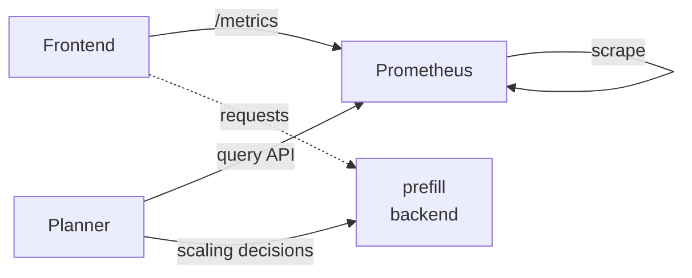

# SLA Planner Deployment Guide

Quick deployment guide for the vLLM disaggregated planner with automatic scaling.

> [!NOTE]
> For high-level architecture and concepts, see [SLA-based Planner](../../architecture/sla_planner.md).

## Architecture Overview

**Components:**
- **Frontend**: Serves requests and exposes `/metrics`
- **Prometheus**: Scrapes frontend metrics every 5 seconds
- **Planner**: Queries Prometheus and adjusts worker scaling every 60 seconds
- **Workers**: prefill and backend workers handle inference



## Prerequisites
- Kubernetes cluster with GPU nodes
- `hf-token-secret` created in target namespace
- [Pre-Deployment Profiling](../../architecture/pre_deployment_profiling.md) results saved to `profiling-pvc` PVC.
- Prefill and decode worker uses the best parallelization mapping suggested by the pre-deployment profiling script.

```bash
export NAMESPACE=your-namespace
```

## 1. Deploy the System

```bash
# Apply the disaggregated planner deployment
kubectl apply -f components/backends/vllm/deploy/disagg_planner.yaml -n $NAMESPACE

# Check deployment status
kubectl get pods -n $NAMESPACE
```

Expected pods (all should be `1/1 Running`):
```
vllm-disagg-planner-frontend-*            1/1 Running
vllm-disagg-planner-prometheus-*          1/1 Running
vllm-disagg-planner-planner-*             1/1 Running
vllm-disagg-planner-backend-*             1/1 Running
vllm-disagg-planner-prefill-*             1/1 Running
```

## 2. Test the System

**Important:** Streaming requests (`"stream": true`) are required for the planner to collect latency metrics and make scaling decisions. Non-streaming requests will produce successful inference outputs but won't provide the necessary telemetry for automatic scaling.

```bash
# Port forward to frontend
kubectl port-forward -n $NAMESPACE deployment/vllm-disagg-planner-frontend 8000:8000

# Send a streaming request (required for full metrics)
curl http://localhost:8000/v1/chat/completions \
  -H "Content-Type: application/json" \
  -d '{
    "model": "Qwen/Qwen3-0.6B",
    "messages": [
    {
        "role": "user",
        "content": "In the heart of Eldoria, an ancient land of boundless magic and mysterious creatures, lies the long-forgotten city of Aeloria. Once a beacon of knowledge and power, Aeloria was buried beneath the shifting sands of time, lost to the world for centuries. You are an intrepid explorer, known for your unparalleled curiosity and courage, who has stumbled upon an ancient map hinting at ests that Aeloria holds a secret so profound that it has the potential to reshape the very fabric of reality. Your journey will take you through treacherous deserts, enchanted forests, and across perilous mountain ranges. Your Task: Character Background: Develop a detailed background for your character. Describe their motivations for seeking out Aeloria, their skills and weaknesses, and any personal connections to the ancient city or its legends. Are they driven by a quest for knowledge, a search for lost familt clue is hidden."
    }
    ],
    "stream":true,
    "max_tokens": 30
  }'
```

## 3. Monitor Scaling

```bash
# Check planner logs for scaling decisions
kubectl logs -n $NAMESPACE deployment/vllm-disagg-planner-planner --tail=10

# Expected successful output (after streaming requests):

# New adjustment interval started!
# Observed num_req: X.XXX isl: X.XXX osl: X.XXX
# Observed ttft: X.XXXs itl: X.XXXs
# Number of prefill workers: 1, number of decode workers: 1
```

### Metrics Requirements
- **Basic metrics** (request count): Available with any request type
- **Latency metrics** (TTFT/ITL): Only available with `"stream": true` requests
- **Scaling decisions**: Require sufficient request volume and streaming requests

## 4. Troubleshooting

**Connection Issues:**
```bash
# Verify Prometheus is accessible (runs on port 8000)
kubectl port-forward -n $NAMESPACE deployment/vllm-disagg-planner-prometheus 8000:8000
curl "http://localhost:8000/api/v1/query?query=up"
```

**Missing Metrics:**
```bash
# Check frontend metrics
kubectl port-forward -n $NAMESPACE deployment/vllm-disagg-planner-frontend 8000:8000
curl http://localhost:8000/metrics | grep nv_llm_http_service
```

**Worker Issues:**
- Large models can take 10+ minutes to initialize
- Check worker logs: `kubectl logs -n $NAMESPACE deployment/vllm-disagg-planner-backend`
- Ensure GPU resources are available for workers
