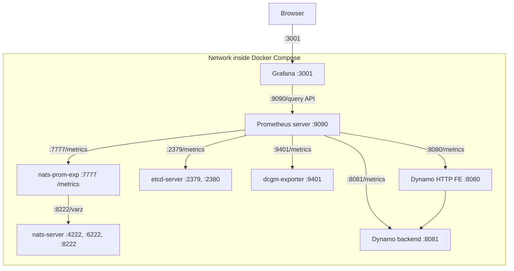

<!--
SPDX-FileCopyrightText: Copyright (c) 2025 NVIDIA CORPORATION & AFFILIATES. All rights reserved.
SPDX-License-Identifier: Apache-2.0

Licensed under the Apache License, Version 2.0 (the "License");
you may not use this file except in compliance with the License.
You may obtain a copy of the License at

http://www.apache.org/licenses/LICENSE-2.0

Unless required by applicable law or agreed to in writing, software
distributed under the License is distributed on an "AS IS" BASIS,
WITHOUT WARRANTIES OR CONDITIONS OF ANY KIND, either express or implied.
See the License for the specific language governing permissions and
limitations under the License.
-->

# Dynamo MetricsRegistry

## Overview

Dynamo provides built-in metrics capabilities through the `MetricsRegistry` trait, which is automatically available whenever you use the `DistributedRuntime` framework. This guide explains how to use metrics for observability and monitoring across all Dynamo components.

## Automatic Metrics

Dynamo automatically exposes metrics with the `dynamo_` name prefixes. It also adds the following labels `dynamo_namespace`, `dynamo_component`, and `dynamo_endpoint` to indicate which component is providing the metric.

**Frontend Metrics**: When using Dynamo HTTP Frontend (`--framework VLLM` or `--framework TRTLLM`), these metrics are automatically exposed with the `dynamo_frontend_*` prefix and include `model` labels containing the model name. These cover request handling, token processing, and latency measurements. See the [Available Metrics section](../../deploy/metrics/README.md#available-metrics) for the complete list of frontend metrics.

**Component Metrics**: The core Dynamo backend system automatically exposes metrics with the `dynamo_component_*` prefix for all components that use the `DistributedRuntime` framework. These include request counts, processing times, byte transfers, and system uptime metrics. See the [Available Metrics section](../../deploy/metrics/README.md#available-metrics) for the complete list of component metrics.

**Specialized Component Metrics**: Components can also expose additional metrics specific to their functionality. For example, a `preprocessor` component exposes metrics with the `dynamo_preprocessor_*` prefix. See the [Available Metrics section](../../deploy/metrics/README.md#available-metrics) for details on specialized component metrics.

**Kubernetes Integration**: For comprehensive Kubernetes deployment and monitoring setup, see the [Kubernetes Metrics Guide](dynamo_deploy/metrics.md). This includes Prometheus Operator setup, metrics collection configuration, and visualization in Grafana.

## Metrics Hierarchy

The `MetricsRegistry` trait is implemented by `DistributedRuntime`, `Namespace`, `Component`, and `Endpoint`, providing a hierarchical approach to metric collection that matches Dynamo's distributed architecture:

- `DistributedRuntime`: Global metrics across the entire runtime
- `Namespace`: Metrics scoped to a specific dynamo_namespace
- `Component`: Metrics for a specific dynamo_component within a namespace
- `Endpoint`: Metrics for individual dynamo_endpoint within a component

This hierarchical structure allows you to create metrics at the appropriate level of granularity for your monitoring needs.

## Getting Started

For a complete setup guide including Docker Compose configuration, Prometheus setup, and Grafana dashboards, see the [Getting Started section](../../deploy/metrics/README.md#getting-started) in the deploy metrics documentation.

The quick start includes:
- Docker Compose setup for Prometheus and Grafana
- Pre-configured dashboards and datasources
- Access URLs for all monitoring endpoints
- GPU targeting configuration

## Implementation Examples

See [Implementation Examples](../../deploy/metrics/README.md#implementation-examples) for detailed examples of creating metrics at different hierarchy levels and using dynamic labels.

### Grafana Dashboards

Use dashboards in `deploy/metrics/grafana_dashboards/`:
- `grafana-dynamo-dashboard.json`: General Dynamo dashboard
- `grafana-dcgm-metrics.json`: DCGM GPU metrics dashboard

## Metrics Visualization Architecture

### Service Topology

The metrics system follows this architecture for collecting and visualizing metrics:

### Grafana Dashboard

The metrics system includes a pre-configured Grafana dashboard for visualizing service metrics:

## Related Documentation

- [Distributed Runtime Architecture](../architecture/distributed_runtime.md)
- [Dynamo Architecture Overview](../architecture/architecture.md)
- [Backend Guide](backend.md)
- [Metrics Implementation Examples](../../deploy/metrics/README.md#implementation-examples)
- [Complete Metrics Setup Guide](../../deploy/metrics/README.md)