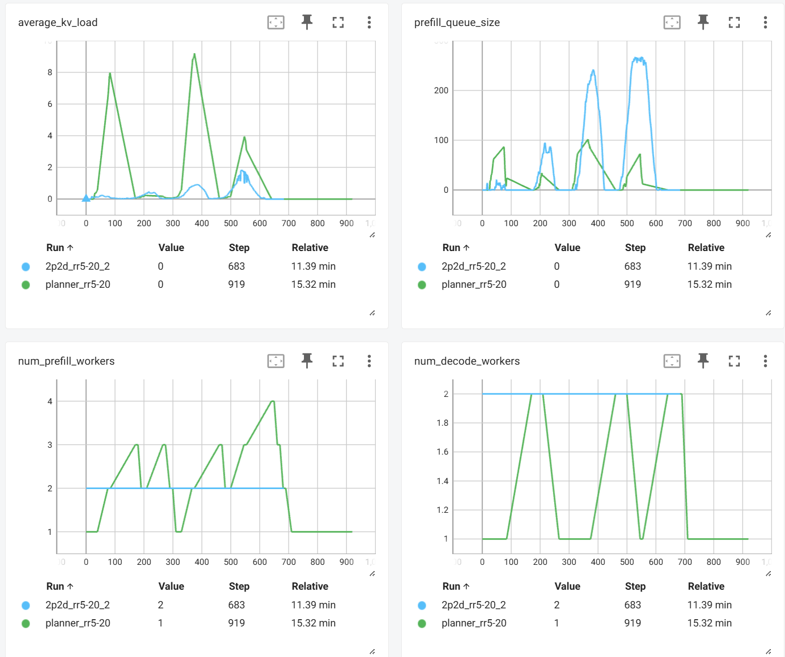

<!--
SPDX-FileCopyrightText: Copyright (c) 2025 NVIDIA CORPORATION & AFFILIATES. All rights reserved.
SPDX-License-Identifier: Apache-2.0

Licensed under the Apache License, Version 2.0 (the "License");
you may not use this file except in compliance with the License.
You may obtain a copy of the License at

http://www.apache.org/licenses/LICENSE-2.0

Unless required by applicable law or agreed to in writing, software
distributed under the License is distributed on an "AS IS" BASIS,
WITHOUT WARRANTIES OR CONDITIONS OF ANY KIND, either express or implied.
See the License for the specific language governing permissions and
limitations under the License.
-->

# Planner Benchmark Example

This guide shows an example of benchmarking `LocalPlanner` performance with synthetic data. In this example, we focus on 8x H100 SXM GPU and `deepseek-ai/DeepSeek-R1-Distill-Llama-8B` model with TP1 prefill and decode engine.

## Synthetic Data Generation

We first generate synthetic data with varying request rate from 0.75 to 3 using the provided `generate_synthetic_data.py` script.

```bash
python sin_synth.py \
    --time-duration 600 \
    --request-rate-min 5 \
    --request-rate-max 20 \
    --request-rate-period 150 \
    --isl1 3000 \
    --osl1 150 \
    --isl2 3000 \
    --osl2 150
```

This will generate a [mooncake style trace](https://github.com/kvcache-ai/Mooncake) with
* duration = 600 seconds
* isl/osl = 3000/150
* request rate varies sinusoidally from 0.75 to 3 requests with a period of 150 seconds

For other models and GPU SKUs, adjust the request rate ranges accordingly to match the load.

## Run the Benchmark

To measure the performance of dynamo with planner, we start from a 1p1d deployment and set planner to make adjustments every 10 seconds:

```bash
cd examples/llm
dynamo serve graphs.disagg:Frontend -f disagg_1p1d.yml

# in terminal 2
genai-perf profile \
    --tokenizer deepseek-ai/DeepSeek-R1-Distill-Llama-8B \
    -m deepseek-ai/DeepSeek-R1-Distill-Llama-8B \
    --service-kind openai \
    --endpoint-type chat \
    --url http://localhost:8000 \
    --streaming \
    --input-file payload:sin_b512_t600_rr5.0-20.0-150.0_io3000150-3000150-0.2-0.8-10.jsonl
```

To view the performance metrics and planner decisions, launch tensorboard with

```bash
tensorboard --logdir log
```

and open `http://localhost:6006` in your browser. The following metrics are available:

* `average_kv_load`: the average KV load in decode workers
* `prefill_queue_size`: the size of the prefill queue
* `num_queued_request`: the number of requests queued in decode workers
* `num_prefill_workers`: the number of prefill workers
* `num_decode_workers`: the number of decode workers
* `num_gpu`: the total number of GPUs used

The benchmark results will be printed out in terminal 3 that runs the `genai-perf` command.

In this example, we use a fixed 2p2d engine as baseline. Planner provides a `--no-operation` flag to watch and log the metrics without making any adjustments:

```bash
# in terminal 1
dynamo serve graphs.disagg:Frontend -f disagg_2p2d.yml

# in terminal 2
genai-perf profile --tokenizer deepseek-ai/DeepSeek-R1-Distill-Llama-8B -m deepseek-ai/DeepSeek-R1-Distill-Llama-8B --service-kind openai --endpoint-type chat --url http://localhost:8000 --streaming --input-file payload:sin_b512_t600_rr5.0-20.0-150.0_io3000150-3000150-0.2-0.8-10.jsonl
```

## Results

The below two figures show the performance comparison between planner and the baseline 2p2d deployment. Planner achieves 1.5x speedup while using 7.4% less GPU resources.




