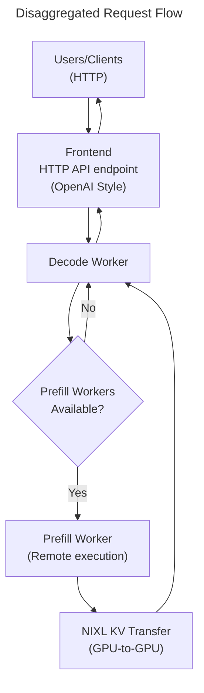
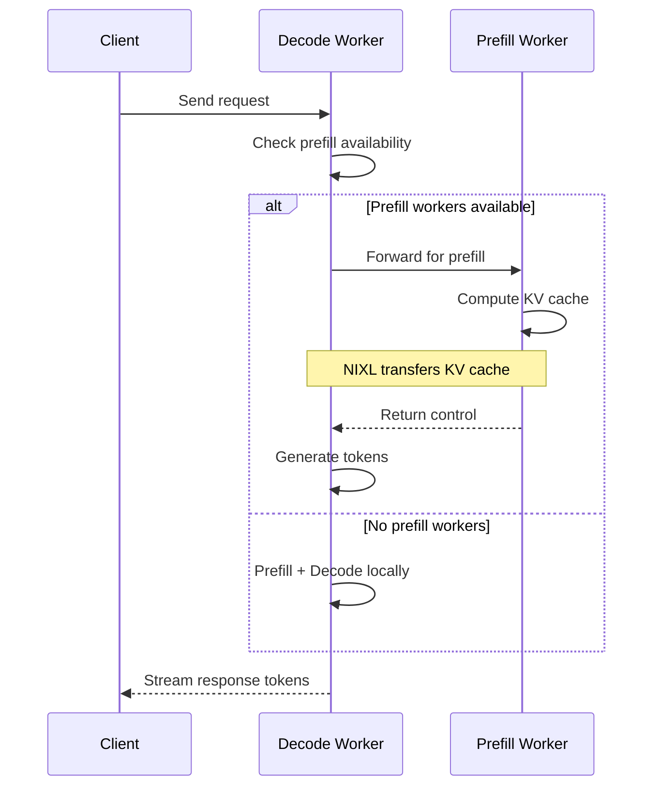

# P/D Disaggregated Serving Example

This example demonstrates Dynamo's **Prefill/Decode Disaggregated Serving** architecture, where the prefill and decode phases of LLM inference are separated into specialized workers for enhanced performance, improved resource utilization, and better scalability.

## What is P/D Disaggregated Serving?

Traditional LLM inference combines two distinct phases with different computational characteristics:

- **Prefill Phase**: Processes the entire input prompt to generate the KV cache (compute-bound)
- **Decode Phase**: Generates output tokens one by one using the KV cache (memory-bound)

Dynamo's disaggregated architecture separates these phases into specialized workers:
- **Prefill Workers**: Optimized for high-throughput parallel processing of input tokens
- **Decode Workers**: Optimized for low-latency sequential token generation

This separation allows for:
- **Better Hardware Utilization**: Use different parallelism configurations optimized for each phase
- **Improved Scalability**: Scale prefill and decode workers independently based on workload
- **Enhanced Performance**: Eliminate head-of-line blocking where long prefills delay ongoing decodes

## Prerequisites

> [!NOTE]
> This example requires having at least 2 GPUs -- one for Prefill and one for Decode

Before running this example, ensure you have the following services running:

- **etcd**: A distributed key-value store used for service discovery and metadata storage
- **NATS**: A high-performance message broker for inter-component communication

You can start these services using Docker Compose:

```bash
docker compose -f deploy/metrics/docker-compose.yml up -d
```

## Components

- [Frontend](../../../components/frontend/README) - HTTP API endpoint that receives requests and forwards them to the decode worker
- [vLLM Prefill Worker](../../../components/backends/vllm/README) - Specialized worker for prefill phase execution
- [vLLM Decode Worker](../../../components/backends/vllm/README) - Specialized worker that handles requests and decides between local/remote prefill



## Instructions

There are four steps to deploy and use disaggregated serving with Dynamo.

### 1. Launch Decode Worker

**Open a new terminal** and start the decode worker:

```bash
export DYN_LOG=debug # Increase log verbosity to see disaggregation
CUDA_VISIBLE_DEVICES=0 python -m dynamo.vllm --model Qwen/Qwen3-0.6B
```

This starts a decode worker that can receive requests and decide whether to:
- Handle short prefills locally (fast path)
- Send long prefills to remote prefill workers (disaggregated path)

Leave this terminal running - it will show Decode Worker logs.

### 2. Launch Prefill Worker

**Open another terminal** and start the prefill worker:

```bash
export DYN_LOG=debug # Increase log verbosity to see disaggregation
CUDA_VISIBLE_DEVICES=1 python -m dynamo.vllm --model Qwen/Qwen3-0.6B --is-prefill-worker
```

This starts a specialized prefill worker that:
- Pulls prefill requests from the NATS queue
- Executes prefill computation efficiently
- Transfers computed KV cache to decode workers via NIXL

Leave this terminal running - it will show Prefill Worker logs.

### 3. Launch Frontend

**Open a third terminal** and start the frontend:

```bash
python -m dynamo.frontend --http-port 8000
```

The frontend will automatically discover the prefill and decode workers through etcd service registry.

### 4. Send Requests

Send requests to test the disaggregated serving setup:

```bash
curl -X POST http://localhost:8000/v1/chat/completions \
  -H 'Content-Type: application/json' \
  -d '{
    "model": "Qwen/Qwen3-0.6B",
    "messages": [
      { "role": "user", "content": "Tell me a story about a cowardly cat" }
    ],
    "stream": false,
    "max_tokens": 1028
  }'
```


## Cleanup

When you're done with the disaggregated serving example:

### 1. Stop Dynamo Components

In each terminal, press `Ctrl+C` to stop:
- Frontend (terminal from step 3)
- Prefill Worker (terminal from step 2)
- Decode Worker (terminal from step 1)

### 2. Stop Infrastructure Services

Stop the etcd and NATS services:

```bash
docker compose -f deploy/metrics/docker-compose.yml down
```

## Understand

### What's Happening Under the Hood

Dynamo's disaggregated serving architecture separates prefill and decode operations for optimal performance:

### 1. Worker Specialization

The system employs two types of specialized workers:

- **Decode Workers**: Handle incoming requests and manage token generation
  - Receive all incoming requests
  - Make routing decisions based on system state
  - Execute the decode phase to generate output tokens

- **Prefill Workers**: Focus exclusively on prefill computation
  - Process input prompts to generate KV cache
  - Transfer computed KV cache to decode workers
  - Return control immediately after prefill completion

### 2. Dynamic Request Routing

The system uses a simple yet effective routing strategy:

- **Availability-Based Routing**: Decode workers monitor prefill worker availability
- **Automatic Fallback**: When no prefill workers are available, decode workers handle everything locally
- **Transparent Operation**: Clients are unaware of whether requests are processed locally or disaggregated

This approach ensures the system remains operational regardless of configuration changes, automatically adapting to the available resources.

### 3. High-Performance KV Cache Transfer

The architecture relies on NVIDIA's NIXL (NVIDIA Inference Transfer Library) for efficient KV cache movement:

- **Direct GPU-to-GPU Transfer**: KV cache data moves directly between GPU memory without CPU involvement
- **Zero-Copy Operations**: Eliminates redundant memory copies for maximum efficiency
- **Automatic Transport Selection**: NIXL chooses the optimal transport (NVLink, InfiniBand, etc.) based on hardware topology

### 4. Request Flow



### 5. Key Benefits

This disaggregated architecture provides several advantages:

1. **Resource Optimization**: Each worker type can be optimized for its specific workload
2. **Independent Scaling**: Add prefill or decode workers based on workload characteristics
3. **Improved Latency**: Ongoing decode operations aren't blocked by new prefill requests
4. **Seamless Degradation**: System continues operating even without prefill workers

### 6. Operational Flexibility

The architecture supports various deployment patterns:

- **Single Node**: Prefill and decode workers on different GPUs of the same machine
- **Multi-Node**: Workers distributed across multiple machines for larger scale
- **Dynamic Scaling**: Add or remove workers without disrupting ongoing operations

By separating concerns and using efficient communication mechanisms, Dynamo achieves the performance benefits of disaggregation without the complexity typically associated with distributed systems.
