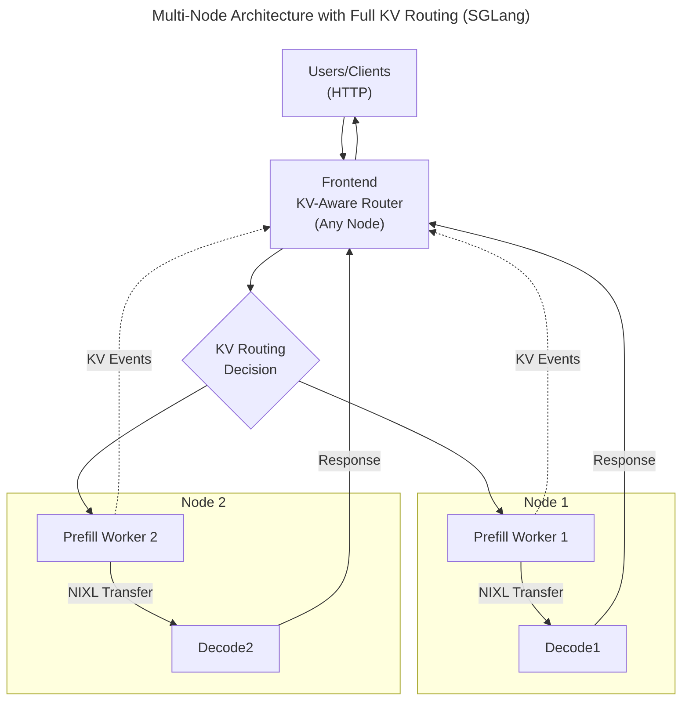

# Multi-Node Dynamo with KV Routing

This example demonstrates running Dynamo across multiple nodes with **KV-aware routing** to distribute requests between two replicas of a disaggregated model. Each replica consists of dedicated prefill and decode workers, providing high availability and load distribution.

For more information about the core concepts, see:
- [Dynamo Disaggregated Serving](../../../docs/architecture/disagg_serving.md)
- [KV Cache Routing Architecture](../../../docs/architecture/kv_cache_routing.md)

## Architecture Overview

The multi-node setup consists of:
- **1 Frontend**: Receives HTTP requests and uses KV routing to distribute them
- **2 Model Replicas**: Each with dedicated prefill and decode workers
- **Smart KV-Aware Routing**: Intelligently routes requests based on KV cache locality across **all workers**



## What is KV-Aware Routing?

KV-aware routing optimizes LLM inference by directing requests to workers that already have relevant data cached. Instead of random or round-robin distribution, the router:

- **Tracks cached data**: Monitors which token sequences are cached on each worker
- **Maximizes cache reuse**: Routes requests to workers with the best cache overlap, reducing redundant computation
- **Balances load**: Considers both cache efficiency and worker utilization when making routing decisions

This is particularly beneficial for:
- **Shared system prompts**: Cached across workers and reused efficiently
- **Multi-turn conversations**: Full conversation history benefits from caching
- **Similar queries**: Common prefixes are computed once and reused
- **Batch processing**: Related requests can be routed to workers with shared context

For detailed technical information about how KV routing works, see the [KV Cache Routing Architecture documentation](../../../docs/architecture/kv_cache_routing.md).

## Prerequisites

### 1. Infrastructure Services

Ensure etcd and NATS are running on a node accessible by all workers:

```bash
# On the infrastructure node (can be Node 1 or a dedicated node)
docker compose -f deploy/docker-compose.yml up -d
```

Note the IP address of this node - you'll need it for worker configuration.

### 2. Software Requirements

Install Dynamo with [SGLang](https://docs.sglang.ai/) support:

```bash
pip install ai-dynamo[sglang]
```

For more information about the SGLang backend and its integration with Dynamo, see the [SGLang Backend Documentation](../../../components/backends/sglang/README.md).

### 3. Network Requirements

Ensure the following ports are accessible between nodes:
- **2379**: etcd client port
- **4222**: NATS client port
- **8000**: Frontend HTTP port (only needed on frontend node)
- **High-speed interconnect**: For optimal NIXL performance (InfiniBand, RoCE, or high-bandwidth Ethernet)

### 4. Hardware Setup

This example assumes:
- **Node 1**: At least 2 GPUs (for Replica 1's decode and prefill workers)
- **Node 2**: At least 2 GPUs (for Replica 2's decode and prefill workers)
- **Frontend Node**: Can be on Node 1, Node 2, or a separate node (no GPU required)

> [!NOTE]
> You can run this example with minimal modifications on a single node with at least 4 GPUs.
> In step 3, modify the `CUDA_VISIBLE_DEVICES` flags to `CUDA_VISIBLE_DEVICES=2`
> for the prefill component and `CUDA_VISIBLE_DEVICES=3` for the decode component.

## Setup Instructions

### Step 1: Set Environment Variables

On all nodes, set the etcd and NATS endpoints:

```bash
# Replace with your infrastructure node's IP
# To find your IP address, run the follwing on your infrastructure node:
# hostname -I | awk '{print $1}'

export INFRA_NODE_IP=<INFRA_NODE_IP>

export ETCD_ENDPOINTS=http://${INFRA_NODE_IP}:2379
export NATS_SERVER=nats://${INFRA_NODE_IP}:4222
export DYN_LOG=debug  # Enable debug logging to see routing decisions
```

### Step 2: Launch Replica 1 (Node 1)

Open a terminal on Node 1 and launch both workers:

```bash
# Launch prefill worker in background
CUDA_VISIBLE_DEVICES=0 python3 -m dynamo.sglang.worker \
    --model-path Qwen/Qwen3-0.6B \
    --served-model-name Qwen/Qwen3-0.6B \
    --page-size 16 \
    --tp 1 \
    --trust-remote-code \
    --skip-tokenizer-init \
    --disaggregation-mode prefill \
    --disaggregation-transfer-backend nixl &

CUDA_VISIBLE_DEVICES=1 python3 -m dynamo.sglang.decode_worker \
    --model-path Qwen/Qwen3-0.6B \
    --served-model-name Qwen/Qwen3-0.6B \
    --page-size 16 \
    --tp 1 \
    --trust-remote-code \
    --skip-tokenizer-init \
    --disaggregation-mode decode \
    --disaggregation-transfer-backend nixl
```

> [!INFO]
> - `CUDA_VISIBLE_DEVICES`: Controls which GPU each worker uses (0 and 1 for different > GPUs)
> - `--page-size 16`: Sets the KV cache block size - must be identical across all workers
> - `--disaggregation-mode`: Separates prefill (prompt processing) from decode (token > generation)
> - `--disaggregation-transfer-backend nixl`: Enables high-speed GPU-to-GPU transfers
> - `--skip-tokenizer-init`: Avoids duplicate tokenizer loading since the frontend > handles tokenization

### Step 3: Launch Replica 2 (Node 2)

Open a terminal on Node 2 and launch both workers:

```bash
# Launch prefill worker in background
CUDA_VISIBLE_DEVICES=0 python3 -m dynamo.sglang.worker \
    --model-path Qwen/Qwen3-0.6B \
    --served-model-name Qwen/Qwen3-0.6B \
    --page-size 16 \
    --tp 1 \
    --trust-remote-code \
    --skip-tokenizer-init \
    --disaggregation-mode prefill \
    --disaggregation-transfer-backend nixl &

# Launch decode worker in foreground
CUDA_VISIBLE_DEVICES=1 python3 -m dynamo.sglang.decode_worker \
    --model-path Qwen/Qwen3-0.6B \
    --served-model-name Qwen/Qwen3-0.6B \
    --page-size 16 \
    --tp 1 \
    --trust-remote-code \
    --skip-tokenizer-init \
    --disaggregation-mode decode \
    --disaggregation-transfer-backend nixl
```

### Step 4: Launch Frontend with KV Routing

Open a terminal on any node and launch the frontend:

```bash
# On any node (no GPU required)
python -m dynamo.frontend \
    --http-port 8000 \
    --router-mode kv
```

Take note of the frontend IP address:

```bash
# On the same node you launched dynamo.frontend
hostname -I | awk '{print $1}'
```

The frontend will:
- Discover all available decode workers via etcd
- Enable KV-aware routing for intelligent request distribution
- Monitor worker health and adjust routing accordingly

For more details about frontend configuration options, see the [Frontend Component Documentation](../../../components/frontend/README.md).

## Testing the Setup

### Prerequisites

Install the [OpenAI Python client](https://github.com/openai/openai-python) library:

```bash
pip install openai
```

Paste in the Dynamo Frontend IP from step 4 (or use localhost if on the same node):

```bash
export DYN_FRONTEND_IP=<PASTE_FRONTEND_IP_HERE>
```

### 1. Simple Request (New Conversation)

Send a request to see it routed to one of the replicas:

```python
from openai import OpenAI
import os

if os.environ.get("DYN_FRONTEND_IP"):
    frontend_ip=os.environ.get("DYN_FRONTEND_IP")
else:
    raise Exception("DYN_FRONTEND_IP is not set")

client = OpenAI(
    base_url=f"http://{frontend_ip}:8000/v1",
    api_key="dummy"  # Not used by Dynamo, but required by OpenAI client
)

response = client.chat.completions.create(
    model="Qwen/Qwen3-0.6B",
    messages=[
        {"role": "user", "content": "What is the capital of France?"}
    ],
    stream=False,
    max_tokens=50
)

print(response.choices[0].message.content)
```

### 2. Multi-Turn Conversation (Tests KV Routing)

Create a conversation to observe how KV routing naturally benefits multi-turn interactions:

```python
from openai import OpenAI
import os

if os.environ.get("DYN_FRONTEND_IP"):
    frontend_ip=os.environ.get("DYN_FRONTEND_IP")
else:
    raise Exception("DYN_FRONTEND_IP is not set")

client = OpenAI(
    base_url=f"http://{frontend_ip}:8000/v1",
    api_key="dummy"  # Not used by Dynamo, but required by OpenAI client
)

# First turn - establishes context
messages = [
    {"role": "system", "content": "You are a helpful assistant."},
    {"role": "user", "content": "My name is Alice. Please remember it."}
]

response1 = client.chat.completions.create(
    model="Qwen/Qwen3-0.6B",
    messages=messages,
    stream=False,
    max_tokens=50
)

print("First response:", response1.choices[0].message.content)

# Add the assistant's response to conversation history
messages.append({"role": "assistant", "content": response1.choices[0].message.content})

# Second turn - includes the full conversation history
# KV routing will likely route this to the same worker due to shared token prefix
messages.append({"role": "user", "content": "What is my name?"})

response2 = client.chat.completions.create(
    model="Qwen/Qwen3-0.6B",
    messages=messages,
    stream=False,
    max_tokens=50
)

print("Second response:", response2.choices[0].message.content)
```

### 3. Load Distribution Test

Send multiple new conversations to see them distributed across replicas:

```python
import asyncio
from openai import AsyncOpenAI
import os

if os.environ.get("DYN_FRONTEND_IP"):
    frontend_ip=os.environ.get("DYN_FRONTEND_IP")
else:
    raise Exception("DYN_FRONTEND_IP is not set")

async def send_request(client, i):
    """Send a single request and return the response"""
    try:
        response = await client.chat.completions.create(
            model="Qwen/Qwen3-0.6B",
            messages=[
                {"role": "user", "content": f"Count to {i}"}
            ],
            stream=False,
            max_tokens=20
        )
        return f"Request {i}: {response.choices[0].message.content}"
    except Exception as e:
        return f"Request {i} failed: {e}"

async def load_test():
    """Send 10 requests in parallel to test load distribution"""
    client = AsyncOpenAI(
        base_url=f"http://{frontend_ip}:8000/v1",
        api_key="dummy"
    )

    # Send 10 requests in parallel
    tasks = [send_request(client, i) for i in range(1, 11)]
    results = await asyncio.gather(*tasks)

    for result in results:
        print(result)

# Run the load test
if __name__ == "__main__":
    asyncio.run(load_test())
```

## Monitoring KV Routing

With `DYN_LOG=debug`, you can observe KV routing decisions in the logs:

```
[DEBUG] KV overlap scores: {worker-1: 15 blocks, worker-2: 8 blocks}
[DEBUG] Selected worker-1 (best overlap: 15 blocks)
[DEBUG] Cache hit rate: 75% for this request
```

### Alternative Routing Modes

While this example demonstrates KV-aware routing for optimal cache utilization, Dynamo also supports simpler routing strategies:

- **KV-Aware** (recommended): Routes based on cache overlap across all workers
- **Round-Robin**: Distributes requests evenly across workers in sequence
- **Random**: Randomly selects workers for each request

```bash
# Example: Use round-robin routing instead of KV routing
python -m dynamo.frontend \
    --http-port 8000 \
    --router-mode round-robin
```

However, for maximum performance with shared prefixes and multi-turn conversations, KV routing provides significant advantages by minimizing redundant computation.

## Monitoring and Debugging

### Check Worker Registration

Verify all workers are properly registered:

```bash
etcdctl --endpoints=$ETCD_ENDPOINTS get --prefix /dynamo/workers/
```

### Monitor Routing Decisions

With `DYN_LOG=debug`, the frontend logs show routing decisions:

```
[DEBUG] KV overlap scores: {prefill-worker-1: 15 blocks, prefill-worker-2: 8 blocks}
[DEBUG] Selected prefill-worker-1 (best overlap: 15 blocks)
[DEBUG] KV overlap scores: {decode-worker-1: 12 blocks, decode-worker-2: 18 blocks}
[DEBUG] Selected decode-worker-2 (best overlap: 18 blocks)
[DEBUG] Worker decode-worker-1 unhealthy, rerouting -> decode-worker-2
```

### Health Checks

Check worker health status:

```bash
curl http://${DYN_FRONTEND_IP}:8000/health
```

## Troubleshooting

### Workers Not Discovering Each Other

1. Verify etcd connectivity from all nodes:
   ```bash
   etcdctl --endpoints=$ETCD_ENDPOINTS endpoint health
   ```

2. Check NATS connectivity:
   ```bash
   nats --server=$NATS_SERVER server check connection
   ```

### NIXL Transfer Failures

1. Ensure GPUs can communicate across nodes
2. Check InfiniBand/RoCE configuration if using high-speed interconnect
3. Verify CUDA IPC is enabled for optimal performance

### Routing Not Working

1. Confirm frontend is started with `--router-mode kv`
2. Check that all workers are properly registered in etcd
3. Verify workers are publishing KV events
4. Check logs for overlap scores - if all zeros, cache tracking may not be working
5. Ensure NATS is functioning for KV event distribution

## Advanced Configuration

For production deployments, you can fine-tune KV routing behavior:

```bash
python -m dynamo.frontend \
    --http-port 8000 \
    --router-mode kv \
    --kv-overlap-score-weight 1.0  # Weight for cache overlap scoring \
    --router-temperature 0.0     # Temperature for probabilistic routing (0 = deterministic)
```

For more advanced configuration options including custom worker selection, block size tuning, and alternative indexing strategies, see the [KV Cache Routing documentation](../../../docs/architecture/kv_cache_routing.md).

## Cleanup

Stop all components in reverse order:

1. Stop Frontend (Ctrl+C in the frontend terminal)
2. Stop workers on each node:
   - On Node 1: Press Ctrl+C in the terminal (this stops the decode worker)
   - On Node 2: Press Ctrl+C in the terminal (this stops the decode worker)
   - To stop the background prefill workers, use one of these methods:
     ```bash
     # Method 1: Kill background jobs in the same terminal
     jobs           # See background jobs
     kill %1        # Kill the background prefill worker

     # Method 2: Close the terminal entirely (sends SIGHUP to background processes)
     exit

     # Method 3: Kill by process name (from any terminal)
     pkill -f "dynamo.sglang.worker.*prefill"
     ```
3. Stop infrastructure services:
   ```bash
   docker compose -f deploy/docker-compose.yml down
   ```

## Next Steps

- **Scale Up**: Add more replicas by repeating Steps 2-3 on additional nodes
- **High Availability**: Run multiple frontend instances with a load balancer
- **Monitoring**: Deploy Prometheus and Grafana for production monitoring
- **Optimization**: Tune worker configurations based on workload patterns
- **Cache Analysis**: Use SGLang's built-in cache statistics to optimize your workloads
