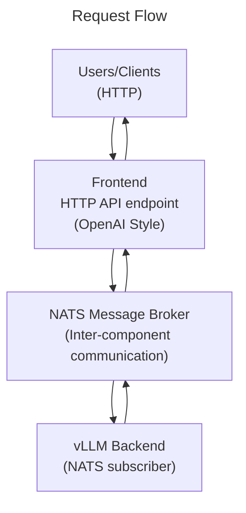

# Quickstart

This is a simple example showing how you can quickly get started deploying Large Language Models with Dynamo.

## Prerequisites

Before running this example, ensure you have the following services running:

- **etcd**: A distributed key-value store used for service discovery and metadata storage
- **NATS**: A high-performance message broker for inter-component communication

You can start these services using Docker Compose:

```bash
docker compose -f deploy/metrics/docker-compose.yml up -d
```

## Components

- [Frontend](../../../components/frontend/README) - A built-in component that launches an OpenAI compliant HTTP server, a pre-processor, and a router in a single process
- [vLLM Backend](../../../components/backends/vllm/README) - A built-in component that runs vLLM within the Dynamo runtime



## Instructions

There are three steps to deploy and use LLM with Dynamo.

### 1. Launch Engine

**Open a new terminal** and run:

```bash
python -m dynamo.vllm --model Qwen/Qwen3-0.6B
```

Leave this terminal running - it will show vLLM Backend logs.

### 2. Launch Frontend

**Open another terminal** and interact with the deployed engine using the built-in frontend component. You have two options:

1. Interactive Command Line Interface

  ```bash
  python -m dynamo.frontend --interactive
  ```

2. HTTP Server

  ```bash
  python -m dynamo.frontend --http-port 8000
  ```

Leave this terminal running as well - it will show Frontend logs.

### 3. Send Requests

If you launched the frontend in `interactive` mode, simply start typing and hit `Enter` to have an interactive chat with your LLM.

If you launched the frontend in HTTP mode, you can send requests via `curl`, or any OpenAI compatible client program or library.

```bash
curl -X POST http://localhost:8000/v1/chat/completions \
  -H 'Content-Type: application/json' \
  -d '{
    "model": "Qwen/Qwen3-0.6B",
    "messages": [
      { "role": "user", "content": "Tell me a story about a brave cat" }
    ],
    "stream": false,
    "max_tokens": 1028
  }'
```

## Cleanup

When you're done with the quickstart example, follow these steps to clean up:

### 1. Stop Dynamo Components

In each terminal where you started Dynamo components, press `Ctrl+C` to stop them:
- Stop the vLLM Backend (terminal from step 1)
- Stop the Frontend (terminal from step 2)

### 2. Stop Infrastructure Services

If you don't plan to run any more examples, stop the etcd and NATS services that were started with Docker Compose:

```bash
docker compose -f deploy/metrics/docker-compose.yml down
```

This will stop and remove the containers for etcd and NATS.


## Understand

### What's Happening Under the Hood

When you run the two commands above, here's what Dynamo does to spin up the necessary processes and connect your HTTP requests to the vLLM Backend:

### 1. Service Registration and Discovery

#### DistributedRuntime Setup
At startup, each Dynamo component (vLLM Backend, Frontend) connects to the `DistributedRuntime`, which involves creating connections to two critical infrastructure services:

- **etcd**: A distributed key-value store used for service discovery and metadata storage
- **NATS**: A high-performance message broker for inter-component communication

#### Component Registration

When the vLLM Backend starts up, it registers itself as a `component` in etcd with one or more `endpoints`.

This registration includes each endpoint's [NATS subject](https://docs.nats.io/nats-concepts/subjects) for communication and is tied to a `lease` that automatically expires if the component goes offline.

<details>
<summary> Inspecting the Component Registry </summary>

If you want to find out more about the internal organization of components in Dynamo, you can inspect the contents of `etcd` using the [`etcdctl` command line tool](https://etcd.io/docs/latest/dev-guide/interacting_v3/). For this example, you can try running

```bash
etcdctl get "instances" --prefix
```

which will show you each registered endpoint, along with their associated NATS subject. Note that the specific etcd and NATS info is internal and always subject to change -- in future examples we'll show how to use the `DistributedRuntime` itself to communicate across components.
</details>


#### Frontend Discovery
When the Frontend starts, it doesn't receive an explicit pointer to the vLLM Backend component. Instead, it constantly watches etcd for registered models, automatically discovering the vLLM Backend component and its endpoints when it becomes available.

### 2. Request Flow and NATS Messaging

When you send an HTTP request to the Frontend:

1. **Request Packaging**: The Frontend wraps your HTTP request in a standardized internal format with routing metadata
2. **NATS Subject Resolution**: Using the discovered endpoints in etcd, it determines the appropriate NATS endpoint
3. **Message Dispatch**: The request is published to the discovered NATS subject, where the target vLLM Backend picks it up
4. **Response Streaming**: The vLLM Backend executes the request, and streams responses back through NATS which the Frontend converts back to HTTP

### 3. Network-Transparent Operation

One of Dynamo's key strengths is that this entire system works seamlessly whether components are:
- Running on the same machine (like in this quickstart)
- Distributed across multiple nodes in a cluster
- Deployed in different availability zones

The same two commands work in all scenarios, as long as all components can connect with the `DistributedRuntime` - Dynamo handles the networking complexity automatically.

