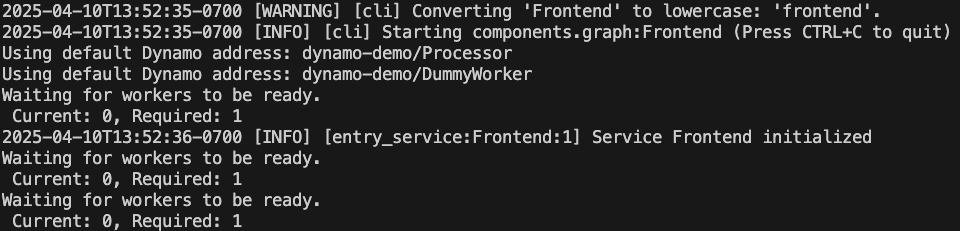
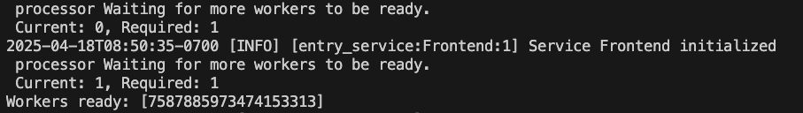
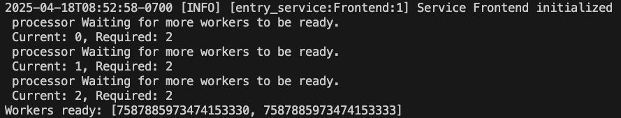

<!--
SPDX-FileCopyrightText: Copyright (c) 2025 NVIDIA CORPORATION & AFFILIATES. All rights reserved.
SPDX-License-Identifier: Apache-2.0

Licensed under the Apache License, Version 2.0 (the "License");
you may not use this file except in compliance with the License.
You may obtain a copy of the License at

http://www.apache.org/licenses/LICENSE-2.0

Unless required by applicable law or agreed to in writing, software
distributed under the License is distributed on an "AS IS" BASIS,
WITHOUT WARRANTIES OR CONDITIONS OF ANY KIND, either express or implied.
See the License for the specific language governing permissions and
limitations under the License.
-->

# Hello World MultiNode Example

## Overview

This example demonstrates how to deploy workers into multinodes and route requests to different workers.

Pipeline Architecture:

```
Users/Clients (HTTP)
      │
      ▼
┌─────────────────────┐
│  Frontend (node 1)  │  HTTP API endpoint (/generate)
└─────────────────────┘
      │ dynamo/runtime
      ▼
┌─────────────────────┐
│  Processor (node 1) │  ─────────────────
└─────────────────────┘   routing         │
      │ dynamo/runtime                    │ dynamo/runtime
      ▼                                   ▼
┌─────────────────────┐        ┌─────────────────────┐
│  Worker_1  (node 2) │        │  Worker_2  (node 3) │
└─────────────────────┘        └─────────────────────┘
```

## Component Descriptions

### Frontend Service
- Serves as the entry point for external HTTP requests
- Exposes a `/generate` HTTP API endpoint that clients can call
- Processes incoming text and passes it to the Middle service

### Processor Service
- Acts as an intermediary service in the pipeline
- Deployed on the same node as Frontend and receives requests from the Frontend
- Calls multiple workers based on the routing mode, random or round-robin.

### Worker Service
- Functions as the final service in the pipeline
- Deployed on a different node from Frontend and Processor
- Appends "GeneratedBy_HostName" to the text and yields tokens

## Prerequisites

Start required services (etcd and NATS) using [Docker Compose](../../../deploy/docker-compose.yml)
```bash
docker compose -f deploy/docker-compose.yml up -d
```

## Running the Single Worker Example
In this example, we will use two nodes to demo the multinode serving.
- Node 1
  - Runs NATS and etcd services
  - Deploys Frontend and Processor
- Node 2
  - Deploys Worker

1. Set environment variables for NATS and etcd services
```bash
export NATS_SERVER="nats://Node_1_IP_ADDRESS:4222"
export ETCD_ENDPOINTS="http://Node_1_IP_ADDRESS:2379"
```
2. Launch Frontend and Processor services:

```bash
cd dynamo/examples/hello_world/multinode_example
dynamo serve components.graph:Frontend -f configs/one_worker.yaml
```
The `dynamo serve` command deploys the entire service graph, automatically handling the dependencies between Frontend, and Processor services. Since no worker is deployed yet, the service remains idle.


3. Go to node 2 and launch Worker service
```bash
export NATS_SERVER="nats://Node_1_IP_ADDRESS:4222"
export ETCD_ENDPOINTS="http://Node_1_IP_ADDRESS:2379"
cd dynamo/examples/hello_world/multinode_example
dynamo serve components.worker:DummyWorker
```
You should see the worker is ready from node 1's terminal.


4. Go back to node 1 and send request to frontend using curl:
```bash
curl -X 'POST' \
  'http://localhost:8000/generate' \
  -H 'accept: text/event-stream' \
  -H 'Content-Type: application/json' \
  -d '{
  "prompt": "test prompt",
  "request_id": "id_number"
}'
```
5. You should be able to see response as below:
`Response: {"worker_output":"test prompt_ProcessedBy_NODE1HOSTNAME_GeneratedBy_NODE2HOSTNAME","request_id":"id_number"}`
Here `NODE1HOSTNAME` is the hostname for node 1, and `NODE2HOSTNAME` is the hostname for node 2.

## Running the Two Workers Example
In this example, we will use three nodes to demo the multinode serving.
- Node 1
  - Runs NATS and etcd services
  - Deploys Frontend and Processor
- Node 2
  - Deploys Worker 1
- Node 3
  - Deploys Worker 2

1. Launch Frontend and Processor services using the `multi_worker.yaml` config from node 1. In this config file, we require 2 workers and set the router mode as **round robin**
```bash
dynamo serve components.graph:Frontend -f configs/multi_worker.yaml
```
The service is waiting for 2 workers this time.

2. Go to node 2 and node 3, launch worker service separately
```bash
export NATS_SERVER="nats://Node_1_IP_ADDRESS:4222"
export ETCD_ENDPOINTS="http://Node_1_IP_ADDRESS:2379"
dynamo serve components.worker:DummyWorker
```
You should see the following messages from node 1's terminal window when both workers are deployed


3. Query the frontend using the same query as before, and run it multiple times. You should see following two responses in turn because of round-robin routing mode between 2 workers.

Response from worker 1: `Response: {"worker_output":"test prompt_ProcessedBy_NODE1HOSTNAME_GeneratedBy_NODE2HOSTNAME","request_id":"id_number"}`

Response from worker 2: `Response: {"worker_output":"test prompt_ProcessedBy_NODE1HOSTNAME_GeneratedBy_NODE3HOSTNAME","request_id":"id_number"}`
