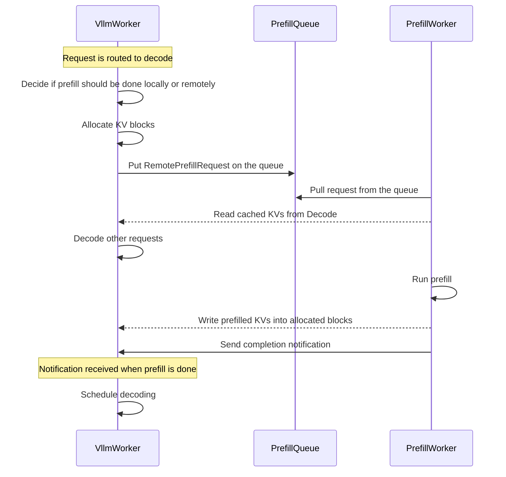

<!--
SPDX-FileCopyrightText: Copyright (c) 2025 NVIDIA CORPORATION & AFFILIATES. All rights reserved.
SPDX-License-Identifier: Apache-2.0

Licensed under the Apache License, Version 2.0 (the "License");
you may not use this file except in compliance with the License.
You may obtain a copy of the License at

http://www.apache.org/licenses/LICENSE-2.0

Unless required by applicable law or agreed to in writing, software
distributed under the License is distributed on an "AS IS" BASIS,
WITHOUT WARRANTIES OR CONDITIONS OF ANY KIND, either express or implied.
See the License for the specific language governing permissions and
limitations under the License.
-->

# LLM Deployment Examples

This directory contains examples and reference implementations for deploying Large Language Models (LLMs) in various configurations.

## Components

- workers: Prefill and decode worker handles actual LLM inference
- router: Handles API requests and routes them to appropriate workers based on specified strategy
- frontend: OpenAI compatible http server handles incoming requests

## Deployment Architectures

### Aggregated
Single-instance deployment where both prefill and decode are done by the same worker.

### Disaggregated
Distributed deployment where prefill and decode are done by separate workers that can scale independently.



## Getting Started

1. Choose a deployment architecture based on your requirements
2. Configure the components as needed
3. Deploy using the provided scripts

### Prerequisites

Start required services (etcd and NATS) using [Docker Compose](../../deploy/docker-compose.yml)
```bash
docker compose -f deploy/docker-compose.yml up -d
```

### Build docker

```bash
# On an x86 machine
./container/build.sh --framework vllm

# On an ARM machine (ex: GB200)
./container/build.sh --framework vllm --platform linux/arm64
```

> [!NOTE]
> Building a vLLM docker image for ARM machines currently involves building vLLM from source,
> which has known issues with being slow and requiring a lot of system RAM:
> https://github.com/vllm-project/vllm/issues/8878
>
> You can tune the number of parallel build jobs for building VLLM from source
> on ARM based on your available cores and system RAM with `VLLM_MAX_JOBS`.
>
> For example, on an ARM machine with low system resources:
> `./container/build.sh --framework vllm --platform linux/arm64 --build-arg VLLM_MAX_JOBS=2`
>
> For example, on a GB200 which has very high CPU cores and memory resource:
> `./container/build.sh --framework vllm --platform linux/arm64 --build-arg VLLM_MAX_JOBS=64`
>
> When vLLM has pre-built ARM wheels published, this process can be improved.

### Run container

```
./container/run.sh -it --framework vllm
```

## Run Deployment

This figure shows an overview of the major components to deploy:

```
                                                 +----------------+
                                          +------| prefill worker |-------+
                                   notify |      |                |       |
                                 finished |      +----------------+       | pull
                                          v                               v
+------+      +-----------+      +------------------+    push     +---------------+
| HTTP |----->| processor |----->| decode/monolith  |------------>| prefill queue |
|      |<-----|           |<-----|      worker      |             |               |
+------+      +-----------+      +------------------+             +---------------+
                  |    ^                  |
       query best |    | return           | publish kv events
           worker |    | worker_id        v
                  |    |         +------------------+
                  |    +---------|     kv-router    |
                  +------------->|                  |
                                 +------------------+

```

### Example architectures
_Note_: For a non-dockerized deployment, first export `DYNAMO_HOME` to point to the dynamo repository root, e.g. `export DYNAMO_HOME=$(pwd)`

#### Aggregated serving
```bash
cd $DYNAMO_HOME/examples/llm
dynamo serve graphs.agg:Frontend -f ./configs/agg.yaml
```

#### Aggregated serving with KV Routing
```bash
cd $DYNAMO_HOME/examples/llm
dynamo serve graphs.agg_router:Frontend -f ./configs/agg_router.yaml
```

#### Disaggregated serving
```bash
cd $DYNAMO_HOME/examples/llm
dynamo serve graphs.disagg:Frontend -f ./configs/disagg.yaml
```

#### Disaggregated serving with KV Routing
```bash
cd $DYNAMO_HOME/examples/llm
dynamo serve graphs.disagg_router:Frontend -f ./configs/disagg_router.yaml
```

### Client

In another terminal:
```bash
# this test request has around 200 tokens isl

curl localhost:8000/v1/chat/completions   -H "Content-Type: application/json"   -d '{
    "model": "deepseek-ai/DeepSeek-R1-Distill-Llama-8B",
    "messages": [
    {
        "role": "user",
        "content": "In the heart of Eldoria, an ancient land of boundless magic and mysterious creatures, lies the long-forgotten city of Aeloria. Once a beacon of knowledge and power, Aeloria was buried beneath the shifting sands of time, lost to the world for centuries. You are an intrepid explorer, known for your unparalleled curiosity and courage, who has stumbled upon an ancient map hinting at ests that Aeloria holds a secret so profound that it has the potential to reshape the very fabric of reality. Your journey will take you through treacherous deserts, enchanted forests, and across perilous mountain ranges. Your Task: Character Background: Develop a detailed background for your character. Describe their motivations for seeking out Aeloria, their skills and weaknesses, and any personal connections to the ancient city or its legends. Are they driven by a quest for knowledge, a search for lost familt clue is hidden."
    }
    ],
    "stream":false,
    "max_tokens": 30
  }'

```

### Multi-node deployment

See [multinode-examples.md](multinode-examples.md) for more details.

### Close deployment

See [close deployment](../../docs/guides/dynamo_serve.md#close-deployment) section to learn about how to close the deployment.

## Deploy to Kubernetes

These examples can be deployed to a Kubernetes cluster using Dynamo Cloud and the Dynamo deploy CLI.

### Prerequisites

Before deploying, ensure you have:
- Dynamo CLI installed
- Ubuntu 24.04 as the base image
- Required dependencies:
  - Helm package manager
  - Dynamo SDK and CLI tools
  - Rust packages and toolchain

You must have first followed the instructions in [deploy/dynamo/helm/README.md](../../deploy/dynamo/helm/README.md) to install Dynamo Cloud on your Kubernetes cluster.

**Note**: Note the `KUBE_NS` variable in the following steps must match the Kubernetes namespace where you installed Dynamo Cloud. You must also expose the `dynamo-store` service externally. This will be the endpoint the CLI uses to interface with Dynamo Cloud.

### Deployment Steps

1. **Login to Dynamo Cloud**

```bash
export PROJECT_ROOT=$(pwd)
export KUBE_NS=dynamo-cloud  # Note: This must match the Kubernetes namespace where you installed Dynamo Cloud
export DYNAMO_CLOUD=https://${KUBE_NS}.dev.aire.nvidia.com # Externally accessible endpoint to the `dynamo-store` service within your Dynamo Cloud installation
```

The `DYNAMO_CLOUD` environment variable is required for all Dynamo deployment commands. Make sure it's set before running any deployment operations.

2. **Build the Dynamo Base Image**

> [!NOTE]
> For instructions on building and pushing the Dynamo base image, see the [Building the Dynamo Base Image](../../README.md#building-the-dynamo-base-image) section in the main README.

```bash
# Set runtime image name
export DYNAMO_IMAGE=<dynamo_docker_image_name>

# Prepare your project for deployment.
cd $PROJECT_ROOT/examples/llm
DYNAMO_TAG=$(dynamo build graphs.agg:Frontend | grep "Successfully built" |  awk '{ print $NF }' | sed 's/\.$//')
```

3. **Deploy to Kubernetes**

```bash
echo $DYNAMO_TAG
export DEPLOYMENT_NAME=llm-agg
dynamo deployment create $DYNAMO_TAG -n $DEPLOYMENT_NAME -f ./configs/agg.yaml
```

4. **Test the deployment**

Once you create the Dynamo deployment, a pod prefixed with `yatai-dynamonim-image-builder` will begin running. Once it finishes running, pods will be created using the image that was built. Once the pods prefixed with `$DEPLOYMENT_NAME` are up and running, you can test out your example!

Find your frontend pod using one of these methods:

```bash
# Method 1: List all pods and find the frontend pod manually
kubectl get pods -n ${KUBE_NS} | grep frontend | cat

# Method 2: Use a label selector to find the frontend pod automatically
export FRONTEND_POD=$(kubectl get pods -n ${KUBE_NS} | grep "${DEPLOYMENT_NAME}-frontend" | sort -k1 | tail -n1 | awk '{print $1}')

# Forward the pod's port to localhost
kubectl port-forward pod/$FRONTEND_POD 8000:8000 -n ${KUBE_NS}

# Note: We forward directly to the pod's port 8000 rather than the service port because the frontend component listens on port 8000 internally.

# Test the API endpoint
curl localhost:8000/v1/chat/completions \
  -H "Content-Type: application/json" \
  -d '{
    "model": "deepseek-ai/DeepSeek-R1-Distill-Llama-8B",
    "messages": [
    {
        "role": "user",
        "content": "In the heart of Eldoria, an ancient land of boundless magic and mysterious creatures, lies the long-forgotten city of Aeloria. Once a beacon of knowledge and power, Aeloria was buried beneath the shifting sands of time, lost to the world for centuries. You are an intrepid explorer, known for your unparalleled curiosity and courage, who has stumbled upon an ancient map hinting at ests that Aeloria holds a secret so profound that it has the potential to reshape the very fabric of reality. Your journey will take you through treacherous deserts, enchanted forests, and across perilous mountain ranges. Your Task: Character Background: Develop a detailed background for your character. Describe their motivations for seeking out Aeloria, their skills and weaknesses, and any personal connections to the ancient city or its legends. Are they driven by a quest for knowledge, a search for lost familt clue is hidden."
    }
    ],
    "stream":false,
    "max_tokens": 30
  }'
```
