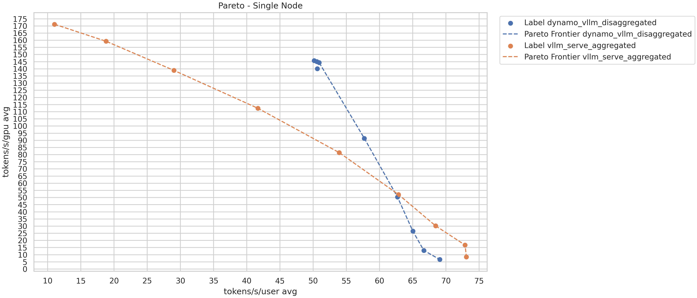

<!--
SPDX-FileCopyrightText: Copyright (c) 2025 NVIDIA CORPORATION & AFFILIATES. All rights reserved.
SPDX-License-Identifier: Apache-2.0

Licensed under the Apache License, Version 2.0 (the "License");
you may not use this file except in compliance with the License.
You may obtain a copy of the License at

http://www.apache.org/licenses/LICENSE-2.0

Unless required by applicable law or agreed to in writing, software
distributed under the License is distributed on an "AS IS" BASIS,
WITHOUT WARRANTIES OR CONDITIONS OF ANY KIND, either express or implied.
See the License for the specific language governing permissions and
limitations under the License.
-->

# LLM Deployment Benchmarking Guide

This guide provides detailed steps on benchmarking Large Language Models (LLMs) in single and multi-node configurations.

> [!NOTE]
> We recommend trying out the [LLM Deployment Examples](./README.md) before benchmarking.


## Prerequisites

> [!Important]
> At least one 8xH100-80GB node is required for the following instructions.

 1. Build benchmarking image

    ```bash
    ./container/build.sh
    ```

 2. Download model

    ```bash
    huggingface-cli download neuralmagic/DeepSeek-R1-Distill-Llama-70B-FP8-dynamic
    ```

 3. Start NATS and ETCD

    ```bash
    docker compose -f deploy/docker_compose.yml up -d
    ```

> [!NOTE]
> This guide was tested on node(s) with the following hardware configuration:
>
> * **GPUs**:
>   8xH100-80GB-HBM3 (GPU Memory Bandwidth 3.2 TBs)
>
> * **CPU**:
>   2 x Intel Sapphire Rapids, Intel(R) Xeon(R) Platinum 8480CL E5, 112 cores (56 cores per CPU), 2.00 GHz (Base), 3.8 Ghz (Max boost), PCIe Gen5
>
> * **NVLink**:
>   NVLink 4th Generation, 900 GB/s (GPU to GPU NVLink bidirectional bandwidth), 18 Links per GPU
>
> * **InfiniBand**:
>   8x400Gbit/s (Compute Links), 2x400Gbit/s (Storage Links)
>
> Benchmarking with a different hardware configuration may yield suboptimal results.


## Disaggregated Single Node Benchmarking

> [!Important]
> One 8xH100-80GB node is required for the following instructions.

In the following setup we compare Dynamo disaggregated vLLM performance to
[native vLLM Aggregated Baseline](#vllm-aggregated-baseline-benchmarking) on a single node. These were chosen to optimize
for Output Token Throughput (per sec) when both are performing under similar Inter Token Latency (ms).
For more details on your use case please see the [Performance Tuning Guide](/docs/guides/disagg_perf_tuning.md).

In this setup, we will be using 4 prefill workers and 1 decode worker.
Each prefill worker will use tensor parallel 1 and the decode worker will use tensor parallel 4.

With the Dynamo repository, benchmarking image and model available, and **NATS and ETCD started**, perform the following steps:

 1. Run benchmarking container

    ```bash
    ./container/run.sh --mount-workspace
    ```

> [!Tip]
> The huggingface home source mount can be changed by setting `--hf-cache ~/.cache/huggingface`.

 2. Start disaggregated services

    ```bash
    cd /workspace/examples/llm
    dynamo serve benchmarks.disagg:Frontend -f benchmarks/disagg.yaml 1> disagg.log 2>&1 &
    ```

> [!Tip]
> Check the `disagg.log` to make sure the service is fully started before collecting performance numbers.

 3. Collect the performance numbers:

 ```bash
 bash -x /workspace/benchmarks/llm/perf.sh --mode disaggregated --deployment-kind dynamo_vllm --prefill-tensor-parallelism 1 --prefill-data-parallelism 4 --decode-tensor-parallelism 4 --decode-data-parallelism 1
 ```

 > [!Important]
 > We should be careful in specifying these options in `perf.sh` script. They should closely reflect the deployment config that is being benchmarked. See `perf.sh --help` to learn more about these option. In the above command, we described that our deployment is using disaggregated serving in dynamo with vLLM backend. We have also accurately described that we have 4 prefill workers with TP=1 and 1 decode worker with TP=4

For more information see [Collecting Performance Numbers](#collecting-performance-numbers) section below.

## Disaggregated Multinode Benchmarking

> [!Important]
> Two 8xH100-80GB nodes are required the following instructions.

In the following steps we compare Dynamo disaggregated vLLM performance to
[native vLLM Aggregated Baseline](#vllm-aggregated-baseline-benchmarking) on two nodes. These were chosen to optimize
for Output Token Throughput (per sec) when both are performing under similar Inter Token Latency (ms).
For more details on your use case please see the [Performance Tuning Guide](/docs/guides/disagg_perf_tuning.md).

In this setup, we will be using 8 prefill workers and 1 decode worker.
Each prefill worker will use tensor parallel 1 and the decode worker will use tensor parallel 8.

With the Dynamo repository, benchmarking image and model available, and **NATS and ETCD started on node 0**, perform the following steps:

 1. Run benchmarking container (nodes 0 & 1)

    ```bash
    ./container/run.sh --mount-workspace
    ```

> [!Tip]
> The huggingface home source mount can be changed by setting `--hf-cache ~/.cache/huggingface`.

 2. Config NATS and ETCD (node 1)

    ```bash
    export NATS_SERVER="nats://<node_0_ip_addr>"
    export ETCD_ENDPOINTS="<node_0_ip_addr>:2379"
    ```

> [!Important]
> Node 1 must be able to reach Node 0 over the network for the above services.

 3. Start workers (node 0)

    ```bash
    cd /workspace/examples/llm
    dynamo serve benchmarks.disagg_multinode:Frontend -f benchmarks/disagg_multinode.yaml 1> disagg_multinode.log 2>&1 &
    ```

> [!Tip]
> Check the `disagg_multinode.log` to make sure the service is fully started before collecting performance numbers.

 4. Start workers (node 1)

    ```bash
    cd /workspace/examples/llm
    dynamo serve components.prefill_worker:PrefillWorker -f benchmarks/disagg_multinode.yaml 1> prefill_multinode.log 2>&1 &
    ```

> [!Tip]
> Check the `prefill_multinode.log` to make sure the service is fully started before collecting performance numbers.

 5. Collect the performance numbers:

 ```bash
 bash -x /workspace/benchmarks/llm/perf.sh --mode disaggregated --deployment-kind dynamo_vllm --prefill-tensor-parallelism 1 --prefill-data-parallelism 8 --decode-tensor-parallelism 8 --decode-data-parallelism 1
 ```

 > [!Important]
 > We should be careful in specifying these options in `perf.sh` script. They should closely reflect the deployment config that is being benchmarked. See `perf.sh --help` to learn more about these option. In the above command, we described that our deployment is using disaggregated serving in dynamo with vLLM backend. We have also accurately described that we have 8 prefill workers with TP=1 and 1 decode worker with TP=8

For more information see [Collecting Performance Numbers](#collecting-performance-numbers) section below.


## vLLM Aggregated Baseline Benchmarking

> [!Important]
> One (or two) 8xH100-80GB nodes are required the following instructions.

With the Dynamo repository and the benchmarking image available, perform the following steps:

 1. Run benchmarking container

    ```bash
    ./container/run.sh --mount-workspace
    ```

> [!Tip]
> The Hugging Face home source mount can be changed by setting `--hf-cache ~/.cache/huggingface`.

 2. Start vLLM serve

    ```bash
    CUDA_VISIBLE_DEVICES=0,1,2,3 vllm serve neuralmagic/DeepSeek-R1-Distill-Llama-70B-FP8-dynamic \
      --block-size 128 \
      --max-model-len 3500 \
      --max-num-batched-tokens 3500 \
      --tensor-parallel-size 4 \
      --gpu-memory-utilization 0.95 \
      --disable-log-requests \
      --port 8001 1> vllm_0.log 2>&1 &
    CUDA_VISIBLE_DEVICES=4,5,6,7 vllm serve neuralmagic/DeepSeek-R1-Distill-Llama-70B-FP8-dynamic \
      --block-size 128 \
      --max-model-len 3500 \
      --max-num-batched-tokens 3500 \
      --tensor-parallel-size 4 \
      --gpu-memory-utilization 0.95 \
      --disable-log-requests \
      --port 8002 1> vllm_1.log 2>&1 &
    ```

> [!Tip]
> Check the `vllm_0.log` and `vllm_1.log` to make sure the service is fully started before collecting performance numbers.
>
> If benchmarking with two or more nodes, `--tensor-parallel-size 8` should be used and only run one `vllm serve` instance per node.

 3. Use NGINX as load balancer

    ```bash
    apt update && apt install -y nginx
    cp /workspace/benchmarks/llm/nginx.conf /etc/nginx/nginx.conf
    service nginx restart
    ```

> [!Note]
> If benchmarking over 2 nodes, the `upstream` configuration will need to be updated to link to the `vllm serve` on the second node.

 4. Collect the performance numbers:

Single-Node

 ```bash
 bash -x /workspace/benchmarks/llm/perf.sh --mode aggregated --deployment-kind vllm_serve --tensor-parallelism 4 --data-parallelism 2
 ```

 Two Nodes

 ```bash
 bash -x /workspace/benchmarks/llm/perf.sh --mode aggregated --deployment-kind vllm_serve --tensor-parallelism 8 --data-parallelism 2
 ```

 > [!Important]
 > We should be careful in specifying these options in `perf.sh` script. They should closely reflect the deployment config that is being benchmarked. See `perf.sh --help` to learn more about these option. In the above command, we described that our deployment is using aggregated serving in `vllm serve`. We have also accurately described that we have 2 workers with TP=4(or TP=8 for two nodes).

For more information see [Collecting Performance Numbers](#collecting-performance-numbers) section below.

## Collecting Performance Numbers

Currently, there is no consistent way of obtaining the configuration of deployment service. Hence, we need to provide this information to the script in form of command line arguments. The benchmarking script `/workspace/examples/llm/benchmarks/perf.sh` uses GenAI-Perf tool to collect the performance numbers at various different request concurrencies. The perf.sh script can be run multiple times to collect numbers for various different deployments. Each script execution will create a new artifacts directory in `artifacts_root` and dump these numbers in it. See [Plotting Pareto Graphs](#plotting-pareto-graphs) to learn how to convert the data from this `artifacts_root` to generate pareto graphs for the performance.

Note: As each `perf.sh` adds a new artifacts directory in the `artifacts_root` always, proper care should be taken that we are starting experiment with clean `artifacts_root` so we include only results from runs that we want to compare.

> [!Tip]
> See [GenAI-Perf tutorial](https://github.com/triton-inference-server/perf_analyzer/blob/main/genai-perf/docs/tutorial.md)
> @ [GitHub](https://github.com/triton-inference-server/perf_analyzer) for additional information about how to run GenAI-Perf
> and how to interpret results.


## Interpreting Results

### Plotting Pareto Graphs

The `artifacts` directory generated by GenAI-Perf contains the raw performance number from the benchmarking.

Using the benchmarking image, install the dependencies for plotting Pareto graph
```bash
pip3 install matplotlib seaborn
```
At the directory where the artifacts are located, plot the Pareto graph

Single-Node:

```bash
python3 /workspace/benchmarks/llm/plot_pareto.py --artifacts-root-dir artifacts_root
```

Two Nodes:

```bash
python3 /workspace/benchmarks/llm/plot_pareto.py --artifacts-root-dir artifacts_root --title "Two Nodes"
```
The graph will be saved to the current directory and named `pareto_plot.png`.

### Interpreting Pareto Graphs

The question we want to answer in this comparison is how much Output Token Throughput can be improved by switching from
aggregated to disaggregated serving when both are performing under similar Inter Token Latency.

For each concurrency benchmarked, it produces a latency and throughput value pair. The x-axis on the Pareto graph is
latency (tokens/s/user), which the latency is lower if the value is higher. The y-axis on the Pareto graph is throughput
(tokens/s/gpu). The latency and throughput value pair forms a dot on the Pareto graph. A line (Pareto Frontier) is
formed when the dots from different concurrency values are plotted on the graph.

With the Pareto Frontiers of the baseline and the disaggregated results plotted on the graph, we can look for the
greatest increase in throughput (along the y-axis) between the baseline and the disaggregated result Pareto Frontier,
over different latencies (along the x-axis).

For example, at 45 tokens/s/user, the increase in tokens/s/gpu is `145 - 80 = 65`, from the orange baseline to the
blue disaggregated line, so the improvement is around 1.44x speed up:

Note: The above example was collected over a single benchmarking run, the actual number may vary between runs, configurations and hardware.

## Supporting Additional Models

The instructions above can be used for nearly any model desired.
More complex setup instructions might be required for certain models.
The above instruction regarding ETCD, NATS, nginx, dynamo-serve, and GenAI-Perf still apply and can be reused.
The specifics of deploying with different hardware, in a unique environment, or using another model framework can be adapted using the links below.

Regardless of the deployment mechanism, the GenAI-Perf tool will report the same metrics and measurements so long as an accessible endpoint is available for it to interact with. Use the provided [perf.sh](../../../benchmarks/llm/perf.sh) script to automate the measurement of model throughput and latency against multiple request concurrences.

### Deployment Examples

- [Dynamo Multinode Deployments](../../../docs/examples/multinode.md)
- [Dynamo TensorRT LLM Deployments](../../../docs/examples/trtllm.md)
    - [Aggregated Deployment of Very Large Models](../../../docs/examples/multinode.md#aggregated-deployment)
- [Dynamo vLLM Deployments](../../../docs/examples/llm_deployment.md)


## Metrics and Visualization

For instructions on how to acquire per worker metrics and visualize them using Grafana,
please see the provided [Visualization with Prometheus and Grafana](../../../deploy/metrics/README.md).
