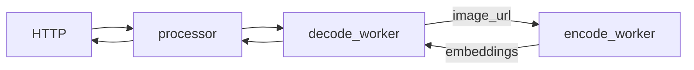
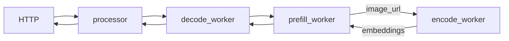

<!--
SPDX-FileCopyrightText: Copyright (c) 2025 NVIDIA CORPORATION & AFFILIATES. All rights reserved.
SPDX-License-Identifier: Apache-2.0

Licensed under the Apache License, Version 2.0 (the "License");
you may not use this file except in compliance with the License.
You may obtain a copy of the License at

http://www.apache.org/licenses/LICENSE-2.0

Unless required by applicable law or agreed to in writing, software
distributed under the License is distributed on an "AS IS" BASIS,
WITHOUT WARRANTIES OR CONDITIONS OF ANY KIND, either express or implied.
See the License for the specific language governing permissions and
limitations under the License.
-->

# Multimodal Deployment Examples

This directory provides example workflows and reference implementations for deploying a multimodal model using Dynamo.
The examples are based on the [llava-1.5-7b-hf](https://huggingface.co/llava-hf/llava-1.5-7b-hf) model.

## Multimodal Aggregated Serving

### Components

- workers: For aggregated serving, we have two workers, [encode_worker](components/encode_worker.py) for encoding and [decode_worker](components/decode_worker.py) for prefilling and decoding.
- processor: Tokenizes the prompt and passes it to the decode worker.
- frontend: HTTP endpoint to handle incoming requests.

### Deployment

In this deployment, we have two workers, [encode_worker](components/encode_worker.py) and [decode_worker](components/decode_worker.py).
The encode worker is responsible for encoding the image and passing the embeddings to the decode worker via a combination of NATS and RDMA.
The work complete event is sent via NATS, while the embeddings tensor is transferred via RDMA through the NIXL interface.
Its decode worker then prefills and decodes the prompt, just like the [LLM aggregated serving](../llm/README.md) example.
By separating the encode from the prefill and decode stages, we can have a more flexible deployment and scale the
encode worker independently from the prefill and decode workers if needed.

This figure shows the flow of the deployment:

```

```bash
cd $DYNAMO_HOME/examples/multimodal
dynamo serve graphs.agg:Frontend -f ./configs/agg.yaml
```

### Client

In another terminal:
```bash
curl http://localhost:8000/v1/chat/completions \
  -H "Content-Type: application/json" \
  -d '{
      "model": "llava-hf/llava-1.5-7b-hf",
      "messages": [
        {
          "role": "user",
          "content": [
            {
              "type": "text",
              "text": "What is in this image?"
            },
            {
              "type": "image_url",
              "image_url": {
                "url": "http://images.cocodataset.org/test2017/000000155781.jpg"
              }
            }
          ]
        }
      ],
      "max_tokens": 300,
      "stream": false
    }'
```

You should see a response similar to this:
```json
{"id": "c37b946e-9e58-4d54-88c8-2dbd92c47b0c", "object": "chat.completion", "created": 1747725277, "model": "llava-hf/llava-1.5-7b-hf", "choices": [{"index": 0, "message": {"role": "assistant", "content": " In the image, there is a city bus parked on a street, with a street sign nearby on the right side. The bus appears to be stopped out of service. The setting is in a foggy city, giving it a slightly moody atmosphere."}, "finish_reason": "stop"}]}
```

## Multimodal Disaggregated serving

### Components

- workers: For disaggregated serving, we have three workers, [encode_worker](components/encode_worker.py) for encoding, [decode_worker](components/decode_worker.py) for decoding, and [prefill_worker](components/prefill_worker.py) for prefilling.
- processor: Tokenizes the prompt and passes it to the decode worker.
- frontend: HTTP endpoint to handle incoming requests.

### Deployment

In this deployment, we have three workers, [encode_worker](components/encode_worker.py), [decode_worker](components/decode_worker.py), and [prefill_worker](components/prefill_worker.py).
For the Llava model, embeddings are only required during the prefill stage. As such, the encode worker is connected directly to the prefill worker.
The encode worker is responsible for encoding the image and passing the embeddings to the prefill worker via a combination of NATS and RDMA.
Its work complete event is sent via NATS, while the embeddings tensor is transferred via RDMA through the NIXL interface.
The prefill worker performs the prefilling step and forwards the KV cache to the decode worker for decoding.
For more details on the roles of the prefill and decode workers, refer to the [LLM disaggregated serving](../llm/README.md) example.

This figure shows the flow of the deployment:


```bash
cd $DYNAMO_HOME/examples/multimodal
dynamo serve graphs.disagg:Frontend -f configs/disagg.yaml
```

### Client

In another terminal:
```bash
curl http://localhost:8000/v1/chat/completions \
  -H "Content-Type: application/json" \
  -d '{
      "model": "llava-hf/llava-1.5-7b-hf",
      "messages": [
        {
          "role": "user",
          "content": [
            {
              "type": "text",
              "text": "What is in this image?"
            },
            {
              "type": "image_url",
              "image_url": {
                "url": "http://images.cocodataset.org/test2017/000000155781.jpg"
              }
            }
          ]
        }
      ],
      "max_tokens": 300,
      "stream": false
    }'
```

You should see a response similar to this:
```json
{"id": "c1774d61-3299-4aa3-bea1-a0af6c055ba8", "object": "chat.completion", "created": 1747725645, "model": "llava-hf/llava-1.5-7b-hf", "choices": [{"index": 0, "message": {"role": "assistant", "content": " This image shows a passenger bus traveling down the road near power lines and trees. The bus displays a sign that says \"OUT OF SERVICE\" on its front."}, "finish_reason": "stop"}]}
```
