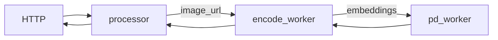
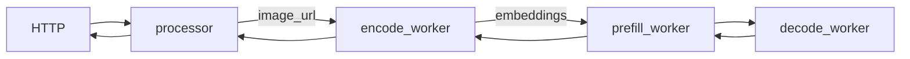
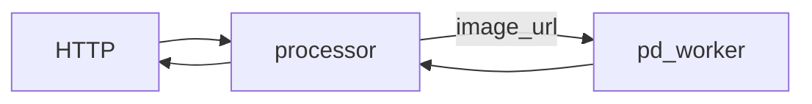
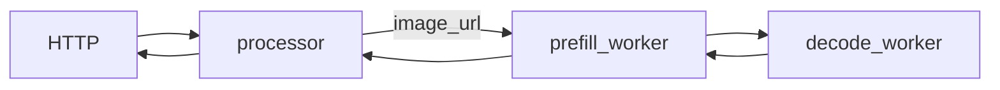

<!--
SPDX-FileCopyrightText: Copyright (c) 2025 NVIDIA CORPORATION & AFFILIATES. All rights reserved.
SPDX-License-Identifier: Apache-2.0

Licensed under the Apache License, Version 2.0 (the "License");
you may not use this file except in compliance with the License.
You may obtain a copy of the License at

http://www.apache.org/licenses/LICENSE-2.0

Unless required by applicable law or agreed to in writing, software
distributed under the License is distributed on an "AS IS" BASIS,
WITHOUT WARRANTIES OR CONDITIONS OF ANY KIND, either express or implied.
See the License for the specific language governing permissions and
limitations under the License.
-->

# Multimodal Deployment Examples

This directory provides example workflows and reference implementations for deploying a multimodal model using Dynamo and vLLM v1.

## Use the Latest Release

We recommend using the latest stable release of dynamo to avoid breaking changes:

[](https://github.com/ai-dynamo/dynamo/releases/latest)

You can find the latest release [here](https://github.com/ai-dynamo/dynamo/releases/latest) and check out the corresponding branch with:

```bash
git checkout $(git describe --tags $(git rev-list --tags --max-count=1))
```

## Multimodal Aggregated Serving

### Components

- workers: For aggregated serving, we have two workers, [VllmEncodeWorker](components/encode_worker.py) for encoding and [VllmPDWorker](components/worker.py) for prefilling and decoding.
- processor: Tokenizes the prompt and passes it to the VllmEncodeWorker.
- frontend: HTTP endpoint to handle incoming requests.

### Graph

In this graph, we have two workers, [VllmEncodeWorker](components/encode_worker.py) and [VllmPDWorker](components/worker.py).
The VllmEncodeWorker is responsible for encoding the image and passing the embeddings to the VllmPDWorker via a combination of NATS and RDMA.
The work complete event is sent via NATS, while the embeddings tensor is transferred via RDMA through the NIXL interface.
Its VllmPDWorker then prefills and decodes the prompt, just like the [LLM aggregated serving](/components/backends/vllm/README.md) example.
By separating the encode from the prefill and decode stages, we can have a more flexible deployment and scale the
VllmEncodeWorker independently from the prefill and decode workers if needed.

This figure shows the flow of the graph:


```bash
cd $DYNAMO_HOME/examples/multimodal
# Serve a LLaVA 1.5 7B model:
bash launch/agg.sh --model llava-hf/llava-1.5-7b-hf
# Serve a Qwen2.5-VL model:
# bash launch/agg.sh --model Qwen/Qwen2.5-VL-7B-Instruct
# Serve a Phi3V model:
# bash launch/agg.sh --model microsoft/Phi-3.5-vision-instruct
```

### Client

In another terminal:
```bash
curl http://localhost:8080/v1/chat/completions \
  -H "Content-Type: application/json" \
  -d '{
      "model": "llava-hf/llava-1.5-7b-hf",
      "messages": [
        {
          "role": "user",
          "content": [
            {
              "type": "text",
              "text": "What is in this image?"
            },
            {
              "type": "image_url",
              "image_url": {
                "url": "http://images.cocodataset.org/test2017/000000155781.jpg"
              }
            }
          ]
        }
      ],
      "max_tokens": 300,
      "temperature": 0.0,
      "stream": false
    }'
```

If serving the example Qwen model, replace `"llava-hf/llava-1.5-7b-hf"` in the `"model"` field with `"Qwen/Qwen2.5-VL-7B-Instruct"`. If serving the example Phi3V model, replace `"llava-hf/llava-1.5-7b-hf"` in the `"model"` field with `"microsoft/Phi-3.5-vision-instruct"`.

You should see a response similar to this:
```json
{"id": "c37b946e-9e58-4d54-88c8-2dbd92c47b0c", "object": "chat.completion", "created": 1747725277, "model": "llava-hf/llava-1.5-7b-hf", "choices": [{"index": 0, "message": {"role": "assistant", "content": " In the image, there is a city bus parked on a street, with a street sign nearby on the right side. The bus appears to be stopped out of service. The setting is in a foggy city, giving it a slightly moody atmosphere."}, "finish_reason": "stop"}]}
```

## Multimodal Disaggregated Serving

### Components

- workers: For disaggregated serving, we have three workers, [VllmEncodeWorker](components/encode_worker.py) for encoding, [VllmDecodeWorker](components/worker.py) for decoding, and [VllmPDWorker](components/worker.py) for prefilling.
- processor: Tokenizes the prompt and passes it to the VllmEncodeWorker.
- frontend: HTTP endpoint to handle incoming requests.

### Graph

In this graph, we have three workers, [VllmEncodeWorker](components/encode_worker.py), [VllmDecodeWorker](components/worker.py), and [VllmPDWorker](components/worker.py).
For the Llava model, embeddings are only required during the prefill stage. As such, the VllmEncodeWorker is connected directly to the prefill worker.
The VllmEncodeWorker is responsible for encoding the image and passing the embeddings to the prefill worker via a combination of NATS and RDMA.
Its work complete event is sent via NATS, while the embeddings tensor is transferred via RDMA through the NIXL interface.
The prefill worker performs the prefilling step and forwards the KV cache to the decode worker for decoding.
For more details on the roles of the prefill and decode workers, refer to the [LLM disaggregated serving](/components/backends/vllm/README.md) example.

This figure shows the flow of the graph:


```bash
cd $DYNAMO_HOME/examples/multimodal
bash launch/disagg.sh --model llava-hf/llava-1.5-7b-hf
```

### Client

In another terminal:
```bash
curl http://localhost:8080/v1/chat/completions \
  -H "Content-Type: application/json" \
  -d '{
      "model": "llava-hf/llava-1.5-7b-hf",
      "messages": [
        {
          "role": "user",
          "content": [
            {
              "type": "text",
              "text": "What is in this image?"
            },
            {
              "type": "image_url",
              "image_url": {
                "url": "http://images.cocodataset.org/test2017/000000155781.jpg"
              }
            }
          ]
        }
      ],
      "max_tokens": 300,
      "temperature": 0.0,
      "stream": false
    }'
```

You should see a response similar to this:
```json
{"id": "c1774d61-3299-4aa3-bea1-a0af6c055ba8", "object": "chat.completion", "created": 1747725645, "model": "llava-hf/llava-1.5-7b-hf", "choices": [{"index": 0, "message": {"role": "assistant", "content": " This image shows a passenger bus traveling down the road near power lines and trees. The bus displays a sign that says \"OUT OF SERVICE\" on its front."}, "finish_reason": "stop"}]}
```

***Note***: disaggregation is currently only confirmed to work with LLaVA. Qwen VL and PhiV are not confirmed to be supported.

## Llama 4 family Serving

The family of Llama 4 models is natively multimodal, however, different
from Llava, they do not directly consume image embedding as input
(see the [support metrics](https://docs.vllm.ai/en/latest/models/supported_models.html#text-generation_1)
from vLLM for the types of multi-modal inputs supported by the model).
Therefore, encoder worker will not be used in the following example and the
encoding will be done along side with prefill.

`meta-llama/Llama-4-Maverick-17B-128E-Instruct-FP8` will be used as an example
for the content below. And the system will be H100x8 which can hold one instance
of the model per node.

### Multimodal Aggregated Serving

#### Components

- workers: For aggregated serving, we have one worker, [VllmPDWorker](components/worker.py) for prefilling and decoding.
- processor: Tokenizes the prompt and passes it to the VllmPDWorker.
- frontend: HTTP endpoint to handle incoming requests.

#### Graph

In this graph, we have [VllmPDWorker](components/worker.py) which will encode the image, prefill and decode the prompt, just like the [LLM aggregated serving](/components/backends/vllm/README.md) example.

This figure shows the flow of the graph:


```bash
cd $DYNAMO_HOME/examples/multimodal
bash launch/agg_llama.sh
```

#### Client

In another terminal:
```bash
curl http://localhost:8080/v1/chat/completions \
  -H "Content-Type: application/json" \
  -d '{
      "model": "meta-llama/Llama-4-Maverick-17B-128E-Instruct-FP8",
      "messages": [
        {
          "role": "user",
          "content": [
            {
              "type": "text",
              "text": "What is in this image?"
            },
            {
              "type": "image_url",
              "image_url": {
                "url": "http://images.cocodataset.org/test2017/000000155781.jpg"
              }
            }
          ]
        }
      ],
      "max_tokens": 300,
      "temperature": 0.0,
      "stream": false
    }'
```

You should see a response similar to this:
```json
{"id": "b8f060fa95584e34b9204eaba7b105cc", "object": "chat.completion", "created": 1752706281, "model": "meta-llama/Llama-4-Maverick-17B-128E-Instruct-FP8", "choices": [{"index": 0, "message": {"role": "assistant", "content": "The image depicts a street scene with a trolley bus as the central focus. The trolley bus is positioned on the left side of the road, facing the camera, and features a white and yellow color scheme. A prominent sign on the front of the bus reads \"OUT OF SERVICE\" in orange letters.\n\n**Key Elements:**\n\n* **Trolley Bus:** The bus is the main subject of the image, showcasing its distinctive design and color.\n* **Sign:** The \"OUT OF SERVICE\" sign is clearly visible on the front of the bus, indicating its current status.\n* **Street Scene:** The surrounding environment includes trees, buildings, and power lines, creating a sense of context and atmosphere.\n* **Lighting:** The image is characterized by a misty or foggy quality, with soft lighting that adds to the overall ambiance.\n\n**Overall Impression:**\n\nThe image presents a serene and somewhat melancholic scene, with the out-of-service trolley bus serving as a focal point. The misty atmosphere and soft lighting contribute to a dreamy or nostalgic feel, inviting the viewer to reflect on the scene."}, "finish_reason": "stop"}]}
```

### Multimodal Disaggregated Serving

#### Components

- workers: For disaggregated serving, we have two workers, [VllmDecodeWorker](components/worker.py) for decoding, and [VllmPDWorker](components/worker.py) for encoding and prefilling.
- processor: Tokenizes the prompt and passes it to the VllmPDWorker.
- frontend: HTTP endpoint to handle incoming requests.

#### Graph

In this graph, we have two workers, [VllmDecodeWorker](components/worker.py), and [VllmPDWorker](components/worker.py).
The prefill worker performs the encoding and prefilling steps and forwards the KV cache to the decode worker for decoding.
For more details on the roles of the prefill and decode workers, refer to the [LLM disaggregated serving](/components/backends/vllm/README.md) example.

This figure shows the flow of the graph:


```bash
cd $DYNAMO_HOME/examples/multimodal
bash launch/disagg_llama.sh --head-node

# On a separate node that has finished standard dynamo setup, i.e.
# the worker node needs NATS_SERVER and ETCD_ENDPOINTS environment variables
# pointing to the head node's external IP address for distributed coordination
cd $DYNAMO_HOME/examples/multimodal
bash launch/disagg_llama.sh
```

#### Client

In another terminal:
```bash
curl http://localhost:8080/v1/chat/completions \
  -H "Content-Type: application/json" \
  -d '{
      "model": "meta-llama/Llama-4-Maverick-17B-128E-Instruct-FP8",
      "messages": [
        {
          "role": "user",
          "content": [
            {
              "type": "text",
              "text": "What is in this image?"
            },
            {
              "type": "image_url",
              "image_url": {
                "url": "http://images.cocodataset.org/test2017/000000155781.jpg"
              }
            }
          ]
        }
      ],
      "max_tokens": 300,
      "temperature": 0.0,
      "stream": false
    }'
```

You should see a response similar to this:
```json
{"id": "6cc99123ad6948d685b8695428238d4b", "object": "chat.completion", "created": 1752708043, "model": "meta-llama/Llama-4-Maverick-17B-128E-Instruct-FP8", "choices": [{"index": 0, "message": {"role": "assistant", "content": "The image depicts a street scene with a trolley bus as the central focus. The trolley bus is positioned on the left side of the road, facing the camera, and features a white and yellow color scheme. A prominent sign on the front of the bus reads \"OUT OF SERVICE\" in orange letters.\n\n**Key Elements:**\n\n* **Trolley Bus:** The bus is the main subject of the image, showcasing its distinctive design and color.\n* **Sign:** The \"OUT OF SERVICE\" sign is clearly visible on the front of the bus, indicating its current status.\n* **Street Scene:** The surrounding environment includes trees, buildings, and power lines, creating a sense of context and atmosphere.\n* **Lighting:** The image is characterized by a misty or foggy quality, with soft lighting that adds to the overall mood.\n\n**Overall Impression:**\n\nThe image presents a serene and somewhat melancholic scene, with the out-of-service trolley bus serving as a focal point. The misty atmosphere and soft lighting contribute to a contemplative ambiance, inviting the viewer to reflect on the situation."}, "finish_reason": "stop"}]}
```
