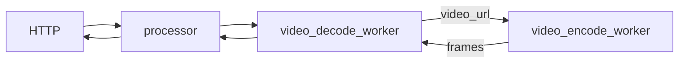
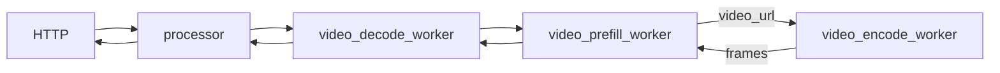

<!--
SPDX-FileCopyrightText: Copyright (c) 2025 NVIDIA CORPORATION & AFFILIATES. All rights reserved.
SPDX-License-Identifier: Apache-2.0

Licensed under the Apache License, Version 2.0 (the "License");
you may not use this file except in compliance with the License.
You may obtain a copy of the License at

http://www.apache.org/licenses/LICENSE-2.0

Unless required by applicable law or agreed to in writing, software
distributed under the License is distributed on an "AS IS" BASIS,
WITHOUT WARRANTIES OR CONDITIONS OF ANY KIND, either express or implied.
See the License for the specific language governing permissions and
limitations under the License.
-->

> [!WARNING]
> The content of this README is derived from `examples/multimodal` and have not been validated in `examples/multimodal_v1`.
> If needed, should validate the content and port to `README.md`


## Deployment with Dynamo Operator

These multimodal examples can be deployed to a Kubernetes cluster using [Dynamo Cloud](../../docs/guides/dynamo_deploy/dynamo_cloud.md) and the Dynamo CLI.

### Prerequisites

You must have first followed the instructions in [deploy/cloud/helm/README.md](../../deploy/cloud/helm/README.md) to install Dynamo Cloud on your Kubernetes cluster.

**Note**: The `KUBE_NS` variable in the following steps must match the Kubernetes namespace where you installed Dynamo Cloud. You must also expose the `dynamo-store` service externally. This will be the endpoint the CLI uses to interface with Dynamo Cloud.

### Deployment Steps

For detailed deployment instructions, please refer to the [Operator Deployment Guide](../../docs/guides/dynamo_deploy/operator_deployment.md). The following are the specific commands for the multimodal examples:

```bash
# Set your project root directory
export PROJECT_ROOT=$(pwd)

# Configure environment variables (see operator_deployment.md for details)
export KUBE_NS=dynamo-cloud
export DYNAMO_CLOUD=http://localhost:8080  # If using port-forward
# OR
# export DYNAMO_CLOUD=https://dynamo-cloud.nvidia.com  # If using Ingress/VirtualService

# Build the Dynamo base image (see operator_deployment.md for details)
export DYNAMO_IMAGE=<your-registry>/<your-image-name>:<your-tag>

# TODO: Apply Dynamo graph deployment for the example
```

**Note**: To avoid rate limiting from unauthenticated requests to HuggingFace (HF), you can provide your `HF_TOKEN` as a secret in your deployment. See the [operator deployment guide](../../docs/guides/dynamo_deploy/operator_deployment.md#referencing-secrets-in-your-deployment) for instructions on referencing secrets like `HF_TOKEN` in your deployment configuration.

**Note**: Optionally add `--Planner.no-operation=false` at the end of the deployment command to enable the planner component to take scaling actions on your deployment.

### Testing the Deployment

Once the deployment is complete, you can test it. If you have ingress available for your deployment, you can directly call the url returned
in `dynamo deployment get ${DEPLOYMENT_NAME}` and skip the steps to find and forward the frontend pod.

```bash
# Find your frontend pod
export FRONTEND_POD=$(kubectl get pods -n ${KUBE_NS} | grep "${DEPLOYMENT_NAME}-frontend" | sort -k1 | tail -n1 | awk '{print $1}')

# Forward the pod's port to localhost
kubectl port-forward pod/$FRONTEND_POD 8000:8000 -n ${KUBE_NS}

# Test the API endpoint
curl localhost:8000/v1/chat/completions \
  -H "Content-Type: application/json" \
  -d '{
    "model": "llava-hf/llava-1.5-7b-hf",
    "messages": [
      {
        "role": "user",
        "content": [
          { "type": "text", "text": "What is in this image?" },
          { "type": "image_url", "image_url": { "url": "http://images.cocodataset.org/test2017/000000155781.jpg" } }
        ]
      }
    ],
    "max_tokens": 300,
    "temperature": 0.0,
    "stream": false
  }'
```

If serving the example Qwen model, replace `"llava-hf/llava-1.5-7b-hf"` in the `"model"` field with `"Qwen/Qwen2.5-VL-7B-Instruct"`. If serving the example Phi3V model, replace `"llava-hf/llava-1.5-7b-hf"` in the `"model"` field with `"microsoft/Phi-3.5-vision-instruct"`.

For more details on managing deployments, testing, and troubleshooting, please refer to the [Operator Deployment Guide](../../docs/guides/dynamo_deploy/operator_deployment.md).

## Multimodal Aggregated Video Serving

This example demonstrates deploying an aggregated multimodal model that can process video inputs.

### Components

- workers: For video serving, we have two workers, [video_encode_worker](components/video_encode_worker.py) for decoding video into frames, and [video_decode_worker](components/video_decode_worker.py) for prefilling and decoding.
- processor: Tokenizes the prompt and passes it to the decode worker.
- frontend: HTTP endpoint to handle incoming requests.

### Graph

In this graph, we have two workers, `video_encode_worker` and `video_decode_worker`.
The `video_encode_worker` is responsible for decoding the video into a series of frames. Unlike the image pipeline which generates embeddings, this pipeline passes the raw frames directly to the `video_decode_worker`. This transfer is done efficiently using RDMA.
The `video_decode_worker` then receives these frames, and performs prefill and decode steps with the model. Separating the video processing from the language model inference allows for flexible scaling.

This figure shows the flow of the graph:


```bash
cd $DYNAMO_HOME/examples/multimodal
# Serve a LLaVA-NeXT-Video-7B model:
dynamo serve graphs.agg_video:Frontend -f ./configs/agg_video.yaml
```

### Client

In another terminal:
```bash
curl -X 'POST'   'http://localhost:8000/v1/chat/completions'   -H 'Content-Type: application/json'   -d '{
    "model": "llava-hf/LLaVA-NeXT-Video-7B-hf",
    "messages": [
      {
        "role": "user",
        "content": [
          {
            "type": "text",
            "text": "Describe the video in detail"
          },
          {
            "type": "video_url",
            "video_url": {
              "url": "https://storage.googleapis.com/gtv-videos-bucket/sample/BigBuckBunny.mp4"
            }
          }
        ]
      }
    ],
    "max_tokens": 300,
    "stream": false
  }' | jq
```

You should see a response describing the video's content similar to
```json
{
  "id": "b5714626-5889-4bb7-8c51-f3bca65b4683",
  "object": "chat.completion",
  "created": 1749772533,
  "model": "llava-hf/LLaVA-NeXT-Video-7B-hf",
  "choices": [
    {
      "index": 0,
      "message": {
        "role": "assistant",
        "content": " Sure! The video features a group of anthropomorphic animals who appear human-like. They're out in a meadow, which is a large, open area covered in grasses, and have given human qualities like speaking and a desire to go on adventures. The animals are seen play-fighting with each other clearly seen glancing at the camera when they sense it, blinking, and Roman the second can be directly heard by the camera reciting the line, \"When the challenge becomes insane, the behavior becomes erratic.\" A white rabbit is the first in shot and he winks the left eye and flips the right ear before shaking with the mouse and squirrel friends on a blurry rock ledge under the sky. At some point, the rabbit turns towards the camera and starts playing with the thing, and there's a distant mountain in the background. Furthermore, a little animal from a tree in the background flies with two rocks, and it's joined by the rest of the group of friends. That outro is an elder turtle in the Ramden musical style saturated with a horn-like thing pattern."
      },
      "finish_reason": "stop"
    }
  ]
}
```

## Multimodal Disaggregated Video Serving

This example demonstrates deploying a disaggregated multimodal model that can process video inputs.

### Dependency

Video example relies on `av` package for video preprocessing inside the encode_worker.
Please install `av` inside the dynamo container to enable video example.

`pip install av`

### Components

- workers: For disaggregated video serving, we have three workers, [video_encode_worker](components/video_encode_worker.py) for decoding video into frames, [video_decode_worker](components/video_decode_worker.py) for decoding, and [video_prefill_worker](components/video_prefill_worker.py) for prefilling.
- processor: Tokenizes the prompt and passes it to the decode worker.
- frontend: HTTP endpoint to handle incoming requests.

### Graph

In this graph, we have three workers, `video_encode_worker`, `video_decode_worker`, and `video_prefill_worker`.
For the LLaVA-NeXT-Video-7B model, frames are only required during the prefill stage. As such, the `video_encode_worker` is connected directly to the `video_prefill_worker`.
The `video_encode_worker` is responsible for decoding the video into a series of frames and passing them to the `video_prefill_worker` via RDMA.
The `video_prefill_worker` performs the prefilling step and forwards the KV cache to the `video_decode_worker` for decoding.

This figure shows the flow of the graph:


```bash
cd $DYNAMO_HOME/examples/multimodal
# Serve a LLaVA-NeXT-Video-7B model:
dynamo serve graphs.disagg_video:Frontend -f ./configs/disagg_video.yaml
```

### Client

In another terminal:
```bash
curl -X 'POST'   'http://localhost:8000/v1/chat/completions'   -H 'Content-Type: application/json'   -d '{
    "model": "llava-hf/LLaVA-NeXT-Video-7B-hf",
    "messages": [
      {
        "role": "user",
        "content": [
          {
            "type": "text",
            "text": "Describe the video in detail"
          },
          {
            "type": "video_url",
            "video_url": {
              "url": "https://storage.googleapis.com/gtv-videos-bucket/sample/BigBuckBunny.mp4"
            }
          }
        ]
      }
    ],
    "max_tokens": 300,
    "stream": false
  }' | jq
```

You should see a response describing the video's content similar to
```json
{
  "id": "d1d641b1-4daf-48d3-9d06-6a60743b5a42",
  "object": "chat.completion",
  "created": 1749775300,
  "model": "llava-hf/LLaVA-NeXT-Video-7B-hf",
  "choices": [
    {
      "index": 0,
      "message": {
        "role": "assistant",
        "content": " The video features two animals in a lush, green outdoor environment. On the ground, there is a white rabbit with big brown eyes, a playful expression, and two antlers. The rabbit is accompanied by a uniquely colored bird with orange pupils, possibly a squirrel or a hamster, sitting on its head. These two animals seem to have embarked on an unlikely journey, flying together in the sky. The backdrop showcases rolling green hills and trees under the pleasant weather. The sky is clear, indicating a beautiful day. The colors and contrast suggest the landscape is during spring or summer, signifying the rabbit and bird could also be engaging in outdoor activities during those seasons. Overall, it's a charming scene depicting an unlikely yet harmonious pair, enjoying a surprise adventure in nature."
      },
      "finish_reason": "stop"
    }
  ]
}
```


## Deploying Multimodal Examples on Kubernetes

This guide will help you quickly deploy and clean up the multimodal example services in Kubernetes.

### Prerequisites

- **Dynamo Cloud** is already deployed in your target Kubernetes namespace.
- You have `kubectl` access to your cluster and the correct namespace set in `$NAMESPACE`.


### Create a secret with huggingface token

```bash
export HF_TOKEN="huggingfacehub token with read permission to models"
kubectl create secret generic hf-token-secret --from-literal=HF_TOKEN=$HF_TOKEN -n $KUBE_NS || true
```

---

Choose the example you want to deploy or delete. The YAML files are located in `examples/multimodal/deploy/k8s/`.

### Deploy the Multimodal Example

```bash
kubectl apply -f examples/multimodal/deploy/k8s/<Example yaml file> -n $NAMESPACE
```

### Uninstall the Multimodal Example


```bash
kubectl delete -f examples/multimodal/deploy/k8s/<Example yaml file> -n $NAMESPACE
```

### Using a different dynamo container

To customize the container image used in your deployment, you will need to update the manifest before applying it.

You can use [`yq`](https://github.com/mikefarah/yq?tab=readme-ov-file#install), a portable command-line YAML processor.

Please follow the [installation instructions](https://github.com/mikefarah/yq?tab=readme-ov-file#install) for your platform if you do not already have `yq` installed. After installing `yq`, you can generate and apply your manifest as follows:


```bash
export DYNAMO_IMAGE=my-registry/my-image:tag

yq '.spec.services.[].extraPodSpec.mainContainer.image = env(DYNAMO_IMAGE)' $EXAMPLE_FILE > my_example_manifest.yaml

# install the dynamo example
kubectl apply -f my_example_manifest.yaml -n $NAMESPACE

# uninstall the dynamo example
kubectl delete -f my_example_manifest.yaml -n $NAMESPACE

```