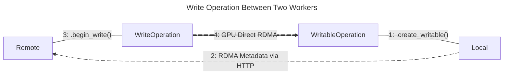
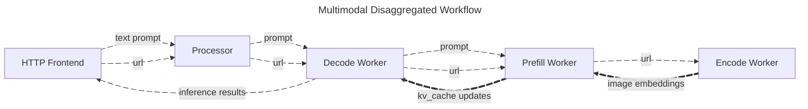

<!--
SPDX-FileCopyrightText: Copyright (c) 2025 NVIDIA CORPORATION & AFFILIATES. All rights reserved.
SPDX-License-Identifier: Apache-2.0

Licensed under the Apache License, Version 2.0 (the "License");
you may not use this file except in compliance with the License.
You may obtain a copy of the License at

http://www.apache.org/licenses/LICENSE-2.0

Unless required by applicable law or agreed to in writing, software
distributed under the License is distributed on an "AS IS" BASIS,
WITHOUT WARRANTIES OR CONDITIONS OF ANY KIND, either express or implied.
See the License for the specific language governing permissions and
limitations under the License.
-->

# Dynamo Connect

Dynamo connect provides a Pythonic interface to the NIXL base RDMA subsystem via a set of Python classes.
The primary goal of this library to simplify the integration of NIXL based RDMA into inference applications.

All operations using the Connect library begin with the [`Connector`](#connector) class and the type of operation required.
There are four types of supported operations:

  - **Register local readable memory**:

    Register local memory buffer(s) with the RDMA subsystem to enable a remote worker to read from.

  - **Register local writable memory**:

    Register local memory buffer(s) with the RDMA subsystem to enable a remote worker to write to.

  - **Read from registered, remote memory**:

    Read remote memory buffer(s), registered by a remote worker to be readable, into local memory buffer(s).

  - **Write to registered, remote memory**:

    Write local memory buffer(s) to remote memory buffer(s) registered by a remote worker to writable.

By connecting correctly paired operations, high-throughput GPU Direct RDMA data transfers can be completed.
Given the list above, the correct pairing of operations would be 1 & 3 or 2 & 4.
Where one side is a "(read|write)-able operation" and the other is its correctly paired "(read|write) operation".
Specifically, a read operation must be paired with a readable operation, and a write operation must be paired with a writable operation.

## Examples

### Generic Example

In the diagram below, Local creates a [`WritableOperation`](#writableoperation) intended to receive data from Remote.
Local then sends metadata about the requested RDMA operation to Remote.
Remote then uses the metadata to create a [`WriteOperation`](#writeoperation) which will perform the GPU Direct RDMA memory transfer from Remote's GPU memory to Local's GPU memory.

### Multimodal Example

In the case of the [Dynamo Multimodal Disaggregated Example](../README.md):

  1. The HTTP frontend accepts a text prompt and a URL to an image.

  2. The prompt and URL are then enqueued with the Processor before being dispatched to the first available Decode Worker.

  3. Decode Worker then requests a Prefill Worker to provide key-value data for the LLM powering the Decode Worker.

  4. Prefill Worker then requests that the image be processed and provided as embeddings by the Encode Worker.

  5. Encode Worker acquires the image, processes it, performs inference on the image using a specialized vision model, and finally provides the embeddings to Prefill Worker.

  6. Prefill Worker receives the embeddings from Encode Worker and generates a key-value cache (KV$) update for Decode Worker's LLM and writes the update directly to the GPU memory reserved for the data.

  7. Finally, Decode Worker performs the requested inference.

  _Note: In this example, it is the data transfer between the Prefill Worker and the Encode Worker that utilizes the Dynamo Connect library. The KV Cache transfer between Decode Worker and Prefill Worker utilizes the NIXL base RDMA subsystem directly without using the Dynamo Connect library._

#### Code Examples

See [prefill_worker](../components/prefill_worker.py#L199) or [decode_worker](../components/decode_worker.py#L239),
for how they coordinate directly with the Encode Worker by creating a [`WritableOperation`](#writableoperation),
sending the operation's metadata via Dynamo's round-robin dispatcher, and awaiting the operation for completion before making use of the transferred data.

See [encode_worker](../components/encode_worker.py#L190),
for how the resulting embeddings are registered with the RDMA subsystem by creating a [`Descriptor`](#descriptor),
a [`WriteOperation`](#writeoperation) is created using the metadata provided by the requesting worker,
and the worker awaits for the data transfer to complete for yielding a response.

## Python Classes

### Connector

Core class for managing the connection between workers in a distributed environment.
Use this class to create readable and writable operations, or read and write data to remote workers.

This class is responsible for interfacing with the NIXL-based RDMA subsystem and providing a "Pythonic" interface
with which to utilize GPU Direct RDMA accelerated data transfers between models hosted by different workers in a Dynamo pipeline.
The connector provides two methods of moving data between workers:

  - Preparing local memory to be written to by a remote worker.

  - Preparing local memory to be read by a remote worker.

In both cases, local memory is registered with the NIXL-based RDMA subsystem via the [`Descriptor`](#descriptor) class and provided to the connector.
The connector then configures the RDMA subsystem to expose the memory for the requested operation and returns an operation control object.
The operation control object, either a [`ReadableOperation`](#readableoperation) or a [`WritableOperation`](#writableoperation),
provides RDMA metadata via its [`.to_serialized()`](#to_serialized) method as well as functionality to know when the operation has been completed or cancel the operation prior to completion.

The RDMA metadata must be provided to the remote worker expected to complete the operation.
The metadata contains required information (identifiers, keys, etc.) which enables the remote worker to interact with the provided memory.

#### Methods

##### `begin_read`

> Creates a [`ReadOperation`](#readoperation) for transferring data from a remote worker.
>
> To create the operation, the serialized request from a remote worker's [`ReadableOperation`](#readableoperation)
> along with a matching set of local memory descriptors which reference memory intended to receive data from the remote worker
> must be provided.
> The serialized request must be transferred from the remote to the local worker via a secondary channel, most likely HTTP or TCP+NATS.
>
> Once created, the operation will begin reading immediately.
> Disposal of the object reference will instruct the RDMA subsystem to cancel the read operation,
> therefore the operation should be awaited until complete or and deleted prior to completion when cancellation is intended.

##### `begin_write`

> Creates a write operation for transferring data to a remote worker.
>
> To create the operation, the serialized request from a remote worker's [`WritableOperation`](#writableoperation)
> along with a matching set of local memory descriptors which reference memory to be transferred to the remote worker
> must be provided.
> The serialized request must be transferred from the remote to the local worker via a secondary channel, most likely HTTP or TCP+NATS.
>
> Once created, the operation will begin writing immediately.
> Disposal of the object reference will instruct the RDMA subsystem to cancel the write operation,
> therefore the operation should be awaited until complete or and deleted prior to completion when cancellation is intended.

##### `create_readable`

> Creates a [`ReadableOperation`](#readableoperation) for transferring data to a remote worker.
>
> To create the operation, a set of local memory descriptors must be provided that reference memory intended to be transferred to
> a remote worker.
> Once created, the memory referenced by the provided descriptors becomes immediately readable by a remote worker with the necessary metadata.
> The metadata required to access the memory referenced by the provided descriptors is accessible via the operations `.to_serialized()` method.
> Once acquired, the metadata needs to be provided to a remote worker via a secondary channel, most likely HTTP or TCP+NATS.
>
> Disposable of the operation's object reference will instruct the RDMA subsystem to cancel the operation,
> therefore the operation should be awaited until complete or and deleted prior to completion when cancellation is intended.

##### `create_writable`

> Creates a [`WritableOperation`](#writableoperation) for transferring data from a remote worker.
>
> To create the operation, a set of local memory descriptors must be provided which reference memory intended to receive data from
> a remote worker.
> Once created, the memory referenced by the provided descriptors becomes immediately writable by a remote worker with the necessary metadata.
> The metadata required to access the memory referenced by the provided descriptors is accessible via the operations `.to_serialized()`  method.
> Once acquired, the metadata needs to be provided to a remote worker via a secondary channel, most likely HTTP or TCP+NATS.
>
> Disposable of the operation's object reference will instruct the RDMA subsystem to cancel the operation,
> therefore the operation should be awaited until complete or and deleted prior to completion when cancellation is intended.

### Descriptor

Memory descriptor that ensures memory is registered with the NIXL base RDMA subsystem.
Memory must be registered with the RDMA subsystem to enable interaction with the memory.

Descriptor objects are administrative and do not copy, move, or otherwise modify the registered memory.

There are four ways to create a descriptor:

  1. From a `torch.Tensor` object. Device information will be derived from the provided object.

  2. From a `tuple` containing either a NumPy or CuPy `ndarray` and information describing where the memory resides (Host/CPU vs GPU).

  3. From a Python `bytes` object. Memory is assumed to reside in CPU addressable host memory.

  4. From a `tuple` comprised of the address of the memory, its size in bytes, and device information.
    An optional reference to a Python object can be provided to avoid garbage collection issues.

### Device

Device describes the device, or kind of memory, a given allocation resides in.
Usually host (`"cpu"`) or GPU (`"cuda"`) memory.

When a system contains multiple GPU devices, specific GPU devices can be identified by including their ordinal index number.
For example, to reference the second GPU in a system `"cuda:1"` can be used.

By default, when `"cuda"` is provided, it is assumed to be `"cuda:0"` or the first GPU enumerated by the system.

### ReadOperation

An operation which transfers data from a remote worker to the local worker.

To create the operation, RDMA metadata ([`SerializedRequest`](#serializedrequest)) from a remote worker's [`ReadableOperation`](#readableoperation)
along with a matching set of local [`Descriptor`](#descriptor) objects which reference memory intended to receive data from the remote worker must be provided.
The RDMA metadata must be transferred from the remote to the local worker via a secondary channel, most likely HTTP or TCP+NATS.

Once created, the operation will begin reading immediately.
Disposal of the object reference will instruct the RDMA subsystem to cancel the read operation,
therefore the operation should be awaited until complete or and deleted prior to completion when cancellation is intended.

#### Methods

##### `cancel`

> Instructs the RDMA subsystem to cancel the operation.
> Completed operations cannot be cancelled.

##### `wait_for_completion`

> Blocks the caller until the memory from the remote worker has been transferred to the provided buffers.

### ReadableOperation

An operation which enables a remote worker to read data from the local worker.

To create the operation, a set of local [`Descriptor`](#descriptor) objects must be provided that reference memory intended to be transferred to a remote worker.
Once created, the memory referenced by the provided descriptors becomes immediately readable by a remote worker with the necessary metadata.
The metadata required to access the memory referenced by the provided descriptors is accessible via the operations `.to_serialized()` method.
Once acquired, the metadata needs to be provided to a remote worker via a secondary channel, most likely HTTP or TCP+NATS.

Disposal of the operation's object reference will instruct the RDMA subsystem to cancel the operation,
therefore the operation should be awaited until complete or and deleted prior to completion when cancellation is intended.

#### Methods

##### `to_serialized`

> Generates and returns the RDMA metadata ([`SerializedRequest`](#serializedrequest)) required for a remote worker to read from the operation.
> Once acquired, the metadata needs to be provided to a remote worker via a secondary channel, most likely HTTP or TCP+NATS.

##### `wait_for_completion`

> Blocks the caller until the operation has received a completion signal from a remote worker.

### WriteOperation

An operation which transfers data from the local worker to a remote worker.

To create the operation, RDMA metadata ([`SerializedRequest`](#serializedrequest)) from a remote worker's [`WritableOperation`](#writableoperation)
along with a matching set of local [`Descriptor`](#descriptor) objects which reference memory to be transferred to the remote worker must be provided.
The RDMA metadata must be transferred from the remote to the local worker via a secondary channel, most likely HTTP or TCP+NATS.

Once created, the operation will begin writing immediately.
Disposal of the object reference will instruct the RDMA subsystem to cancel the write operation,
therefore the operation should be awaited until complete or and deleted prior to completion when cancellation is intended.

#### Methods

##### `cancel`

> Instructs the RDMA subsystem to cancel the operation.
> Completed operations cannot be cancelled.

##### `wait_for_completion`

> Blocks the caller until all provided buffers have been transferred to the remote worker.

### WritableOperation

An operation which enables a remote worker to write data to the local worker.

To create the operation, a set of local [`Descriptor`](#descriptor) objects must be provided which reference memory intended to receive data from a remote worker.
Once created, the memory referenced by the provided descriptors becomes immediately writable by a remote worker with the necessary metadata.
The metadata required to access the memory referenced by the provided descriptors is accessible via the operations `.to_serialized()` method.
Once acquired, the metadata needs to be provided to a remote worker via a secondary channel, most likely HTTP or TCP+NATS.

Disposal of the operation's object reference will instruct the RDMA subsystem to cancel the operation,
therefore the operation should be awaited until complete or and deleted prior to completion when cancellation is intended.

#### Methods

##### `to_serialized`

> Generates and returns the RDMA metadata ([`SerializedRequest`](#serializedrequest)) required for a remote worker to write to the operation.
> Once acquired, the metadata needs to be provided to a remote worker via a secondary channel, most likely HTTP or TCP+NATS.

##### `wait_for_completion`

> Blocks the caller until the operation has received a completion signal from a remote worker.

### SerializedRequest

A Pydantic type intended to provide JSON serialized RDMA metadata about a [`ReadableOperation`](#readableoperation) or [`WritableOperation`](#writableoperation) object.

Use the [`.to_serialized()`](#to_serialized) method on either of the above types to generate a `SerializedRequest` object for an operation.

## References

  - [NVIDIA Dynamo](https://developer.nvidia.com/dynamo) @ [GitHub](https://github.com/ai-dynamo/dynamo)
  - [NVIDIA Inference Transfer Library (NIXL)](https://developer.nvidia.com/blog/introducing-nvidia-dynamo-a-low-latency-distributed-inference-framework-for-scaling-reasoning-ai-models/#nvidia_inference_transfer_library_nixl_low-latency_hardware-agnostic_communication%C2%A0) @ [GitHub](https://github.com/ai-dynamo/nixl)
  - [Dynamo Multimodal Example](https://github.com/ai-dynamo/dynamo/tree/main/examples/multimodal)
  - [NVIDIA GPU Direct](https://developer.nvidia.com/gpudirect)
