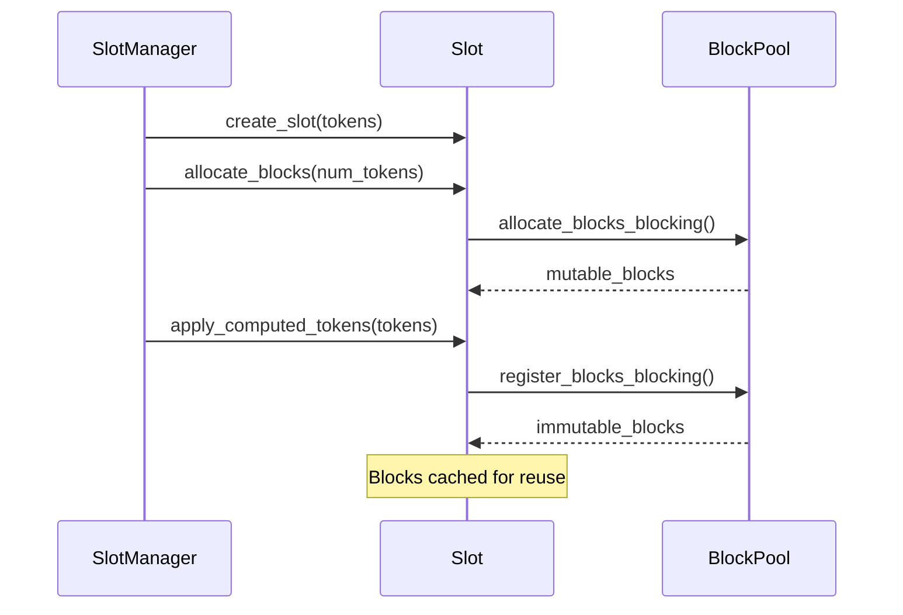
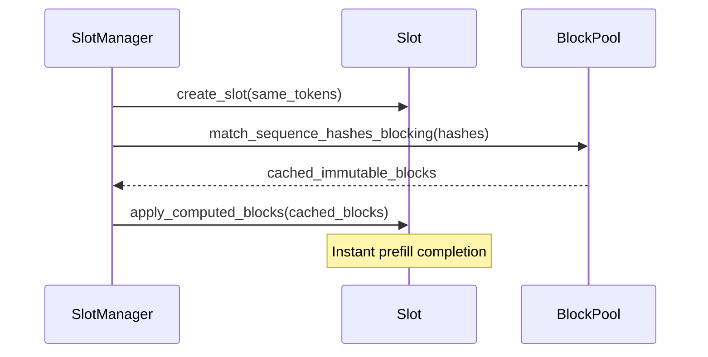

# SlotManager Block Management Test Plan

## Overview

This document outlines a comprehensive testing strategy for the `SlotManager` block management functionality, focusing on the two primary block operation paths and their various constraints, dependencies, and edge cases.

## Core Block Operations

### 1. Cache Miss Path: Allocate → Apply Tokens → Register Blocks



**Key Validation Points:**
- Block allocation before token application
- Sufficient block capacity for tokens
- Successful transition from mutable → immutable
- Block registration in pool cache
- Correct sequence hash generation

### 2. Cache Hit Path: Lookup → Apply Cached Blocks



**Key Validation Points:**
- Sequence hash matching accuracy
- Cached block application without token validation
- **Shared block IDs**: Multiple slots using same blocks
- Performance improvement over cache miss
- State equivalence with cache miss path

## Test Implementation Phases

### Phase 1: Basic Block Operations

#### Test: `test_cache_miss_block_allocation_and_registration`
```rust
// Test the complete cache miss workflow
create_slot() → allocate_blocks() → apply_tokens() → verify_registration()
```

**Validation:**
- `get_block_ids()` returns allocated block IDs
- `num_tokens(Computed)` increases as tokens applied
- Blocks successfully registered in pool cache

#### Test: `test_cache_hit_block_lookup_and_application`
```rust
// Test cache hit after cache miss
slot1: cache_miss_workflow() → slot2: cache_hit_workflow()
```

**Validation:**
- `get_block_ids()` returns **same block IDs** for both slots
- `sequence_hashes()` identical for same tokens/salt
- Faster execution than cache miss path

### Phase 2: Order Dependencies and Constraints

#### Test: `test_required_operation_orders`
```rust
// Validate mandatory operation sequences
✅ allocate_before_apply: allocate() → apply_tokens()
❌ apply_without_allocation: apply_tokens() without allocate()
```

#### Test: `test_mutual_exclusivity_validation`
```rust
// Ensure cache hit XOR cache miss
❌ both_tokens_and_blocks: apply_tokens() + apply_cached_blocks()
✅ tokens_only: apply_tokens()
✅ cached_blocks_only: apply_cached_blocks()
```

### Phase 3: Advanced Workflow Scenarios

#### Test: `test_progressive_token_application`
```rust
// Apply tokens incrementally (work around assertion bug)
allocate_blocks(total_capacity) → apply_token(1) → apply_token(2) → ...
```

#### Test: `test_cross_slot_cache_validation`
```rust
// Verify block sharing across slots
slot1(tokens, salt1) → slot2(tokens, salt2) // Different hashes
slot3(tokens, salt1) → slot4(tokens, salt1) // Shared blocks
```

**Key Assertion:**
```rust
assert_eq!(slot3.get_block_ids(), slot4.get_block_ids());
```

### Phase 4: Error Conditions and Edge Cases

#### Test: `test_validation_failures`
```rust
// Test various failure scenarios
insufficient_allocation() → apply_tokens() // Should fail
mismatched_sequence_hashes() → apply_cached_blocks() // Should fail
```

#### Test: `test_resource_constraint_handling`
```rust
// Test resource exhaustion scenarios
exhaust_block_pool() → allocate_blocks() // Should fail gracefully
```

### Phase 5: Integration Tests

#### Test: `test_end_to_end_cache_miss_to_hit_cycle`
```rust
// Complete workflow validation
create_slot1() → cache_miss_workflow() → destroy_slot1()
create_slot2(same_tokens) → cache_hit_workflow() → verify_equivalence()
```

**State Equivalence Validation:**
```rust
assert_eq!(slot1.num_tokens(All), slot2.num_tokens(All));
assert_eq!(slot1.sequence_hashes(All), slot2.sequence_hashes(All));
// But potentially shared block IDs for efficiency
```

#### Test: `test_multi_slot_parallel_processing`
```rust
// Multiple slots with different token sequences
slots[0..n].each { |slot| independent_block_management(slot) }
```

## Key APIs and Validation Patterns

### Primary SlotManager APIs
```rust
// Slot lifecycle
manager.create_slot(request_id, salt, tokens) → Vec<SequenceHash>
manager.update_slot(update, block_manager) → Result<BlockStates>
manager.get_block_ids(request_id) → Vec<BlockId>
manager.num_tokens(request_id, position) → usize
manager.free_blocks(request_id) → Result<()>
manager.drop_slot(request_id) → Result<()>
```

### Block ID Sharing Validation
```rust
// When slots share cached blocks, they should have identical block IDs
let slot1_blocks = manager.get_block_ids("slot1");
let slot2_blocks = manager.get_block_ids("slot2");
assert_eq!(slot1_blocks, slot2_blocks); // Shared blocks
```

### Sequence Hash Determinism
```rust
// Same tokens + salt = same hashes
let hashes1 = manager.create_slot("req1", salt, tokens.clone());
let hashes2 = manager.create_slot("req2", salt, tokens);
assert_eq!(hashes1, hashes2);
```

## Success Criteria

### ✅ Functional Requirements
- Cache miss path works correctly
- Cache hit path reuses blocks efficiently
- Block IDs are shared when blocks are cached
- State consistency between cache hit/miss paths
- Proper error handling and validation

### ✅ Performance Requirements
- Cache hits significantly faster than cache miss
- Block reuse reduces memory allocation
- No memory leaks in block lifecycle

### ✅ Correctness Requirements
- Deterministic sequence hash generation
- Proper mutual exclusivity enforcement
- Graceful handling of resource constraints
- Debug assertion workarounds function correctly

## Implementation Strategy

1. **Start with basic operations** (Phase 1)
2. **Add constraint validation** (Phase 2)
3. **Implement advanced scenarios** (Phase 3)
4. **Cover error conditions** (Phase 4)
5. **Complete with integration tests** (Phase 5)

Each test should use the top-level SlotManager APIs and focus on observable behavior rather than internal implementation details.

> 💡 **Key Insight:** The most critical test is verifying that `get_block_ids()` returns identical block IDs when slots share cached blocks - this proves the caching mechanism works correctly.
