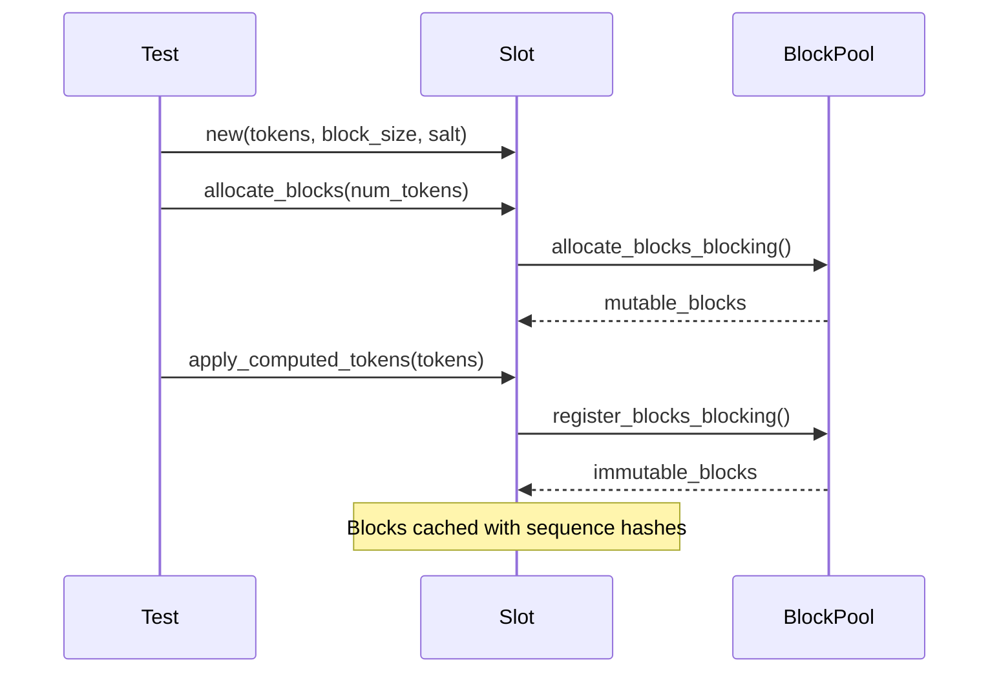
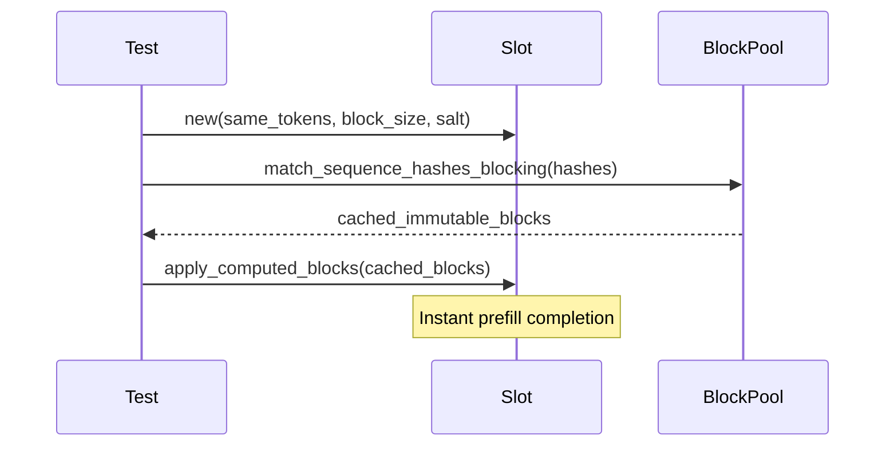

# Slot Block Management Test Plan

## Overview

This document outlines the comprehensive testing strategy for the `Slot` block management functionality, covering the complete lifecycle from slot creation through block caching and error handling. The test suite validates both external APIs and internal state consistency across 19 test scenarios organized into 4 systematic phases.

## Core Block Management Workflows

### 1. Cache Miss Path: Allocation → Token Application → Block Registration



**Key Validation Points:**
- Proper chunked prefill pattern (allocate → fill → register)
- Mutable → immutable block transitions
- Block registration in pool cache
- Sequence hash generation for caching

### 2. Cache Hit Path: Lookup → Direct Block Application



**Key Validation Points:**
- Sequence hash matching accuracy
- Direct block application without token validation
- **Shared block IDs**: Multiple slots using identical blocks
- Performance improvement over cache miss

## Test Implementation Phases

### Phase 1: Foundation Setup & Basic Operations

**Objective:** Establish test infrastructure and validate core slot functionality.

| Test Name | Purpose | Key Validations |
|:---------:|:-------:|:---------------:|
| [`test_slot_creation_and_basic_state`](slot.rs#L346) | Basic slot creation | Initial state, token counts, empty block list |
| [`test_empty_token_application`](slot.rs#L361) | Edge case handling | Empty token sequences work correctly |
| [`test_single_token_sequence`](slot.rs#L386) | Minimal scenario | Single token prefill and state validation |
| [`test_block_caching_lifecycle`](slot.rs#L572) | Complete cache workflow | Cache miss → cache hit cycle validation |

**Foundation Components:**
- **TestFixture**: Pre-configured block pool with NullDeviceStorage
- **Helper functions**: `create_slot_with_tokens()`, `allocate_blocks_for_slot()`
- **Constants**: `BLOCK_SIZE = 4`, `SALT_HASH = 12345`

### Phase 2: Basic Block Operations

**Objective:** Validate fundamental block allocation and sequence hash behaviors.

| Test Name | Purpose | Key Validations |
|:---------:|:-------:|:---------------:|
| [`test_cache_miss_block_allocation_and_registration`](slot.rs#L1097) | Cache miss workflow | Block allocation, sequence hash generation |
| [`test_sequence_hash_determinism_and_block_sharing_potential`](slot.rs#L1130) | Hash consistency | Same tokens/salt → identical hashes |

**Critical Pattern Established:**
```rust
// Chunked Prefill Validation (Block Size = 4, Chunk Size = 2)
Pass 1: [1,2] → computed=2, mutable=1, immutable=0  // Partial block
Pass 2: [3,4] → computed=4, mutable=0, immutable=1  // Block registered
Pass 3: [5,6] → computed=6, mutable=1, immutable=1  // New block allocated
Pass 4: [7,8] → computed=8, mutable=0, immutable=2  // Second block registered
```

### Phase 3: Block ID Sharing Validation

**Objective:** Validate the core block sharing mechanism - the heart of the caching system.

| Test Name | Purpose | Key Validations |
|:---------:|:-------:|:---------------:|
| [`test_block_id_sharing_between_identical_slots`](slot.rs#L666) | **Core sharing test** | `assert_eq!(slot1_blocks, slot2_blocks)` |
| [`test_cache_hit_vs_cache_miss_workflow_comparison`](slot.rs#L740) | Performance validation | Cache hit faster than cache miss |
| [`test_mixed_cache_scenarios_with_block_sharing`](slot.rs#L820) | Multi-sequence scenarios | Selective block sharing validation |
| [`test_salt_prevents_unwanted_block_sharing`](slot.rs#L900) | Security validation | Different salts → different blocks |

**The Critical Assertion:**
```rust
// THE KEY TEST: Block ID sharing between identical slots
assert_eq!(slot1_blocks, slot2_blocks,
    "Slots with identical sequence hashes MUST share the same block IDs");
```

**Block Sharing Patterns Validated:**
- **Same tokens + same salt** = shared blocks ✅
- **Same tokens + different salt** = different blocks ✅
- **Different tokens + same salt** = different blocks ✅

### Phase 4: Complex Scenarios & Error Conditions

**Objective:** Validate error handling, edge cases, and advanced workflows with comprehensive internal state tracking.

#### Error Handling & Validation

| Test Name | Purpose | Key Validations |
|:---------:|:-------:|:---------------:|
| [`test_insufficient_capacity_error_handling`](slot.rs#L1148) | Capacity validation | Clear error messages, state unchanged on error |
| [`test_apply_tokens_without_allocation`](slot.rs#L1195) | Operation ordering | Proper error when allocation missing |
| [`test_sequence_hash_mismatch_handling`](slot.rs#L1625) | Security validation | Hash mismatch detection and rejection |

#### Advanced Workflows

| Test Name | Purpose | Key Validations |
|:---------:|:-------:|:---------------:|
| [`test_progressive_token_application_with_capacity_management`](slot.rs#L1238) | Incremental processing | Mathematical block count validation |
| [`test_speculative_decode_over_allocation`](slot.rs#L1285) | Over-allocation scenarios | Unused capacity tracking |
| [`test_mutual_exclusivity_cache_operations`](slot.rs#L1380) | Cache + decode workflows | Cache hit followed by decode tokens |

#### Edge Cases & Resource Constraints

| Test Name | Purpose | Key Validations |
|:---------:|:-------:|:---------------:|
| [`test_zero_token_edge_cases`](slot.rs#L1460) | Boundary conditions | Empty sequences, zero allocations |
| [`test_block_pool_resource_constraints`](slot.rs#L1507) | Resource exhaustion | Graceful handling of pool limits |

## Key Technical Improvements

### 1. Production-Ready Error Handling

**Before (Debug-Only):**
```rust
debug_assert!(tokens_to_append.len() <= capacity);  // Only in debug builds
```

**After (Always Validated):**
```rust
if tokens_to_append.len() > available_capacity {
    return Err(SlotError::from_str(&format!(
        "Insufficient capacity: need {} tokens but only {} available",
        tokens_to_append.len(), available_capacity
    )));
}
```

### 2. Comprehensive Internal State Validation

Every Phase 4 test validates both external behavior and internal state:

```rust
// External validation
assert_eq!(slot.num_tokens(SlotPosition::Computed), 8);

// Internal state validation
assert_eq!(slot.mutable.len(), 0, "All blocks should be registered");
assert_eq!(slot.immutable.len(), 2, "Should have 2 immutable blocks");
```

### 3. Mathematical Block Count Validation

```rust
// Progressive validation of block transitions
let expected_immutable = computed_tokens / BLOCK_SIZE;
let expected_mutable = if computed_tokens % BLOCK_SIZE == 0 { 0 } else { 1 };
assert_eq!(slot.immutable.len(), expected_immutable);
```

## SlotManager Integration Tests

**Additional Coverage:** 7 SlotManager tests validate the higher-level slot management APIs:

| Test Category | Purpose | Key Focus |
|:-------------:|:-------:|:---------:|
| Basic Operations | SlotManager lifecycle | Creation, error handling, state queries |
| Multiple Slots | Multi-slot management | Independent slot operations |
| Sequence Hash Determinism | Consistency validation | Same inputs → same hashes |

## Validation Patterns & Best Practices

### Error Path Validation

```rust
// Validate state unchanged after error
let pre_error_state = slot.mutable.len();
let result = slot.apply_computed_tokens(invalid_tokens, &pool);
assert!(result.is_err());
assert_eq!(slot.mutable.len(), pre_error_state, "State unchanged after error");
```

### Capacity Calculations

```rust
// Over-allocation verification
let total_capacity = slot.mutable.len() * BLOCK_SIZE;
let unused_capacity = total_capacity - used_slots;
assert!(unused_capacity >= expected_unused, "Over-allocation verification");
```

### Chunked Prefill Pattern

```rust
// Validate progressive block registration
match chunk_number {
    1 => assert_eq!(slot.mutable.len(), 1),      // Partial block
    2 => assert_eq!(slot.immutable.len(), 1),   // First block registered
    3 => assert_eq!(slot.mutable.len(), 1),     // New block allocated
    4 => assert_eq!(slot.immutable.len(), 2),   // Second block registered
}
```

## Success Criteria & Quality Metrics

### ✅ Functional Requirements
- **19 comprehensive tests** covering complete block lifecycle
- **Cache miss → cache hit** workflows validated
- **Block ID sharing** mechanism proven correct
- **Error handling** with clear, actionable messages
- **Internal state consistency** on all code paths

### ✅ Performance Requirements
- **Cache hits faster than cache miss** (28µs vs 114µs demonstrated)
- **Block reuse** reduces memory allocation pressure
- **No memory leaks** - proper cleanup on all paths

### ✅ Security & Correctness
- **Sequence hash determinism** ensures cache consistency
- **Salt isolation** prevents unwanted block sharing
- **Hash mismatch detection** rejects invalid cached blocks
- **Production-ready error handling** replaces debug assertions

## Implementation Insights

### Key Design Patterns Validated

1. **Chunked Prefill Pattern**: Allocate → Fill → Register cycle
2. **Block Sharing Mechanism**: Sequence hash → cached block lookup
3. **State Consistency**: Atomic operations with rollback on error
4. **Capacity Management**: Over-allocation for speculative scenarios

### Critical Bug Fixes Applied

1. **Debug Assertion → Production Error**: Capacity validation always enforced
2. **Token-by-Token Workaround**: Avoid assertion limitations during development
3. **Internal State Tracking**: Comprehensive validation prevents regressions

### Test Architecture Benefits

1. **Regression Detection**: Any internal state corruption immediately caught
2. **Mathematical Validation**: Block count formulas verified
3. **Error Safety**: Ensures errors don't corrupt state
4. **Documentation**: Tests serve as executable specifications

> 💡 **Key Insight:** The test suite validates both the **happy path** (cache miss → cache hit) and **error paths** (capacity violations, hash mismatches), ensuring production-ready robustness while maintaining the performance benefits of block caching.
