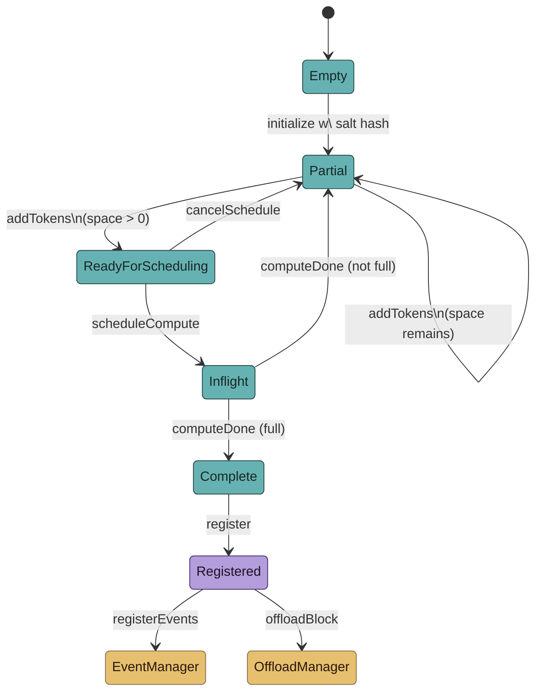
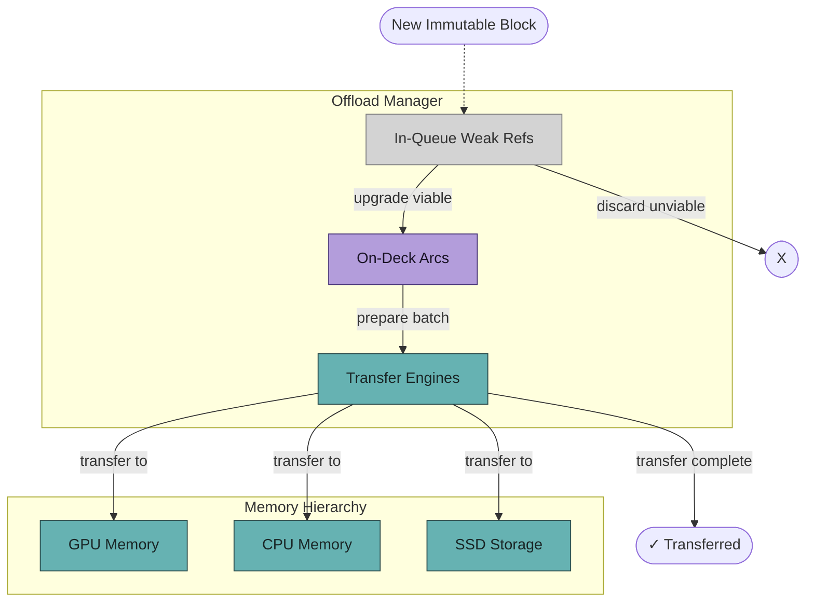

## Block States

<!-- Component Diagram - Table Sync -->

Note: The color scheme is designed to be accessible in both light and dark modes, with:
- Teal representing concrete states in the block lifecycle (mutable blocks)
- Purple representing traits (immutable interface - Registered state)
- Muted gold representing default constructable components (external managers)

| State | Description |
|-------|-------------|
| Empty | Initial state before block initialization |
| Partial | State when block is partially filled with tokens |
| ReadyForScheduling | State when block is ready for compute scheduling |
| Inflight | State when block is being computed |
| Complete | State when block computation is complete |
| Registered | Final immutable state after block computation is finalized |
| EventManager | External system for managing block events (see separate diagram) |
| OffloadManager | External system for managing block offloading (see separate diagram) |

## OffloadManager

The OffloadManager orchestrates the movement of immutable registered blocks (Arc<MutableBlock>) between different memory hierarchies (e.g., GPU → CPU → SSD). It manages a pipeline of block transfers through three primary components:

1.  **Transfer Engines**: Actively copies sequences of blocks between memory hierarchies. Optimized for transport bandwidth.

```mermaid
stateDiagram-v2
    direction LR
    [*] --> InQueueWP:::weakRef : new block (weak ref)

    InQueueWP --> OnDeckQ:::trait : upgrade weak ref
    OnDeckQ --> TransferEng:::concrete : schedule transfer

    TransferEng --> TransferredPS : transfer complete
    TransferredPS --> [*]

    %% Styling
    classDef concrete fill:#66B2B2,stroke:#2A4949,color:#1A2626
    classDef trait fill:#B39DDB,stroke:#4A367A,color:#1A1426
    classDef defaultConstructable fill:#E6C06E,stroke:#8B7355,color:#2B1810
    classDef weakRef fill:#D3D3D3,stroke:#808080,color:#333333
```

2.  **On-Deck Stage**: Blocks are held in their shared immutable state (Arc<MutableBlock>), ready to be transferred next. This queue is filled first.
3.  **In-Queue Stage**: A priority queue holding demoted weak references (Weak<MutableBlock>) to blocks. This queue is used if the On-Deck stage is full.

The system maintains a continuous flow: when Transfer Engines finish a set of transfers, prepared blocks are pulled from the On-Deck queue. Subsequently, In-Queue blocks are upgraded to strong references (Arc<MutableBlock>) and moved to the On-Deck queue. Weak blocks that cannot be upgraded are discarded, and new blocks are pulled from In-Queue until On-Deck is populated.

<!-- Component Diagram - Table Sync -->

| Component         | Description                                                                 |
|-------------------|-----------------------------------------------------------------------------|
| InQueueWP         | Priority queue of weak references (Weak<MutableBlock>) to blocks.         |
| OnDeckQ           | Queue of blocks in shared immutable state (Arc<MutableBlock>), ready for transfer. |
| TransferEng       | Active transfer operations between memory hierarchies.                      |
| TransferredPS     | Pseudo-state indicating blocks have been successfully transferred.            |

<!-- Component Diagram - Table Sync -->

| Component                  | Description                                                                     |
|----------------------------|---------------------------------------------------------------------------------|
| M_GPU                      | GPU Memory: Source memory hierarchy.                                            |
| M_CPU                      | CPU Memory: Intermediate/Destination memory hierarchy.                          |
| M_SSD                      | SSD Storage: Destination memory hierarchy.                                      |
| IQ In-Queue Weak Refs      | Priority queue of weak references (Weak<MutableBlock>) to blocks awaiting offload. |
| OD (On-Deck Arcs)          | Queue of shared immutable blocks (Arc<MutableBlock>) ready for transfer.        |
| TE (Transfer Engines)      | Manages the active copying of block data between memory locations.              |
| NewBlock                   | Represents a new immutable block entering the offload system.                   |
| Discarded                  | Represents weak-referenced blocks that could not be upgraded and are discarded. |
| TC (Transferred)           | Represents the state where a block transfer is successfully completed.          |

Note: The color scheme is designed to be accessible in both light and dark modes, with:
- Teal (`concrete`): Concrete components, memory locations, and active processes.
- Purple (`trait`): Shared immutable blocks (Arc<T>).
- Muted Gold (`defaultConstructable`): Components that might be optionally constructed (not heavily used here).
- Light Gray (`weakRef`): Blocks held as weak references (Weak<T>).
