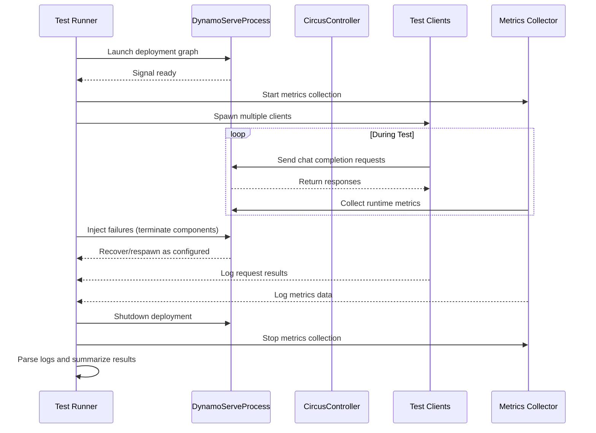
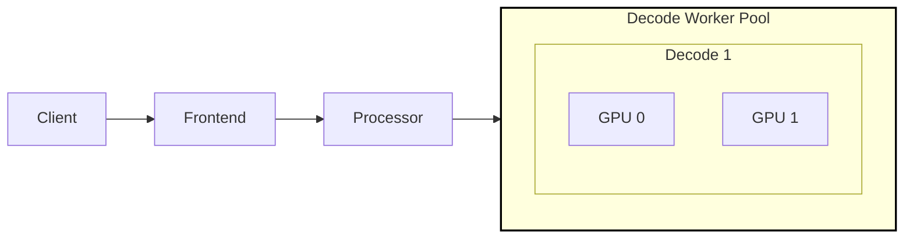
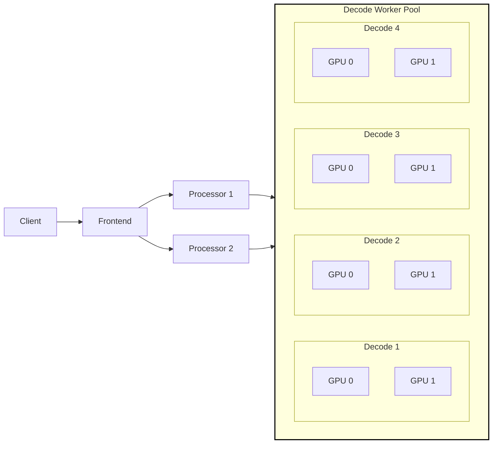
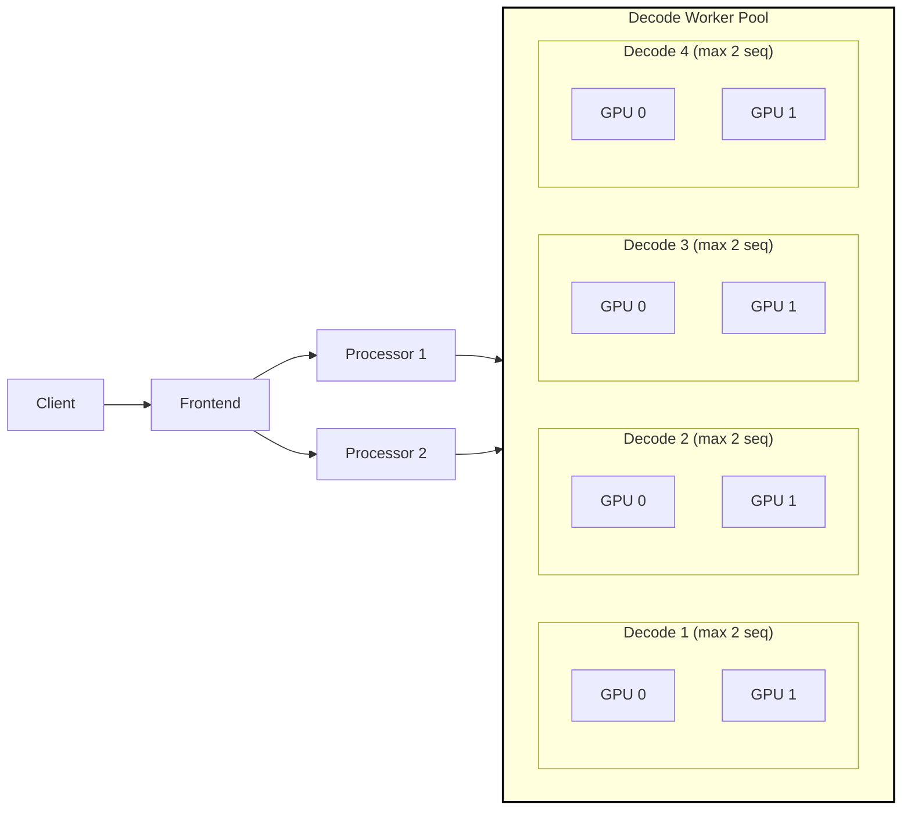
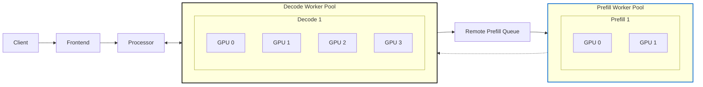
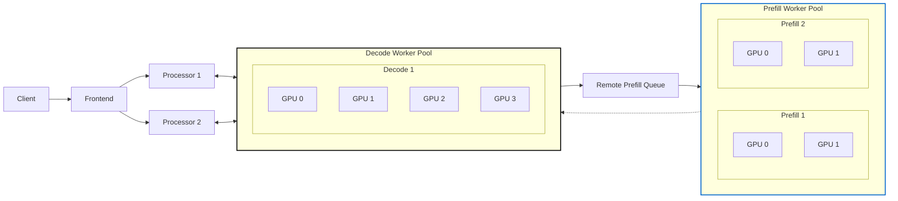

<!--
SPDX-FileCopyrightText: Copyright (c) 2024-2025 NVIDIA CORPORATION & AFFILIATES. All rights reserved.
SPDX-License-Identifier: Apache-2.0

Licensed under the Apache License, Version 2.0 (the "License");
you may not use this file except in compliance with the License.
You may obtain a copy of the License at

http://www.apache.org/licenses/LICENSE-2.0

Unless required by applicable law or agreed to in writing, software
distributed under the License is distributed on an "AS IS" BASIS,
WITHOUT WARRANTIES OR CONDITIONS OF ANY KIND, either express or implied.
See the License for the specific language governing permissions and
limitations under the License.
-->

# Fault Tolerance Test Suite

As a large scale distributed inference serving framework in addition
to providing high throughput and low latency, Dynamo needs to
provide fault detection, resilency, and quick recovery in the face of
unforseen failures. In order to test Dynamo we are developing a test
suite to inject and measure the impact of different types of failure
conditions.

## Test Architecture

The fault tolerance test suite is designed as a set of pytest
configurations that launch typical dynamo serve graph deployments and
then inject failures by terminating processes in the graph. To test
the recovery time and impact of failures a set number of clients are
launched in parallel. Each client sends a set number of synchronous
requests. Log files are stored for each dynamo process as well as for
each client and inspected using a post-processing script.

> [!NOTE]
> Test pass / failure is not an indication of SLA for recovery or resilience
> It only indicates is the test was executed and data was collected

> [!NOTE]
> The test suite currently targets single node Dynamo Serve.
> Support for Dynamo Deploy is a work in progress.

###  Test Sequence Diagram



### Failure Scenarios

The test suite includes several predefined fault injection scenarios designed to validate system resilience under various failure conditions. These scenarios are configured in `scenarios.py` and can be selected via pytest parameters. Below is a description of the available scenarios:

| Scenario Name          | Description                                                                 | Affected Components                             | Timing Example     |
|------------------------|-----------------------------------------------------------------------------|-------------------------------------------------|--------------------|
| **decode_worker**      | Terminates decoder worker processes                                         | `dynamo_vllmworker`                             | 30 seconds         |
| **prefill_worker**     | Terminates prefill worker processes                                         | `dynamo_prefillworker`                          | 30 seconds         |
| **frontend**           | Terminates frontend processes handling client requests                      | `dynamo_frontend`                               | 30 seconds         |
| **processor**          | Terminates processor nodes responsible for task orchestration               | `dynamo_processor`                              | 30 seconds         |
| **vllm_worker**        | Terminates low-level VLLM worker processes                                  | `vllm_worker` (external to Dynamo)              | 30 seconds         |
| **none**               | Baseline scenario with no failures                                          | N/A                                             | N/A                |


#### Key Characteristics:
1. **Timing**: Failures are injected at predefined intervals (e.g., 30 seconds after test start)
2. **Severity**: The number of terminated processes can be configured (default: 1)
3. **Scope**: Failures target specific components while leaving others operational

#### Configuration:
- **Injection Timing**: Defined in `failure_scenarios` dictionary in `scenarios.py`
- **Process Count**: Adjustable via tuple values (e.g., `("dynamo_vllmworker", 1)` terminates 1 process)
- **Component Mapping**:
  - `dynamo_*`: Internal Dynamo services
  - `vllm_worker`: External VLLM model workers

#### Example Scenario Execution:

Run all graph configurations injecting a decode_worker failure.

```bash
cd tests/fault_tolerance
pytest test_runner.py -k decode_worker
```

### Test Results Directory

For each test scenario a directory of log files is created and post processed to summarize the test.

```
test_worker_failure[agg-tp-2-dp-4-none]

.
├── client_0.log.txt
├── client_1.log.txt
├── client_2.log.txt
├── client_3.log.txt
├── client_4.log.txt
├── client_5.log.txt
├── client_6.log.txt
├── client_7.log.txt
├── dynamo_Frontend
│   ├── error.log
│   └── output.log
├── dynamo.log.txt
├── dynamo_Planner
│   ├── error.log
│   └── output.log
├── dynamo_Processor
│   ├── error.log
│   └── output.log
├── dynamo_VllmWorker
│   ├── error.log
│   └── output.log
├── etcd.log.txt
├── nats-server.log.txt
├── nvidia-smi.log.txt
├── test.log.txt
└── watcher.log.txt

```

| File/Directory Name                | Description                                                                                      |
|------------------------------------|------------------------------------------------------------------------------------------------|
| **client_*.log.txt**               | Request/response logs for each client instance (contains JSON-formatted request details)        |
| **dynamo_*/error.log**             | Error logs for specific Dynamo components (e.g., Frontend, Processor, VllmWorker)               |
| **dynamo_*/output.log**            | Standard output logs for Dynamo components (service startup/shutdown messages)                |
| **dynamo.log.txt**                 | Aggregate logs for Dynamo services (orchestration and initialization)                           |
| **etcd.log.txt**                   | Logs for etcd, the distributed key-value store used for service coordination                    |
| **nats-server.log.txt**            | Logs for NATS message broker, handling inter-service communication                             |
| **nvidia-smi.log.txt**             | GPU monitoring logs (records utilization statistics during test execution)                      |
| **test.log.txt**                   | Primary test execution log (contains fault injection timing, process management, and test status)|
| **watcher.log.txt**                | Metrics collected by the watcher service (e.g., pending requests, active workers)               |

### Summary Results

Results are presented in table format after each test providing summary statistics.

**Test Group:** agg-tp-2-dp-1

**Test Command:**  dynamo serve graphs.agg:Frontend -f /workspace/tests/fault_tolerance/configs/agg_tp_2_dp_1.yaml --Frontend.port 8000 in /workspace/examples/llm

|    Failure    |   Startup Time |   Success |   Failed |   Latency Before |   Latency After |   Pending Before |   Pending After |   Violations Before |   Violations After |   Recovery Time |
|:-------------:|---------------:|----------:|---------:|-----------------:|----------------:|-----------------:|----------------:|--------------------:|-------------------:|----------------:|
|     none      |          56.00 |    800.00 |     0.00 |             1.97 |             N/A |             0.00 |             N/A |                8.00 |                N/A |             N/A |
|   frontend    |          56.00 |    656.00 |   144.00 |             1.96 |            1.96 |             0.00 |            0.00 |                0.00 |               0.00 |           17.53 |
|   processor   |          57.00 |    584.00 |   216.00 |             1.96 |            1.96 |             0.00 |            0.00 |                0.00 |               0.00 |           25.96 |
| decode_worker |          80.00 |    520.00 |   280.00 |             2.01 |            1.98 |             0.00 |            0.00 |                8.00 |               8.00 |           37.99 |
|  vllm_worker  |          58.00 |    120.00 |   680.00 |             1.98 |             nan |             0.00 |            0.00 |                0.00 |               0.00 |             N/A |


| Column Name           | Description                                                                 |
|-----------------------|-----------------------------------------------------------------------------|
| **Failure**           | Type of fault injection applied during the test (or 'none' for baseline)     |
| **Startup Time**      | Time (seconds) taken for the service to become ready after initialization    |
| **Success**           | Number of client requests that succeeded                                    |
| **Failed**            | Number of client requests that failed or were invalid                       |
| **Latency Before**    | Average request latency (seconds) for successful requests before fault injection |
| **Latency After**     | Average request latency (seconds) for successful requests after fault injection (N/A if no fault) |
| **Pending Before**    | Average number of pending requests observed before fault injection          |
| **Pending After**     | Average number of pending requests observed after fault injection (N/A if no fault) |
| **Violations Before** | Number of successful requests exceeding SLA latency before fault injection  |
| **Violations After**  | Number of successful requests exceeding SLA latency after fault injection (N/A if no fault) |
| **Recovery Time**     | Time (seconds) taken for failed components to recover after fault injection  |

## Example Results

The following results were obtained running on a single node with 8
L40 GPUs using "deepseek-ai/DeepSeek-R1-Distill-Llama-8B" with 8
concurrent clients each sending 100 requests.

### Aggregated Workers

#### No Redundancy

To demonstrate the failure and recovery time in the case that there is
a single instance of each process we ran a simmple "agg-tp-2-dp-1" configuration.



#### Results:

**Test Group: agg-tp-2-dp-1**

**Test Command:**  dynamo serve graphs.agg:Frontend -f /workspace/tests/fault_tolerance/configs/agg_tp_2_dp_1.yaml --Frontend.port 8000 in /workspace/examples/llm

|    Failure    |   Startup Time |   Success |   Failed |   Latency Before |   Latency After |   Pending Before |   Pending After |   Violations Before |   Violations After |   Recovery Time |
|:-------------:|---------------:|----------:|---------:|-----------------:|----------------:|-----------------:|----------------:|--------------------:|-------------------:|----------------:|
|     none      |          56.00 |    800.00 |     0.00 |             1.97 |             N/A |             0.00 |             N/A |                8.00 |                N/A |             N/A |
|   frontend    |          56.00 |    656.00 |   144.00 |             1.96 |            1.96 |             0.00 |            0.00 |                0.00 |               0.00 |           17.53 |
|   processor   |          57.00 |    584.00 |   216.00 |             1.96 |            1.96 |             0.00 |            0.00 |                0.00 |               0.00 |           25.96 |
| decode_worker |          80.00 |    520.00 |   280.00 |             2.01 |            1.98 |             0.00 |            0.00 |                8.00 |               8.00 |           37.99 |
|  vllm_worker  |          58.00 |    120.00 |   680.00 |             1.98 |             nan |             0.00 |            0.00 |                0.00 |               0.00 |             N/A |


#### Summary:

1. Dynamo does not currently detect and recover from direct vllm worker sub process failure. (WIP)
2. Recovery time for the decode worker itself is the largest and a decode worker failure has the largest impact (as expected)
3. Overall failure count is roughly equal to recovery time multiplied by number of clients (as expected).


#### Redundant Workers (Over Provisoned)

To demonstrate the failure and recovery time in the case that there
are multiple instances of each process (except for the frontend) we
ran a simple "agg-tp-2-dp-4" configuration.

In this case we also consider the system to be "over provisioned" for
the workload as multiple workers are not needed to maintain SLA for
the 8 clients.



#### Results:

**Test Group:** agg-tp-2-dp-4

**Test Command:**  dynamo serve graphs.agg:Frontend -f /workspace/tests/fault_tolerance/configs/agg_tp_2_dp_4.yaml --Frontend.port 8000 in /workspace/examples/llm

|    Failure    |   Startup Time |   Success |   Failed |   Latency Before |   Latency After |   Pending Before |   Pending After |   Violations Before |   Violations After |   Recovery Time |
|:-------------:|---------------:|----------:|---------:|-----------------:|----------------:|-----------------:|----------------:|--------------------:|-------------------:|----------------:|
|     none      |          57.00 |    800.00 |     0.00 |             1.76 |             N/A |             0.00 |             N/A |                0.00 |                N/A |             N/A |
|   frontend    |          57.00 |    672.00 |   128.00 |             1.77 |            1.74 |             0.00 |            0.00 |                0.00 |               0.00 |           16.65 |
|   processor   |          52.00 |    680.00 |   120.00 |             1.79 |            1.78 |             0.00 |            0.00 |                0.00 |               0.00 |           21.25 |
| decode_worker |          56.00 |    796.00 |     4.00 |             1.82 |            1.78 |             0.00 |            0.00 |                0.00 |               0.00 |           44.88 |
|  vllm_worker  |          52.00 |    634.00 |   166.00 |             1.78 |            1.78 |             0.00 |            0.00 |                0.00 |               0.00 |             N/A |

#### Summary:

1. Dynamo does not currently detect and recover from direct vllm
   worker sub process failure. In the case of redundant workers this
   results in roughtly 1/4 the requests failing after the initial 30
   seconds. (WIP)
2. By immediately detecting a decode worker failure, Dynamo can limit
   the failures and reroute requests to healthy workers with minimal
   impact.
3. While the processor was configured with redundancy - the system was
   unable to instantiate two processors successfully leading to
   failure when the processor was terminated. (WIP)


#### Redundant Workers (Exact Provisioning)

To demonstrate the failure and recovery time in the case that there
are multiple instances of each process (except for the frontend) we
ran a simple "agg-tp-2-dp-4" configuration.

In this case we also consider the system to be "exact provisioned" for
the workload as we limit the max-num-seqs for each decode worker to
exactly 2. This artificially creates a scenario that results in queing
when a failur occurs before a worker is recovered.




#### Results:

**Test Group:** agg-tp-2-dp-4

**Test Command:**  dynamo serve graphs.agg:Frontend -f /workspace/tests/fault_tolerance/configs/agg_tp_2_dp_4.yaml --Frontend.port 8000 --VllmWorker.max_num_seqs 2 in /workspace/examples/llm

|    Failure    |   Startup Time |   Success |   Failed |   Latency Before |   Latency After |   Pending Before |   Pending After |   Violations Before |   Violations After |   Recovery Time |
|:-------------:|---------------:|----------:|---------:|-----------------:|----------------:|-----------------:|----------------:|--------------------:|-------------------:|----------------:|
|     none      |          57.00 |    800.00 |     0.00 |             1.77 |             N/A |             0.01 |             N/A |                0.00 |                N/A |             N/A |
|   frontend    |          56.00 |    664.00 |   136.00 |             1.80 |            1.77 |             0.00 |            0.00 |                0.00 |               0.00 |           17.22 |
|   processor   |          56.00 |    649.00 |   151.00 |             1.76 |            1.77 |             0.01 |            0.00 |                0.00 |               0.00 |           25.79 |
| decode_worker |          56.00 |    798.00 |     2.00 |             1.77 |            1.89 |             0.00 |            0.13 |                0.00 |              84.00 |           44.57 |
|  vllm_worker  |          56.00 |    632.00 |   168.00 |             1.80 |            2.23 |             0.00 |            0.38 |                0.00 |             232.00 |             N/A |

#### Summary:

1. Dynamo does not currently detect and recover from direct vllm
   worker sub process failure. In the case of redundant workers this
   results in roughtly 1/4 the requests failing after the initial 30
   seconds. All requests after the initial 30 seconds would also be
   subject to queing as a result and we see increased SLA
   violations. (WIP)
2. By immediately detecting a decode worker failure, Dynamo can limit
   the failures and reroute requests to healthy workers with minimal
   impact. However during the recovery period requests are subject to
   queing and as a results we see increased SLA violations.
3. While the processor was configured with redundancy - the system was
   unable to instantiate two processors successfully leading to
   failure when the processor was terminated. (WIP)

### Disaggregated Workers

#### No Redunancy

To demonstrate the failure and recovery time in the case of a
disaaggregated deployment with a single instance for each process in
the graph we ran a simple `disagg-p-tp-2-dp-1-d-tp-4-dp-1` configuration.



#### Results:

**Test Group:** disagg-p-tp-2-dp-1-d-tp-4-dp-1

**Test Command:**  dynamo serve graphs.disagg:Frontend -f /workspace/tests/fault_tolerance/configs/disagg_p_tp_2_dp_1_d_tp_4_dp_1.yaml --Frontend.port 8000 in /workspace/examples/llm
|    Failure     |   Startup Time |   Success |   Failed |   Latency Before |   Latency After |   Pending Before |   Pending After |   Violations Before |   Violations After |   Recovery Time |
|:--------------:|---------------:|----------:|---------:|-----------------:|----------------:|-----------------:|----------------:|--------------------:|-------------------:|----------------:|
|      none      |          83.00 |    800.00 |     0.00 |             1.19 |             N/A |             0.01 |             N/A |                0.00 |                N/A |             N/A |
|    frontend    |          78.00 |    664.00 |   136.00 |             1.19 |            1.19 |             0.07 |            0.02 |                0.00 |               0.00 |           17.24 |
|   processor    |          77.00 |    576.00 |   224.00 |             1.19 |            1.19 |             0.00 |            0.00 |                0.00 |               0.00 |           26.90 |
| decode_worker  |          72.00 |    200.00 |   600.00 |             1.20 |            1.28 |             0.03 |             N/A |                0.00 |               0.00 |             N/A |
| prefill_worker |          81.00 |    798.00 |     2.00 |             1.19 |            1.22 |             0.05 |            0.05 |                0.00 |               0.00 |           42.31 |
|  vllm_worker   |          83.00 |    797.00 |     3.00 |             1.19 |            1.22 |             0.00 |            0.03 |                0.00 |               8.00 |             N/A |

#### Summary:


1. Dynamo does not currently detect and recover from direct vllm
   worker sub process failure. In this example the vllm sub process
   failure targets a prefill worker and has the same overall impact.
   (WIP)

2. Prefill worker failure causes request timeout (30 sec) and in
   addition during recovery time prefill requests are queued in the
   prefill queue.

3. Decode worker failure is currently permanent in the disaggregated
   case as the prefill worker holds references to memory and which are
   not freed. This leads to total failure after fault injection.


#### Redundant Workers

To demonstrate the failure and recovery time in the case that there
are multiple instances of each process (except for the frontend and
decode worker) we ran a simple "disagg-p-tp-2-dp-2-d-tp-4-dp-1"
configuration.




#### Results:

**Test Group:** disagg-p-tp-2-dp-2-d-tp-4-dp-1

**Test Command:**  dynamo serve graphs.disagg:Frontend -f /workspace/tests/fault_tolerance/configs/disagg_p_tp_2_dp_2_d_tp_4_dp_1.yaml --Frontend.port 8000 in /workspace/examples/llm

|    Failure     |   Startup Time |   Success |   Failed |   Latency Before |   Latency After |   Pending Before |   Pending After |   Violations Before |   Violations After |   Recovery Time |
|:--------------:|---------------:|----------:|---------:|-----------------:|----------------:|-----------------:|----------------:|--------------------:|-------------------:|----------------:|
|      none      |          83.00 |    800.00 |     0.00 |             1.19 |             N/A |             0.00 |             N/A |                1.00 |                N/A |             N/A |
|    frontend    |          82.00 |    704.00 |    96.00 |             1.19 |            1.17 |             0.00 |            0.01 |                1.00 |               0.00 |           12.95 |
|   processor    |          78.00 |    795.00 |     5.00 |             1.20 |            1.18 |             0.02 |            0.01 |                1.00 |               0.00 |           25.91 |
| decode_worker  |          78.00 |    199.00 |   601.00 |             1.21 |             nan |             0.00 |             N/A |                1.00 |               0.00 |             N/A |
| prefill_worker |          77.00 |    800.00 |     0.00 |             1.22 |            1.18 |             0.00 |            0.01 |                1.00 |               1.00 |           45.14 |
|  vllm_worker   |          77.00 |    799.00 |     1.00 |             1.20 |            1.16 |             0.02 |            0.00 |                1.00 |               1.00 |             N/A |

#### Summary:

1. Dynamo does not currently detect and recover from direct vllm
   worker sub process failure. In this example the vllm sub process
   failure targets a prefill worker and has the same overall impact.
   Since the prefill workers are redundant - a failure has low impact.

2. Redundant prefill workers are able to absorb the load and no
   additional queing is needed.

3. Decode worker failure is currently permanent in the disaggregated
   case as the prefill worker holds references to memory and which are
   not freed. This leads to total failure after fault injection.

4. Redundant processors work in this case.
